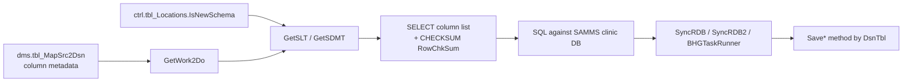

# SelectConstructor.cs — Complete Reference

**File:** `BCAppCode/BHG-DR-LIB_updated/SelectConstructor.cs`  
**Purpose:** Builds source `SELECT` column lists from metadata, applies schema/site column exclusions, computes `RowChkSum`, and routes extracted data to the correct `Save*` method.

Use this doc when migrating to Fabric or debugging column mismatches: it tells you **what to include**, **what to exclude**, and **why**.

---

## 1. What This Class Does (Big Picture)



| Layer | Source | Role |
|-------|--------|------|
| **Which columns exist** | `dms.tbl_MapSrc2Dsn` (via `WorkToDo` view) | Master list of mapped fields per `ActionKey` + `ActionStepKey` |
| **Which columns to skip** | `SelectConstructor.GetSLT()` | Old-schema / site-specific exclusions |
| **Site schema flag** | `ctrl.tbl_Locations.IsNewSchema` → `dms.vw_MapAction` | Turns exclusions on or off |
| **Where to load** | `Save*` switch on `DsnTbl` | Routes DataTable to correct Azure upsert |

**Important:** SelectConstructor does **not** define the full column list. It starts from `dms.tbl_MapSrc2Dsn` and **removes** columns that do not exist (or should not be read) on older SAMMS databases.

---

## 2. IsNewSchema — What It Is

### Definition

`IsNewSchema` is a **per-clinic flag** stored in `ctrl.tbl_Locations` and surfaced through `dms.vw_MapAction` / `vw_TaskListMap`.

| Value | Meaning |
|-------|---------|
| `true` | Clinic runs a **newer SAMMS schema** — source tables have newer columns |
| `false` | Clinic runs an **older SAMMS schema** — some columns in BHG_DR mapping do not exist at source |
| `null` | Treated as `false` in `BHGTaskRunner` (`NewSchema = false`) |

### How it is used in code

```csharp
// BHGTaskRunner (updatedProgram.cs)
if (!st.IsNewSchema.HasValue) { NewSchema = false; }
else { NewSchema = st.IsNewSchema.Value; }

strFlds = sc.GetSLT(tdwork, ChkSumEnabled, NewSchema, st.FromTblVw, st.SiteCode);
```

Inside `GetSLT` / `GetSDMT`:

```csharp
if (!NewSchema)   // IsNewSchema == false
{
    switch (tblName.ToLower())
    {
        // table-specific column skips (see Section 4)
    }
}
// if NewSchema == true → NO skips in this switch → include all mapped columns
```

### Practical rule for Fabric / PySpark

```
IF site.IsNewSchema = true  → SELECT all columns from dms.tbl_MapSrc2Dsn for that ActionKey/StepKey
IF site.IsNewSchema = false → SELECT mapped columns MINUS the exclusions in Section 4 for that source table + site
```

### Query to see schema flag per site

```sql
SELECT SiteCode, ClinicName, IsNewSchema, RegionCode, IsActive
FROM ctrl.tbl_Locations
WHERE IsActive = 1
ORDER BY SiteCode;
```

---

## 3. GetSLT — Column List Builder (Main Method)

### Signature

```csharp
GetSLT(List<VwMapSrc2Dsn> mywork, bool ChkSumEnabled, bool NewSchema, string tblName, string sc)
```

| Parameter | Meaning |
|-----------|---------|
| `mywork` | Enabled rows from `dms.tbl_MapSrc2Dsn` for this task step |
| `ChkSumEnabled` | Append `CHECKSUM(...) AS RowChkSum` |
| `NewSchema` | `IsNewSchema` for the clinic |
| `tblName` | Source object name (`FromTblVw`, e.g. `tblClinic`) |
| `sc` | Site code (e.g. `AHK`, `LAB`, `V14`) |

### Algorithm (every field in `mywork`)

| Step | Rule | Include? |
|------|------|----------|
| 1 | If `!NewSchema`, apply table/site skip rules (Section 4) | Skip if matched |
| 2 | Field name = `RowChkSum` | **Always exclude** (computed, not sourced) |
| 3 | Field is SQL expression (`@`, `.`, or `case ` in name) | Include as raw expression + alias |
| 4 | Normal column | Include as `[FieldName] alias` |
| 5 | For CHECKSUM list | Include column **unless** type is `ntext`, `varbinary`, or `timestamp` |
| 6 | If `ChkSumEnabled` | Append `CHECKSUM(col1, col2, ...) RowChkSum` |
| 7 | If `!ChkSumEnabled` | Trim trailing comma only (no checksum) |

### Output example

```sql
[clnID] clnID, [clnName] clnName, ..., CHECKSUM([clnID], [clnName], ...) RowChkSum
```

---

## 4. Table-Wise & Site-Wise Column Exclusions

**Only applied when `IsNewSchema = false` (`NewSchema = false`).**

### 4.1 `tblCodes`

| Column to EXCLUDE | Condition |
|-------------------|-----------|
| `reqauth` | All old-schema sites |
| `obat` | All old-schema sites |
| `isprescreening` | All old-schema sites |
| `cde3pposoverride` | All old-schema sites |
| `intakeprog` | **Additional** skip when `SiteCode = V14` |

**Include when `IsNewSchema = true`:** all of the above.

---

### 4.2 `tblUAResult`

| Column to EXCLUDE | Condition |
|-------------------|-----------|
| `location_` | All old-schema sites |
| `location` | All old-schema sites |
| `scheduleddate` | All old-schema sites |
| `uabase64` | All old-schema sites |
| `uaprogram` | All old-schema sites |

---

### 4.3 `tblUAResultDetail`

| Column to EXCLUDE | Condition |
|-------------------|-----------|
| `uardfullnote` | All old-schema sites |
| `uardkey` | All old-schema sites |
| `uardnote` | All old-schema sites |

---

### 4.4 `tblClinic`

#### Always excluded (old schema, any site)

| Column |
|--------|
| `blasterwide` |
| `pumpcalibrate` |
| `checkvisitingpatient` |
| `requireclientsignatureorderrequest` |
| `dischargeallowpayer` |
| `dymodetailed` |

#### Additional site-specific exclusions

| Column | SiteCode condition |
|--------|-------------------|
| `dischargedallowaddpayer` | `B28`, `B42A`, `B54`, `B55`, `TTCB` |
| `enablecommentsonmulticheckin` | `LAB` |
| `PullPicsFromD` | `LAB` |
| `enablecompetentcheckboxatdosing` | `LAB` |
| `enableactivateorderwhennotinsuboxoneprog` | `LAB` |
| `enableprinttoxlandscape` | `LAB` |
| `enableflagnurseforbac` | `LAB` |

---

### 4.5 All other source tables

No hardcoded column skips in `SelectConstructor`.  
Column list comes **entirely** from `dms.tbl_MapSrc2Dsn` (+ universal rules in Section 5).

> **Commented-out code:** `tblOrder` signature columns (`sigdr`, `sigentered`, etc.) had skip logic that is currently **disabled** (commented). Those columns are included if present in metadata.

---

## 5. Universal Include / Exclude Rules (All Tables)

These apply **regardless of table** and **regardless of IsNewSchema**.

| Rule | Include or Exclude | Notes |
|------|-------------------|-------|
| `RowChkSum` in metadata | **Exclude** from SELECT list | Added via `CHECKSUM()` when enabled |
| SQL expression fields (`@`, `.`, `case `) | **Include** as expression | Used for computed / joined columns in mapping |
| `ntext` columns | Include in SELECT; **exclude from CHECKSUM** | Large text |
| `varbinary` columns | Include in SELECT; **exclude from CHECKSUM** | Binary blobs |
| `timestamp` columns | Include in SELECT; **exclude from CHECKSUM** | SQL Server rowversion |
| `ChkSumEnabled = false` | No `RowChkSum` appended | When `ActionKey = 3` |
| PHC sites (in BHGTaskRunner, not in SelectConstructor itself) | Only rows where `PHC_Enabled = true` in metadata | Filter applied before `GetSLT` |

### CHECKSUM (`RowChkSum`) enablement

| Condition | `ChkSumEnabled` |
|-----------|-----------------|
| `ActionKey != 3` | `true` — checksum computed at source |
| `ActionKey == 3` | `false` — no checksum (client demo path) |

---

## 6. GetSDMT — Primary-Key-Only Builder

Same skip logic as `GetSLT` for `IsNewSchema` / table / site, but output differs:

| Aspect | `GetSLT` | `GetSDMT` |
|--------|----------|-----------|
| Columns output | All non-skipped mapped fields | **Only fields where `PrimaryKey` is set** |
| Expression fields | Include if has `@` and dots/`case` | Include if has `@` **and** `PrimaryKey` |
| CHECKSUM | Yes (when enabled) | Yes (when enabled) |

Use case: lightweight PK-only queries (metadata / delete detection patterns elsewhere in the library).

---

## 7. Destination Table Routing (`Save*` Methods)

After data is extracted, `SyncRDB` and `SyncRDB2` route by **`DsnTbl`** (Azure destination), not `FromTblVw`.

### 7.1 Full routing map

| Destination (`DsnTbl`) | Save Method | Notes |
|------------------------|-------------|-------|
| `tbl_clientdemo1` | `SaveClientDemo1var` | Receives `ActionKey` |
| `tbl_clientdemo2` | `SaveClientDemo2` or `SaveClientDemo3` | `ActionKey=3` → `SaveClientDemo3` (SyncRDB2 only) |
| `tbl_bills` | `SaveBills` | SyncRDB skips source read; uses `SaveBills` with SQL path in some flows |
| `tbl_codes` | `SaveCodes` | SyncRDB2 sets `x = false` (disabled) |
| `tbl_checkin` | `SaveCheckIn` | |
| `tbl_claims` | `SaveClaims` | Optional claim cleanup (commented) |
| `tbl_claimlineitem` | `SaveClaimLineItem` | |
| `tbl_claimlineitemactivity` | `SaveClaimLineItemActivity` | |
| `tbl_clinic` | `SaveClinic` | |
| `tbl_dartssrv` | `SaveDartSrv20XX` by year | 2008–2014 → `SaveDartSrv2014`; 2015–2022 → year-specific methods |
| `tbl_dose` | `SaveDoses` | |
| `tbl_dose_excuse` | `SaveDoseExcuse` | |
| `tbl_enrollment` | `SaveEnrollment` | Skipped when `SiteCode = Lab` (returns success, no load) |
| `tbl_ClinicalOpiateWithdrawalScale` | `SaveGlobalClinicalOpiateWithdrawalScale` | |
| `tbl_feesched` | `SaveFeeSchedules` | |
| `tbl_globalpayor` | `SaveGlobalPayer` | |
| `tbl_payerclient` | `SavePayerClient` or `RemovePayerClients` | If source = `vw_payerclt_inactive` → remove |
| `tbl_orders` | `SaveOrders2016` … `SaveOrders2021` | Splits DataTable by `OrderDate.Year` |
| `tbl_uaresults` | `SaveUAResults` | |
| `tbl_uaresultdetail` | `SaveUAResultDetail` | |
| `tbl_user` | `SaveGlobalUser` | |
| `tbl_usersites` | `SaveGlobalUserSite` | |
| `tbl_consents` | `SaveGlobalConsents` | |
| `tbl_3pelig` | `Save3pElig` | |
| `tbl_pbi3payauth` | `SaveAuths` | |
| `tbl_services` | `SaveServices` | SyncRDB2 only |
| `tbl_formssammsclient` | `SaveGlobalFormsSAMMSClients` | SyncRDB only |

---

## 8. WHERE Clause Overrides (Source Filter)

`GetSQLCmd` and `SyncRDB2` override `WhereCondition` for specific **source** tables.

### SyncRDB2 / yearly audit (`SyncRDB2`)

| Source (`FromTblVw`) | WHERE override |
|----------------------|----------------|
| `tblclaims` | `Year(tpcCreatedDate) = WrkYear` (or + SiteCode if ActionKey=5) |
| `tbldartssvc` | `Year(dsdtstart) = WrkYear` |
| `tbldose` | `Year(dtDate) = WrkYear` |
| `tbldoseexcuse` | Uses metadata `WhereCondition` as-is |
| `tbl3pelig` | `Year(edate) = WrkYear` |
| `tbl3payauth` | `1 = 1` (full load) |
| **default** | `Year(DateField) = WrkYear` |

### SyncRDB / reinit (`GetSQLCmd`)

| Source (`FromTblVw`) | WHERE override |
|----------------------|----------------|
| `tblclaims` | `Year(tpcCreatedDate) = pDT.Year` |
| `tblorder` | `Year(OrderDate) = pDT.Year` |
| `tbldartssvc` | `Year(dsdtstart) = pDT.Year` |
| `tbldose` | `Year(dtDate) = pDT.Year` |
| **default** | Metadata `WhereCondition` with `@WorkDate`, `@SiteCode`, `@EnrollCutoff`, `@Samms` replaced |

Placeholder replacement in `GetSQLCmd`:

```
@SiteCode     → 'AHK'
@WorkDate     → pDT (run date, NOT WorkDate-15 in this path)
@EnrollCutoff → site EnrollCutoff or '1900-01-01'
@Samms        → 'SAMMS'
```

> **Note:** Daily ETL in `BHGTaskRunner/updatedProgram.cs` uses `@WorkDate = WorkDate.AddDays(-15)`. `GetSQLCmd` here uses `pDT` directly — different caller, different lookback.

---

## 9. Other Public Methods

| Method | Purpose |
|--------|---------|
| `GetWorkingSet(year, sites, tblname)` | Loads `YearlyAuditData` rows for reinit/audit runs; special B/V site grouping for `tbl_dartssrv` |
| `SyncRDB2(st, i, ptask, wrkdate)` | Year-based full sync: build SELECT → extract → Save* → insert child task |
| `SyncRDB(st, mywork, pDT, Taskid, Firsthalf, dbs)` | Reinit sync using `GetSQLCmd` |
| `RunClaimCleanup(sites, tblname)` | Compare source claim IDs vs Azure; delete orphans via `CleanupDeletedData` |
| `GetWork2Do(actionkey, stepkey)` | Returns enabled `VwMapSrc2Dsn` rows ordered by `FieldKey` |
| `GetParentTask(wrkDate)` | Finds SAMMS parent task for task hierarchy |
| `GetParentTaskId(wrkDate)` | Returns parent TaskId |

---

## 10. Quick Decision Guide (Fabric / Silver Layer)

### For any P1/P2 table migration

1. **Get base columns** from `dms.tbl_MapSrc2Dsn` for `ActionKey` + `ActionStepKey`.
2. **Read `IsNewSchema`** for the clinic from `ctrl.tbl_Locations`.
3. **If `IsNewSchema = false`**, remove columns from Section 4 for that `FromTblVw` + site.
4. **Always** exclude `RowChkSum` from source; recompute checksum in pipeline if needed.
5. **Exclude from checksum only:** `ntext`, `varbinary`, `timestamp`.
6. **Apply WHERE** from `dms.tbl_MapAction.WhereCondition` + any override from Section 8 + BHGTaskRunner switch overrides.
7. **Route to target** using `DsnTbl` → Save method map (Section 7).

### Include / exclude cheat sheet

| Question | Answer |
|----------|--------|
| Column in `tbl_MapSrc2Dsn` and site has `IsNewSchema=true`? | **Include** |
| Column in Section 4 and site has `IsNewSchema=false`? | **Exclude** |
| Column type `ntext`/`varbinary`/`timestamp`? | **Include in data**; **exclude from CHECKSUM** |
| Field named `RowChkSum`? | **Never select from source** |
| `ActionKey = 3`? | **No CHECKSUM** appended |
| `SiteCode = Lab` for enrollment? | **Skip entire table load** |
| Source `vw_payerclt_inactive`? | **Remove** payer clients, not upsert |

---

## 11. SQL Queries for Day-to-Day Reference

### Column list for a task step

```sql
SELECT ActionKey, ActionStepKey, FieldKey, FieldName, DsnFieldName,
       FieldType, PrimaryKey, Enabled, PHC_Enabled
FROM dms.tbl_MapSrc2Dsn
WHERE ActionKey = @ActionKey
  AND ActionStepKey = @ActionStepKey
  AND Enabled = 1
ORDER BY FieldKey;
```

### Full task definition (source → destination → filters)

```sql
SELECT ma.ActionKey, ma.StepKey, ma.SiteCode,
       ma.SrcSchema + '.' + ma.FromTblVw AS SourceTable,
       ma.DsnSchema + '.' + ma.DsnTbl     AS DestinationTable,
       ma.WhereCondition, ma.SortOrder,
       l.IsNewSchema, l.IsActive, l.RegionCode
FROM dms.tbl_MapAction ma
JOIN ctrl.tbl_Locations l ON l.SiteCode = ma.SiteCode   -- conceptual; actual view may differ
WHERE ma.Enabled = 1
ORDER BY ma.ActionKey, ma.StepKey, ma.SiteCode;
```

### Compare old vs new schema column impact for tblClinic

```sql
-- Columns that are ONLY safe on new-schema sites (excluded when IsNewSchema=0)
-- Cross-check with Section 4.4 above
SELECT FieldName, DsnFieldName
FROM dms.tbl_MapSrc2Dsn
WHERE ActionKey = 1 AND ActionStepKey = 2   -- example: adjust to your clinic step
  AND LOWER(FieldName) IN (
    'blasterwide','pumpcalibrate','checkvisitingpatient',
    'requireclientsignatureorderrequest','dischargeallowpayer','dymodetailed',
    'dischargedallowaddpayer','enablecommentsonmulticheckin','pullpicsfromd',
    'enablecompetentcheckboxatdosing','enableactivateorderwhennotinsuboxoneprog',
    'enableprinttoxlandscape','enableflagnurseforbac',
    'reqauth','obat','isprescreening','cde3pposoverride','intakeprog',
    'location_','location','scheduleddate','uabase64','uaprogram',
    'uardfullnote','uardkey','uardnote'
  );
```

---

## 12. Tables With Hardcoded Logic in SelectConstructor (Summary)

Only **4 source table names** have explicit column skip logic:

| Source Table (`FromTblVw`) | `# Exclusion Rules` | Site-Specific Rules |
|----------------------------|--------------------|---------------------|
| `tblCodes` | 4 global + 1 for V14 | V14 → skip `intakeprog` |
| `tblUAResult` | 5 global | None |
| `tblUAResultDetail` | 3 global | None |
| `tblClinic` | 6 global | B28/B42A/B54/B55/TTCB; LAB |

All other tables: **metadata-driven only** (no extra skips in this file).

---

## 13. Related Files

| File | Relationship |
|------|--------------|
| `BHGTaskRunner/updatedProgram.cs` | Main daily ETL caller of `GetSLT`; applies `DaysBack=-15` on `@WorkDate` |
| `dms.tbl_MapSrc2Dsn` | Column mapping master |
| `dms.tbl_MapAction` / `vw_MapAction` | Task definitions, WhereCondition |
| `ctrl.tbl_Locations` | `IsNewSchema`, `IsActive`, `RegionCode` |
| `ActionKey_ActionStepKey_Explained.md` | Broader ActionKey/StepKey documentation |
| `ControlTables_Explained.md` | Control table join model |

---

*Generated from `BHG-DR-LIB_updated/SelectConstructor.cs` (1083 lines). Update this doc if skip rules or routing switches change in code.*
