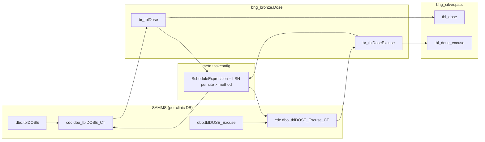

# Dose & DoseExcuse CDC — Implementation Guide

Step-by-step plan to add **SQL Server CDC** to the existing Doses Fabric ETL for **two methods**:

| Method | SAMMS source | CDC capture table | Bronze | Silver | Merge key |
|---|---|---|---|---|---|
| **Dose** | `dbo.tblDOSE` | `cdc.dbo_tblDOSE_CT` | `bhg_bronze.Dose.br_tblDose` | `bhg_silver.pats.tbl_dose` | `SiteCode + DoseId` |
| **DoseExcuse** | `dbo.tblDOSE_Excuse` | `cdc.dbo_tblDOSE_Excuse_CT` | `bhg_bronze.Dose.br_tblDoseExcuse` | `bhg_silver.pats.tbl_dose_excuse` | `SiteCode + ExId` |

Use this together with [LiquidLog_CDC_Simulation_Guide.md](./LiquidLog_CDC_Simulation_Guide.md) for CDC concepts (LSN, `ScheduleExpression`, operations).

---

## 1. Why CDC for Doses?

Both SAMMS source tables are listed in `SAMMS_Source_Tables_Without_Modified_Date.sql`:

- `dbo.tblDOSE`
- `dbo.tblDOSE_Excuse`

There is **no reliable `ModifiedOn`** column. Today the Doses pipeline uses **FULL** bronze loads (`LoadType = FULL`, ConfigId **7**) and silver **UPSERT** (ConfigId **8**).

CDC replaces “re-read everything / complex date filters” with **change log + LSN bookmark** — same pattern as LiquidLog.

---

## 2. Current vs target state

### Current (production Fabric)

| Layer | ConfigId | LoadType | Behavior |
|---|---:|---|---|
| Bronze Dose / DoseExcuse | 7 | FULL | Full table copy per site → append bronze |
| Silver Dose / DoseExcuse | 8 | UPSERT | MERGE to silver |
| Gold Dose / DoseExcuse | 9 | APPEND | Publish to gold (optional) |

Pipeline reference: `BCAppCode/Doses-ETL/dosedefinistion.txt`, `dosescopy.txt`

### Target (CDC pilot → rollout)

| Layer | Change |
|---|---|
| Bronze taskconfig | `LoadType = CDC`, `SourceTable` JSON with `cdc_table`, `ScheduleExpression` = LSN |
| Bronze Copy | Switch: CDC / Incremental / Full (copy LiquidLog pattern) |
| Silver | MERGE using `__$operation`; **soft delete** on operation 1 |
| Gold | No change initially |

**Reuse existing bronze and silver tables** — do not create parallel `*_CDC` test tables for production.

---

## 3. Architecture



---

## 4. Implementation checklist

### Phase 0 — Scope (do first)

- [ ] **Pilot sites:** start with 3 — e.g. **AHK, B12B, CBCO** (same as LiquidLog CDC pilot)
- [ ] **Both methods** in pilot: `Dose` + `DoseExcuse`
- [ ] **Soft delete only:** `__$operation = 1` → `RowState = false` (not hard `DELETE`)
- [ ] **Keep** `br_tblDose`, `br_tblDoseExcuse`, `tbl_dose`, `tbl_dose_excuse`
- [ ] Leave non-pilot sites on `LoadType = FULL` until pilot passes

---

### Phase 1 — Enable CDC on SAMMS (DBA) ← **START HERE**

Run on **each pilot clinic database** (e.g. `SAMMS-Ahoskie`):

```sql
-- Once per database
EXEC sys.sp_cdc_enable_db;

-- Method 1: Dose
EXEC sys.sp_cdc_enable_table
    @source_schema = N'dbo',
    @source_name   = N'tblDOSE',
    @role_name     = NULL;

-- Method 2: DoseExcuse
EXEC sys.sp_cdc_enable_table
    @source_schema = N'dbo',
    @source_name   = N'tblDOSE_Excuse',
    @role_name     = NULL;
```

**Verify:**

```sql
SELECT t.name AS source_table, ct.capture_instance
FROM cdc.change_tables ct
JOIN sys.tables t ON ct.source_object_id = t.object_id
WHERE t.name IN ('tblDOSE', 'tblDOSE_Excuse');
```

Expected (default naming):

| Source | Capture instance |
|---|---|
| `tblDOSE` | `dbo_tblDOSE` → table `cdc.dbo_tblDOSE_CT` |
| `tblDOSE_Excuse` | `dbo_tblDOSE_Excuse` → table `cdc.dbo_tblDOSE_Excuse_CT` |

> Enable on **~115 DBs × 2 tables** only after pilot sign-off. Roll out in batches (10–20 clinics).

---

### Phase 2 — Taskconfig (meta)

Update **pilot site rows only** (ConfigId **7**, one row per site per method).

#### Dose — example row (AHK)

| Column | Value |
|---|---|
| ConfigId | 7 |
| Method | `Dose` |
| LoadType | `CDC` |
| SourceTable | `{"table":"dbo.tblDOSE","cdc_table":"cdc.dbo_tblDOSE_CT"}` |
| ScheduleExpression | `NULL` or `0x00000000000000000000` (first run) |
| TargetSchema | `Dose` |
| TargetTable | `br_tblDose` |
| SiteCode | `AHK` |
| DataBaseName | `SAMMS-Ahoskie` |
| IsActive | 1 |
| RequestBody | `{"full_table":"bhg_bronze.Dose.br_tblDose","ingest_column":"IngestRunId","site_column":"SiteCode","database_column":"SourceDatabase","dq_keys":["SiteCode","DoseId"]}` |

#### DoseExcuse — example row (AHK)

| Column | Value |
|---|---|
| Method | `DoseExcuse` |
| SourceTable | `{"table":"dbo.tblDOSE_Excuse","cdc_table":"cdc.dbo_tblDOSE_Excuse_CT"}` |
| TargetTable | `br_tblDoseExcuse` |
| RequestBody dq_keys | `["SiteCode","ExId"]` |

Repeat for **B12B**, **CBCO**.

**Column meanings (same as LiquidLog):**

| Column | CDC meaning |
|---|---|
| `ScheduleExpression` | **LSN bookmark** (hex) — NOT a date |
| `LastRunDate` | Timestamp of last successful run |
| `LookbackDays` | Ignored on CDC path; used only for Incremental fallback |

Silver rows (ConfigId **8**) stay as method-level UPSERT rows; silver notebook reads bronze by `IngestRunId`.

---

### Phase 3 — Bronze pipeline (Copy activity)

In Doses bronze child pipeline (`pl_saveorders` / `dosedefinistion.txt` pattern):

- [ ] Add **Switch on `@item().LoadType`** per method (mirror LiquidLog `fe_SaveLiquidlog`)
- [ ] **CDC case:** build SQL from `json(item().SourceTable).cdc_table` + LSN filter from `ScheduleExpression`
- [ ] **Incremental case:** keep date-based query (fallback)
- [ ] **Full case:** keep full table query (initial backfill / reload)
- [ ] Include CDC columns in SELECT: `__$start_lsn`, `__$operation`, etc.
- [ ] Include business columns + `CHECKSUM(...) AS RowChkSum`, `CAST(1 AS bit) AS RowState`
- [ ] Copy **append** to existing bronze tables
- [ ] Consider **sequential** site processing for high-volume Dose (`isSequential: true`)

#### CDC query template (Dose)

```sql
SELECT
    '<SiteCode>' AS SiteCode,
    CONVERT(VARCHAR(50), __$start_lsn, 1) AS __$start_lsn,
    CONVERT(VARCHAR(50), __$end_lsn, 1) AS __$end_lsn,
    CONVERT(VARCHAR(50), __$seqval, 1) AS __$seqval,
    __$operation,
    CONVERT(VARCHAR(50), __$update_mask, 1) AS __$update_mask,
    __$command_id,
    -- all tblDOSE business columns ...
    CHECKSUM(/* same columns as legacy */) AS RowChkSum,
    CAST(1 AS bit) AS RowState
FROM cdc.dbo_tblDOSE_CT
WHERE __$start_lsn > CONVERT(binary(10), '<ScheduleExpression or 0x00...>', 1)
ORDER BY __$start_lsn, __$seqval
```

Reference implementation: `BCAppCode/CDC/Liquidlogcdc.txt` → `fe_SaveLiquidlog` → Switch `CDC`.

> **Note:** Legacy Dose uses complex date/year filters in `BHGTaskRunner/Program.cs` for non-CDC paths. CDC path **does not** use those filters — the change log is the filter.

---

### Phase 4 — Bronze table schema

Ensure bronze Delta tables accept CDC metadata:

- [ ] `__$start_lsn`, `__$end_lsn`, `__$seqval`, `__$operation`, `__$update_mask`, `__$command_id`
- [ ] Audit: `SourceDatabase`, `IngestRunId`, `ExtractedAt`, `SourceQueryStartDate`, etc.

Add columns via schema evolution or one-time ALTER before first CDC run.

---

### Phase 5 — Silver MERGE + soft delete

Update silver notebooks (ConfigId **8**) for both methods.

#### Operation handling

| `__$operation` | Silver action |
|---:|---|
| 2 (insert) | INSERT / upsert, `RowState = true` |
| 4 (update after) | UPDATE if `RowChkSum` changed, `RowState = true` |
| 3 (update before) | Skip |
| **1 (delete)** | **`RowState = false`** on `SiteCode + DoseId` (or `ExId`) — **soft delete** |

#### Pseudocode

```python
# After successful MERGE for site + method:
max_lsn_df = bronze_df.groupBy("SiteCode").agg(F.max("__$start_lsn").alias("new_lsn"))

DeltaTable.forName(spark, "bhg_bronze.meta.taskconfig").update(
    condition="""
        ConfigId = 7
        AND Method = 'Dose'
        AND SiteCode = '<site>'
    """,
    set={
        "ScheduleExpression": F.lit(new_lsn),
        "LastRunDate": F.current_timestamp(),
        "ModifiedAt": F.current_timestamp()
    }
)
```

#### Legacy parity notes (from `Dose_DoseExcuse_Parity_Fix_Findings.md`)

- Dose silver already applies **void/client `RowState = false`** rules from legacy logic
- CDC soft delete on operation 1 **extends** that pattern to true source deletes
- **Reload mode** is not in Fabric today — use **Full** LoadType for backfill if needed

---

### Phase 6 — Pilot test run

**Order:**

1. One site, one method: **Dose @ AHK**
2. **DoseExcuse @ AHK**
3. Expand to **B12B**, **CBCO**
4. Compare row counts / keys vs legacy for same window

#### Validation queries

**Taskconfig bookmarks:**

```sql
SELECT TaskConfigId, SiteCode, Method, LoadType, ScheduleExpression, LastRunDate, IsActive
FROM bhg_bronze.meta.taskconfig
WHERE ConfigId = 7
  AND Method IN ('Dose', 'DoseExcuse')
  AND SiteCode IN ('AHK', 'B12B', 'CBCO');
```

**Bronze CDC rows this run:**

```sql
SELECT SiteCode, __$start_lsn, __$operation, DoseId, IngestRunId, ExtractedAt
FROM bhg_bronze.Dose.br_tblDose
WHERE IngestRunId = '<your_run_id>'
ORDER BY __$start_lsn, __$seqval;
```

**Soft delete check (operation 1):**

```sql
SELECT SiteCode, __$operation, DoseId
FROM bhg_bronze.Dose.br_tblDose
WHERE __$operation = 1
ORDER BY ExtractedAt DESC;

SELECT SiteCode, DoseId, RowState
FROM bhg_silver.pats.tbl_dose
WHERE SiteCode = '<site>' AND DoseId = <id>;
-- Expect RowState = false after silver processing
```

**Max LSN (what silver should write to ScheduleExpression):**

```sql
SELECT SiteCode, MAX(__$start_lsn) AS new_bookmark
FROM bhg_bronze.Dose.br_tblDose
WHERE IngestRunId = '<your_run_id>'
GROUP BY SiteCode;
```

---

### Phase 7 — Production rollout

- [ ] Enable CDC on next clinic batch (SAMMS)
- [ ] Clone pilot taskconfig pattern per site (both methods)
- [ ] Set `IsActive = 1` as each DB is CDC-ready
- [ ] Monitor SQL Server CDC overhead and Fabric run duration
- [ ] Document for report owners: filter **`RowState = true`** for active rows

---

## 5. Simulation — Dose @ B12B (Day 1)

### Starting taskconfig

| SiteCode | Method | ScheduleExpression |
|---|---|---|
| B12B | Dose | `NULL` |

### SAMMS activity

New dose recorded in `dbo.tblDOSE`:

| DoseId | CltId | DtDate | Dose | BlVoid |
|---:|---:|---|---:|---|
| 90001 | 12345 | 2026-08-18 | 40 | 0 |

CDC capture:

| __$start_lsn | __$operation | DoseId |
|---|---:|---:|
| 0x00008BB400006000000A | 2 | 90001 |

### Copy → bronze

| SiteCode | __$start_lsn | __$operation | DoseId | IngestRunId |
|---|---|---:|---:|---|
| B12B | 0x00008BB400006000000A | 2 | 90001 | DOSE_CDC_RUN_001 |

### Silver MERGE

Upsert into `tbl_dose` on `SiteCode + DoseId`, `RowState = true`.

### Taskconfig update

| SiteCode | ScheduleExpression | LastRunDate |
|---|---|---|
| B12B | `0x00008BB400006000000A` | 2026-08-18 10:00:00 |

---

## 6. Simulation — soft delete (operation 1)

SAMMS deletes dose row `DoseId = 90001`:

| __$start_lsn | __$operation | DoseId |
|---|---:|---:|
| 0x00008BB400006000000C | **1** | 90001 |

Silver action:

```text
UPDATE tbl_dose SET RowState = false, LastModAt = now()
WHERE SiteCode = 'B12B' AND DoseId = 90001
```

Row **remains** in silver for audit; it is not physically deleted.

---

## 7. Effort estimate

| Area | Effort | Notes |
|---|---|---|
| SAMMS CDC enable (pilot 3 DBs) | Low | 2 tables each |
| SAMMS CDC enable (all ~115 DBs) | Medium | Operational / DBA |
| Bronze pipeline CDC Switch × 2 methods | Medium | Copy from LiquidLog |
| Silver MERGE + soft delete × 2 | Medium | Highest logic effort |
| Taskconfig pilot rows | Low | 3 sites × 2 methods = 6 rows |
| Full rollout taskconfig | Medium | ~230 bronze rows |
| **Overall first ETL after LiquidLog** | **Medium** | Dose is higher volume than LiquidLog |

---

## 8. Do NOT on day one

- Enable all 115 clinics at once
- Hard delete silver rows on operation 1
- Create separate `*_CDC` production tables (pilot table names OK for LiquidLog test only)
- Assume first CDC run from LSN zero is small — plan **Full** backfill first if history is huge
- Skip DBA review of CDC impact on high-volume SAMMS servers

---

## 9. Related files in repo

| File | Purpose |
|---|---|
| [LiquidLog_CDC_Simulation_Guide.md](./LiquidLog_CDC_Simulation_Guide.md) | CDC concepts, LSN, ScheduleExpression |
| [Liquidlogcdc.txt](./Liquidlogcdc.txt) | Reference CDC Copy Switch JSON |
| `BCAppCode/Doses-ETL/dosedefinistion.txt` | Doses pipeline definition |
| `BCAppCode/Doses-ETL/dosescopy.txt` | Copy / silver notebook cells |
| `BCAppCode/Doses-ETL/dosescontrolandaudittables.txt` | Current taskconfig examples |
| `BCAppCode/Doses-ETL/Dose_DoseExcuse_Parity_Fix_Findings.md` | Legacy vs Fabric parity |
| `BCAppCode/Doses-ETL/update_dose_taskconfig_pyspark.py` | Taskconfig maintenance script |
| `BCAppCode/BHG-DR-LIB/SaveDoses.cs` | Legacy C# upsert logic |
| `SAMMS_Source_Tables_Without_Modified_Date.sql` | Confirms no ModifiedOn on Dose tables |

---

## 10. One-page summary

```text
1. Enable CDC on dbo.tblDOSE + dbo.tblDOSE_Excuse (pilot SAMMS DBs first)
2. Set taskconfig LoadType=CDC, SourceTable JSON, ScheduleExpression=0 (pilot sites)
3. Add CDC Switch + Copy query to Doses bronze pipeline (both methods)
4. Extend bronze schema for CDC columns
5. Silver: MERGE on __$operation; op 1 = soft delete (RowState=false)
6. Silver: MAX(__$start_lsn) → update ScheduleExpression per site per method
7. Pilot AHK → B12B → CBCO, then roll out remaining clinics in batches
```

**ScheduleExpression = LSN bookmark. LastRunDate = when you last ran. Operation 1 = soft delete only.**

---

*Generated for BCAppCode CDC rollout — Dose / DoseExcuse (`Schedule 10` / Doses ETL).*
