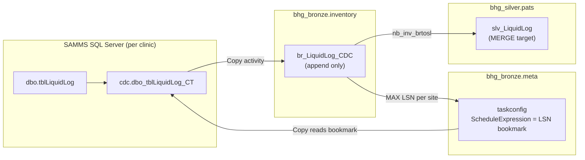

# LiquidLog CDC — How It Works (Simulation Guide)

This guide walks through the **LiquidLog CDC pipeline** step by step using **real table names, taskconfig values, and example data** from the BHG Fabric setup.

Use this when you need to understand:
- What CDC is and why LiquidLog uses it
- What `ScheduleExpression` really means (hint: **not a date**)
- How Copy, bronze, silver, and taskconfig connect

---

## 1. The problem CDC solves

### Legacy C# ETL (`SaveLiquidlog`)

```
SAMMS clinic DB  →  SELECT from dbo.tblLiquidLog  →  Azure pats.tbl_LiquidLog
```

**Problem:** `dbo.tblLiquidLog` has **no `ModifiedOn` / `ModifiedBy` columns**.

You cannot reliably ask: *"give me rows changed since yesterday."*

### CDC solution

SQL Server watches the table and writes every insert/update/delete to a **change log**:

```
dbo.tblLiquidLog          ← nurses write dispensing records here
        ↓ (SQL Server CDC, automatic)
cdc.dbo_tblLiquidLog_CT   ← change log with LSN + operation type
```

Fabric reads the **change log**, not the base table, using an **LSN bookmark** stored in taskconfig.

---

## 2. Architecture overview



### Two pipelines

| Pipeline | Role |
|---|---|
| `pl_inv_CDC_LiquidLog` (parent) | Load taskconfig → audit → invoke bronze child → run silver notebook |
| `pl_inv__srctobr_CDC_LiquidLog` (child) | Copy CDC changes from each SAMMS DB into bronze |

---

## 3. Control tables (meta)

### 3.1 `meta.etlconfig` — one row per layer

| ConfigId | ConfigName | TargetName | Pipeline |
|---:|---|---|---|
| 114 | CDC Bronze Pipeline | BR | pl_inv |
| 115 | CDC Silver Pipeline | SL | nb_inv_brtosl |

### 3.2 `meta.taskconfig` — one row **per site** (bronze)

**Pilot sites today (ConfigId 114):**

| TaskConfigId | SiteCode | DataBaseName | LoadType | SourceTable | ScheduleExpression | LastRunDate |
|---:|---|---|---|---|---|---|
| 8616 | AHK | SAMMS-Ahoskie | CDC | `{"table":"dbo.tblLiquidLog","cdc_table":"cdc.dbo_tblLiquidLog_CT"}` | `0x00008AA4000060000001` | 2026-08-07 |
| 8617 | B12B | SAMMS-ColoradoSpringsV5 | CDC | same JSON | `0x00008AA4000060000009` | 2026-08-07 |
| 8618 | CBCO | SAMMS-CoeurdAleneV6 | CDC | same JSON | `0x00008AA4000060000009` | 2026-08-07 |

#### Column cheat sheet

| Column | What it means for CDC |
|---|---|
| `SourceTable` | JSON with `table` (base) and `cdc_table` (change log) |
| `LoadType` | Must be `CDC` to use the CDC Copy path |
| **`ScheduleExpression`** | **LSN bookmark** — last processed log position (**NOT a date**) |
| **`LastRunDate`** | **Actual timestamp** of last successful run |
| `TargetTable` | Bronze table: `br_LiquidLog_CDC` |
| `SiteCode` | Clinic code stamped on every row |

---

## 4. SAMMS source — before any pipeline runs

CDC must be enabled **once per clinic database**:

```sql
EXEC sys.sp_cdc_enable_db;

EXEC sys.sp_cdc_enable_table
    @source_schema = N'dbo',
    @source_name   = N'tblLiquidLog',
    @role_name     = NULL;
```

After enablement, SQL Server creates `cdc.dbo_tblLiquidLog_CT` in that database.

---

## 5. Simulation — Day 1, Site B12B (first run)

### 5.1 Starting taskconfig

| SiteCode | ScheduleExpression | LastRunDate |
|---|---|---|
| B12B | `NULL` (or `0x00000000000000000000`) | `NULL` |

Pipeline treats NULL as `0x00000000000000000000` → read all CDC history since CDC was enabled.

### 5.2 Activity in SAMMS (Colorado Springs)

Nurse dispenses methadone. SAMMS inserts into `dbo.tblLiquidLog`:

**`dbo.tblLiquidLog` (business table)**

| liqID | amt | dtm | staff | btlID |
|---:|---:|---|---|---:|
| 100001 | 40 | 2026-08-18 08:00 | JSMITH | 502 |

SQL Server CDC copies that to the change table:

**`cdc.dbo_tblLiquidLog_CT` (change log)**

| __$start_lsn | __$seqval | __$operation | liqID | amt | dtm | staff | btlID |
|---|---|---:|---:|---:|---|---|---:|---:|
| 0x00008AA400006000000A | 0x0000000000000001 | **2** (insert) | 100001 | 40 | 2026-08-18 08:00 | JSMITH | 502 |

> **__$operation:** 1=delete, 2=insert, 3=update-before, 4=update-after

### 5.3 Copy activity builds SQL

From taskconfig for B12B:

```sql
SELECT
    'B12B' AS SiteCode,
    CONVERT(VARCHAR(50), __$start_lsn, 1) AS __$start_lsn,
    CONVERT(VARCHAR(50), __$end_lsn, 1) AS __$end_lsn,
    CONVERT(VARCHAR(50), __$seqval, 1) AS __$seqval,
    __$operation,
    CONVERT(VARCHAR(50), __$update_mask, 1) AS __$update_mask,
    __$command_id,
    liqID, Pump, doseID, btlID, bkrID,
    CASE WHEN amt = 690122921 THEN 0 ELSE amt END AS amt,
    dtm, [desc], staff, blLogOnly, blPrepack,
    memonew, memo, dtRTI, acknowledgeDate, acknowledgeUser,
    RegionalDate, RegionalUser, ComplainceUser, ComplianceDate,
    invgroup, SiteID,
    CHECKSUM(...) AS RowChkSum,
    CAST(1 AS bit) AS RowState
FROM cdc.dbo_tblLiquidLog_CT
WHERE __$start_lsn > CONVERT(binary(10), '0x00000000000000000000', 1)
ORDER BY __$start_lsn, __$seqval
```

Copy connects to database **`SAMMS-ColoradoSpringsV5`** and runs this query.

### 5.4 Copy adds audit columns and appends to bronze

Fabric adds:

| Column | Value |
|---|---|
| SourceDatabase | SAMMS-ColoradoSpringsV5 |
| IngestRunId | CDC_RUN_001 |
| ExtractedAt | 2026-08-18 09:00:00 |

**`bhg_bronze.inventory.br_LiquidLog_CDC` (after append)**

| SiteCode | __$start_lsn | __$operation | liqID | amt | IngestRunId | SourceDatabase |
|---|---|---:|---:|---:|---|---|
| B12B | 0x00008AA400006000000A | 2 | 100001 | 40 | CDC_RUN_001 | SAMMS-ColoradoSpringsV5 |

Bronze is **append-only** — no MERGE at this layer.

### 5.5 Silver notebook (`nb_inv_brtosl`)

**Step A — Read bronze for this run only**

```sql
SELECT * FROM bhg_bronze.inventory.br_LiquidLog_CDC
WHERE IngestRunId = 'CDC_RUN_001' AND SiteCode = 'B12B'
```

**Step B — MERGE into silver**

For `__$operation = 2` (insert): upsert row keyed on `SiteCode + liqID`.

**`bhg_silver.pats.slv_LiquidLog` (after MERGE)**

| SiteCode | LiqId | Amt | Dtm | Staff | RowChkSum |
|---|---:|---:|---|---|---:|
| B12B | 100001 | 40 | 2026-08-18 08:00 | JSMITH | 884521 |

**Step C — Update taskconfig bookmark**

Silver finds max LSN from bronze this run:

```
MAX(__$start_lsn) = 0x00008AA400006000000A
```

Updates taskconfig row 8617:

| SiteCode | ScheduleExpression | LastRunDate |
|---|---|---|
| B12B | **`0x00008AA400006000000A`** | **2026-08-18 09:05:00** |

> Silver writes the **hex LSN** to `ScheduleExpression` and the **clock time** to `LastRunDate`.

---

## 6. Simulation — Day 2, Site B12B (incremental run)

### 6.1 Starting taskconfig (after Day 1)

| SiteCode | ScheduleExpression | LastRunDate |
|---|---|---|
| B12B | `0x00008AA400006000000A` | 2026-08-18 09:05:00 |

### 6.2 New activity in SAMMS

**New insert:**

| __$start_lsn | __$operation | liqID | amt |
|---|---|---:|---:|---:|
| 0x00008AA400006000000B | 2 | 100002 | 35 |

**Update to existing row** (amount corrected):

| __$start_lsn | __$operation | liqID | amt |
|---|---|---:|---:|---:|
| 0x00008AA400006000000C | 3 | 100001 | 40 |
| 0x00008AA400006000000C | 4 | 100001 | 38 |

### 6.3 Copy SQL filter (only new changes)

```sql
WHERE __$start_lsn > CONVERT(binary(10), '0x00008AA400006000000A', 1)
```

Returns **3 CDC rows** (1 insert + 1 update pair). Does **not** re-read Day 1 data.

### 6.4 Bronze append (Run CDC_RUN_002)

| SiteCode | __$start_lsn | __$operation | liqID | amt | IngestRunId |
|---|---|---:|---:|---:|---|
| B12B | 0x00008AA400006000000B | 2 | 100002 | 35 | CDC_RUN_002 |
| B12B | 0x00008AA400006000000C | 3 | 100001 | 40 | CDC_RUN_002 |
| B12B | 0x00008AA400006000000C | 4 | 100001 | 38 | CDC_RUN_002 |

### 6.5 Silver MERGE logic

| __$operation | Silver action |
|---:|---|
| 2 (insert) | INSERT liqID 100002 |
| 3 (update before) | Usually **skip** (old image) |
| 4 (update after) | UPDATE liqID 100001 → amt = 38 |
| 1 (delete) | DELETE from silver |

**Silver after MERGE:**

| SiteCode | LiqId | Amt |
|---|---:|---:|
| B12B | 100001 | **38** (updated) |
| B12B | 100002 | 35 (new) |

**Taskconfig update:**

| SiteCode | ScheduleExpression | LastRunDate |
|---|---|---|
| B12B | **`0x00008AA400006000000C`** (max LSN this run) | 2026-08-19 09:00:00 |

---

## 7. Simulation — Day 3, no new changes

If no dispensing activity overnight:

- Copy query returns **0 rows** for B12B
- Bronze gets nothing new
- Silver has nothing to MERGE
- **`ScheduleExpression` stays `0x00008AA400006000000C`** (bookmark unchanged)
- `LastRunDate` may or may not update depending on notebook design

---

## 8. Full end-to-end timeline (all 3 pilot sites)

```
08:00  Pipeline starts (pl_inv_CDC_LiquidLog)
       │
       ├─ nb_get_sammsinv_taskconfig
       │     reads ConfigId 114 → returns JSON for AHK, B12B, CBCO
       │
       ├─ nb_sammsinv_audit_start
       │     writes audit / pipelinerun rows
       │
       ├─ Child: pl_inv__srctobr_CDC_LiquidLog
       │     │
       │     ├─ Site AHK  (sequential)
       │     │     Copy: SAMMS-Ahoskie → br_LiquidLog_CDC
       │     │     bookmark: 0x...0001 → 0x...0005
       │     │
       │     ├─ Site B12B
       │     │     Copy: SAMMS-ColoradoSpringsV5 → br_LiquidLog_CDC
       │     │     bookmark: 0x...0009 → 0x...000C
       │     │
       │     └─ Site CBCO
       │           Copy: SAMMS-CoeurdAleneV6 → br_LiquidLog_CDC
       │           bookmark: 0x...0009 → 0x...000B
       │
       ├─ nb_inv_brtosl (silver)
       │     per site: MERGE + update ScheduleExpression + LastRunDate
       │
       └─ nb_sammsinv_audit_finalize_success
             pipeline complete
```

Sites run **one at a time** (`isSequential: true`) because LSN order matters.

---

## 9. CDC columns reference

| Column | Type | Meaning |
|---|---|---|
| `__$start_lsn` | binary → hex string | Position in transaction log — **used as bookmark** |
| `__$end_lsn` | binary → hex string | End of change range |
| `__$seqval` | binary → hex string | Order within same LSN |
| `__$operation` | int | 1=delete, 2=insert, 3=update-before, 4=update-after |
| `__$update_mask` | binary | Which columns changed (updates only) |
| `__$command_id` | bigint | Groups rows from same SQL command |

---

## 10. ScheduleExpression vs LastRunDate

| | ScheduleExpression | LastRunDate |
|---|---|---|
| **What is it?** | LSN hex bookmark | Calendar timestamp |
| **Example** | `0x00008AA4000060000009` | `2026-08-07 09:34:55` |
| **Who reads it?** | Copy activity (bronze) | Humans / monitoring |
| **Who writes it?** | Silver notebook | Silver notebook |
| **Used in SQL as** | `WHERE __$start_lsn > bookmark` | Reporting only |
| **Is it a date?** | **NO** | **YES** |

### Analogy

| Concept | Real world |
|---|---|
| `dbo.tblLiquidLog` | Notebook where nurses write entries |
| `cdc.dbo_tblLiquidLog_CT` | Photocopy log of every edit |
| `__$start_lsn` | Page number of each photocopy |
| `ScheduleExpression` | Your bookmark: "I've read up to page 847" |
| `LastRunDate` | "I last read on August 7th at 9:34 AM" |
| Copy activity | "Photocopy everything after page 847" |
| Silver MERGE | Apply edits to the final clean notebook |

---

## 11. What each component does / does not do

| Component | Does | Does NOT |
|---|---|---|
| SQL Server CDC | Capture changes to change table | Send data to Fabric |
| Copy activity | Read CDC + append bronze | Update ScheduleExpression |
| Bronze table | Store raw CDC rows (history) | MERGE / dedupe |
| Silver notebook | MERGE + update bookmark | Read SAMMS directly |
| taskconfig | Store per-site bookmark | Run by itself |

---

## 12. Pilot vs production

| Item | Pilot (today) | Production (future) |
|---|---|---|
| Sites | 3 (AHK, B12B, CBCO) | ~115 clinics |
| Bronze table | `br_LiquidLog_CDC` | May rename to production bronze |
| SAMMS CDC | Enabled on 3 DBs | Enable per DB as you roll out |
| taskconfig rows | 3 rows ConfigId 114 | One row per site |

---

## 13. Common confusion — FAQ

### Q: Is ScheduleExpression a cron schedule?
**No.** For LiquidLog CDC it stores the **LSN bookmark**.

### Q: Is ScheduleExpression a date?
**No.** The date column is **`LastRunDate`**.

### Q: How does silver know what LSN to write?
It reads **`MAX(__$start_lsn)`** from bronze rows for this `IngestRunId` + `SiteCode`.

### Q: How does silver know which taskconfig row to update?
Match on **`ConfigId = 114`** + **`Method = SaveLiquidlog`** + **`SiteCode`**.

### Q: Why not use ModifiedOn like Forms ETL?
`tblLiquidLog` has **no ModifiedOn column** in SAMMS.

### Q: Does Copy MERGE into bronze?
**No.** Copy **appends**. MERGE happens in silver.

### Q: Do I enable CDC once or per clinic?
**Per clinic database** (~115 SAMMS DBs). Each gets its own `cdc.dbo_tblLiquidLog_CT`.

### Q: What if I reset ScheduleExpression to all zeros?
Next run re-processes **all CDC history** since CDC was enabled on that DB.

---

## 14. Validation queries

### Check taskconfig bookmarks
```sql
SELECT TaskConfigId, SiteCode, ScheduleExpression, LastRunDate, IsActive
FROM bhg_bronze.meta.taskconfig
WHERE ConfigId = 114 AND Method = 'SaveLiquidlog';
```

### Check bronze rows for a run
```sql
SELECT SiteCode, __$start_lsn, __$operation, liqID, amt, IngestRunId
FROM bhg_bronze.inventory.br_LiquidLog_CDC
WHERE IngestRunId = 'CDC_RUN_001'
ORDER BY SiteCode, __$start_lsn, __$seqval;
```

### Check max LSN per site (what silver should write)
```sql
SELECT SiteCode, MAX(__$start_lsn) AS new_bookmark
FROM bhg_bronze.inventory.br_LiquidLog_CDC
WHERE IngestRunId = 'CDC_RUN_001'
GROUP BY SiteCode;
```

### Check CDC enabled on SAMMS
```sql
SELECT is_cdc_enabled FROM sys.databases WHERE name = DB_NAME();

SELECT ct.capture_instance, t.name
FROM cdc.change_tables ct
JOIN sys.tables t ON ct.source_object_id = t.object_id
WHERE t.name = 'tblLiquidLog';
```

---

## 15. One-page summary

```
1. SAMMS: nurse writes dbo.tblLiquidLog
2. SQL Server CDC: copies change → cdc.dbo_tblLiquidLog_CT (with LSN + operation)
3. taskconfig: stores last LSN in ScheduleExpression per site
4. Copy: SELECT FROM cdc_table WHERE __$start_lsn > ScheduleExpression → append bronze
5. Silver: MERGE bronze → silver using __$operation (insert/update/delete)
6. Silver: MAX(__$start_lsn) → write back to ScheduleExpression; write clock time to LastRunDate
7. Next run: Copy starts from new bookmark — only new changes
```

**ScheduleExpression = where you left off in the log (LSN). LastRunDate = when you last ran (timestamp).**

---

*Generated for BCAppCode CDC pilot — LiquidLog (`pl_inv_CDC_LiquidLog`). See also `Liquidlogcdc.txt` for pipeline JSON and taskconfig export.*
