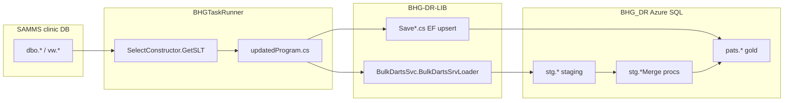

# Finance Domain — 14 Tables ETL Transformation Reference

**Scope:** Regional SAMMS P1 + P2 Finance domain (same 14 gold tables as `Regional_P1_P2_Source_to_Destination.md` §3).  
**Purpose:** Single reference for load path, `updatedProgram.cs` routing, RowChkSum / RowState, transforms, SPs, and related repo files.

---

## Related documentation & metadata (this folder)

| File | Purpose |
| --- | --- |
| `Csvs/finance_vw_MapActions.csv` | Task routing, source WHERE, `TaskName`, schedules |
| `Csvs/finance_vw_MapSrc2Dsn.csv` | Column rename map (`cltFName` → `FirstName`, etc.) |
| `Csvs/finance_map_coverage_check..csv` | Map coverage sanity check |
| `Csvs/finance_clientdemo_activity_copy_path.csv` | ClientDemo bulk vs EF activity paths |
| `finance_map_metadata_queries.sql` | Queries against `dms.tbl_MapSrc2Dsn` / task map |
| `columnsanddatatypesFinance.txt4` | Gold column types for finance tables |
| `../P1/P2-Analysis/Regional_P1_P2_Source_to_Destination.md` | Domain catalog + SP appendix |

---

## Shared pipeline architecture



### Global runner settings (`updatedProgram.cs`)

| Setting | Value | Lines |
| --- | --- | --- |
| `@WorkDate` substitution | `WorkDate + DaysBack` where **`DaysBack = -15`** | ~142–146 |
| SELECT build | `SelectConstructor.GetSLT()` from `dms.tbl_MapSrc2Dsn` via `db.WorkToDo` | ~120–127 |
| RowChkSum in SELECT | `ChkSumEnabled = true` unless **`ActionKey == 3`** | ~124 |
| Base command | `Select {strFlds} from {SrcSchema}.{FromTblVw}` | ~143 |
| Map WHERE | `strWhere` from `st.WhereCondition` with `@WorkDate` / `@SiteCode` replaced | ~144–147 |

**RowChkSum at source:** `SelectConstructor.GetSLT()` appends `CHECKSUM(mapped columns) RowChkSum` when `ChkSumEnabled` is true. The `RowChkSum` map row itself is skipped from the column list.

**Bulk path pattern (`BulkDartsSvc.cs`):**

1. `SqlBulkCopy` → staging table (`stg.*`)
2. `switch (dsnSchTbl)` → `exec stg.*Merge @SiteCode`
3. `Truncate Table {staging}` (except forms counts / forms samms client special cases)

**EF path pattern (`Save*.cs`):**

1. Pre-load Azure rows for site (scope varies)
2. Optional RowState pre-pass (soft-delete)
3. Per-row lookup by merge key
4. RowChkSum guard (if implemented) → map fields or skip
5. `SaveChanges()` (single or two-phase)

---

## Master table index

| # | Gold table | Source | Load | Method / SP | RowChkSum guard | RowState | Batch |
| --- | --- | --- | --- | --- | --- | --- | --- |
| 1 | `pats.tbl_Bills` | `dbo.tblBill` | EF | `SaveBills` | **Yes** | bool soft-delete | P1+P2 |
| 2 | `pats.tbl_pbi3PayAuth` | `dbo.tbl3PAYauth` | EF | `SaveAuths` | **Yes** | bool full cycle | P1 |
| 3 | `pats.tbl_vw3pBillSub` | `dbo.vw3pBillSub` | Bulk (+ EF B41/B42) | `sp_BillSubMerge` / `SaveAuthBillsub` | Bulk: SP · EF: stored only | bool (EF) | P1 |
| 4 | `pats.tbl_Fmp` | `dbo.tblFMP` | EF | `SaveFmp` | **No** | bool full cycle | P1 |
| 5 | `pats.tbl_PayerCltHistory` | `dbo.tblPayerCltHistory` | EF | `SavePayerCltHistory` | **No** | N/A | P1+P2 |
| 6 | `pats.tbl_FinancialHardshipApplication` | `dbo.FinancialHardshipApplication` | EF | `SaveFinancialHardshipApplication` | Stored, **not guarded** | bool via IsDeleted | P1 |
| 7 | `pats.tbl_3pElig` | `dbo.Tbl3pElig` | EF | `Save3pElig` | **Yes** | bool full cycle | P1 |
| 8 | `pats.tbl_ClaimLineItem` | `dbo.tbl3pClaimLineItem` | Bulk | `ClaimLineItemMerge` | SP MERGE | via SP | P2 |
| 9 | `pats.tbl_ClaimLineItemActivity` | `dbo.tbl3pClaimLineItemActivity` | Bulk | `ClaimLineItemActivityMerge` | SP MERGE | via SP | P2 |
| 10 | `pats.tbl_Claims` | `dbo.tbl3pClaim` | Bulk (+ EF 4 sites) | `ClaimsMerge` / `SaveClaims` | **Yes** (both paths) | bool (EF) | P2 |
| 11 | `pats.tbl_PayerClient` | `dbo.tblPayerClt` | EF | `SavePayerClient` / `RemovePayerClients` | Disabled (`if (1==1)`) | N/A (PyActive) | P2 |
| 12 | `pats.tbl_tbldiag10` | `dbo.Tbldiag10` | Bulk | `sp_tblDiag10Merge` | SP MERGE | via SP | P1 |
| 13 | `pats.tbl_ClientDemo1` | `dbo.tblclient` | Bulk (active) | `ClientDemoMerge1` | SP MERGE | via SP | P1 |
| 14 | `pats.tbl_ClientDemo2` | `dbo.tblclient` | Bulk (active) | `ClientDemoMerge2` | SP MERGE | via SP | P1 |

---

## 1. `pats.tbl_Bills`

### Files

| Role | Path |
| --- | --- |
| Runner | `BCAppCode/BHGTaskRunner/updatedProgram.cs` case `pats.tbl_bills` **~524–555** |
| Save logic | `BCAppCode/BHG-DR-LIB/SaveBills.cs` → `SaveBills()` |
| Model | `BCAppCode/BHG-DR-LIB/Models/TblBills.cs` |
| Documentation | `BCAppCode/BHG-DR-LIB/SaveBills-Documentation/SaveBills_ETL_Complete_Documentation.md` |
| Map metadata | `Csvs/finance_vw_MapActions.csv` (StepKey 3) · `Csvs/finance_vw_MapSrc2Dsn.csv` |

### Runner (`updatedProgram.cs`)

- **Ignores map WHERE** — custom filter instead of `strWhere`:
  - `year(billDate) >= year(WorkDate + BillDaysBack)` AND `billdate <= WorkDate + 12 days`
- **`Reload=true`** → `BillDaysBack = -728250` (effectively all history)
- Skips save if `SrcDt.Rows.Count == 0`
- Calls: `sd.SaveBills(SrcDt, SiteCode, WorkDate.Date, BillDaysBack, null)`

### Save logic (`SaveBills.cs`)

| Item | Detail |
| --- | --- |
| **Merge key** | `(SiteCode, BillId)` — `BillCltid` removed from lookup (2023) |
| **RowChkSum** | `if ((bill.RowChkSum != myrcs) \|\| NewRow)` → map ~18 bill fields |
| **RowState** | Pre-pass: active rows in Azure year window → `false`; re-set from `BillCltid <= 0` → false else true |
| **Transforms** | `BillReason` truncated to 2498 chars if > 2500; null RowChkSum treated as 0 |
| **Bulk SP** | None |

---

## 2. `pats.tbl_pbi3PayAuth`

### Files

| Role | Path |
| --- | --- |
| Runner | `updatedProgram.cs` case `pats.tbl_pbi3payauth` **~1344–1355** |
| Save logic | `BCAppCode/BHG-DR-LIB/SaveAuths.cs` → `SaveAuths()` |
| Model | `BCAppCode/BHG-DR-LIB/Models/TblPbi3Payauth.cs` |
| Documentation | `BCAppCode/BHG-DR-LIB/SaveAuths-Documentation/SaveAuths_ETL_Complete_Documentation.md` |

### Runner

- Standard map WHERE: `1 = 1` (full table)
- `sd.SaveAuths(SrcDt, SiteCode, null)`

### Save logic

| Item | Detail |
| --- | --- |
| **Merge key** | `(SiteCode, TpaId)` |
| **Pre-pass** | ALL site auths → `RowState = false` before loop |
| **RowChkSum** | `if (NewRow \|\| (rcs != auth.RowChkSum))` → map ~22 fields; on match only `RowState=true` + `LastModAt` |
| **RowState** | Full soft-delete cycle — rows not in extract stay false |
| **Transforms** | Date fields: `.Replace('-','/')` on several columns; `TpServ` truncated to 299 if length > 300 |

---

## 3. `pats.tbl_vw3pBillSub`

### Files

| Role | Path |
| --- | --- |
| Runner | `updatedProgram.cs` case `pats.tbl_vw3pbillsub` **~3131–3155** |
| Bulk | `BCAppCode/BHG-DR-LIB/BulkDartsSvc.cs` → `stg.tbl_vw3pbillsub` → **`exec stg.sp_BillSubMerge`** (~327) |
| EF (exception) | `SaveAuths.cs` → `SaveAuthBillsub()` |
| SP script | `BCAppCode/BHG-DR-LIB/AllSPs/SP_script.ipynb` → `# [stg].[sp_BillSubMerge]` |
| Documentation | `SaveAuths-Documentation/SaveAuths_ETL_Complete_Documentation.md` § SaveAuthBillsub |

### Runner

- SELECT transforms before extract:
  - `Select distinct`
  - `isnull(CptMod, ':(')`, `isnull(pySUBSID, ':(')`, `isnull(charge, 0)`
- **Site B41, B42:** `sd.SaveAuthBillsub(...)` — EF, no SP
- **All other sites:** `BulkDartsSrvLoader(SrcDt, "stg.tbl_vw3pbillsub", ...)`

### Bulk path

| Item | Detail |
| --- | --- |
| **Staging** | `stg.tbl_vw3pbillsub` |
| **SP** | `stg.sp_BillSubMerge @SiteCode` |
| **Merge key (typical)** | `(SiteCode, dsID, dsClt, Modifier)` + RowChkSum in MERGE WHEN clause |
| **Post-merge** | Staging truncated |

### EF path (`SaveAuthBillsub`) — B41/B42 only

| Item | Detail |
| --- | --- |
| **Merge key** | `SiteCode + DsId + PyPayerid + PySubsid + PyGroup + CptMod + Charge` |
| **RowChkSum** | Stored on object — **no skip guard** (always updates on match) |
| **RowState** | Pre-pass all → false; match path sets true |
| **Note** | Removes duplicate soft-deleted rows with alternate key before insert |

---

## 4. `pats.tbl_Fmp`

### Files

| Role | Path |
| --- | --- |
| Runner | `updatedProgram.cs` case `pats.tbl_fmp` **~1070–1081** |
| Save logic | `BCAppCode/BHG-DR-LIB/SaveFmp.cs` → `SaveFmp()` |
| Documentation | `BCAppCode/BHG-DR-LIB/SaveFmp-Documentation/SaveFmp_ETL_Complete_Documentation.md` |

### Runner

- Map WHERE: `1 = 1`
- `sd.SaveFmp(SrcDt, SiteCode, WorkDate.Date, null)` — **`wrkdt` unused** in save method

### Save logic

| Item | Detail |
| --- | --- |
| **Merge key** | `(SiteCode, FmpId)` |
| **RowChkSum** | **Not implemented** — all mapped fields overwritten every match |
| **RowState** | Pre-pass: all `RowState==true` → false; source rows → true (ignores source rowstate value) |
| **LastModAt** | Always `DateTime.Today` (not source value) |
| **Commit** | Two-phase: updates then `AddRange` new rows |

---

## 5. `pats.tbl_PayerCltHistory`

### Files

| Role | Path |
| --- | --- |
| Runner | `updatedProgram.cs` case `pats.tbl_payerclthistory` **~3156–3160** |
| Save logic | `BCAppCode/BHG-DR-LIB/SavePayorClient.cs` → `SavePayerCltHistory()` |
| Documentation | `BCAppCode/BHG-DR-LIB/SavePayorClient-Documentation/SavePayorClient_ETL_Complete_Documentation.md` |

### Runner

- Map WHERE: `pyDtm is not null and pyDtm >= @WorkDate` (15-day lookback)
- `sd.SavePayerCltHistory(SrcDt, SiteCode, WorkDate+DaysBack, false, null)`

### Save logic

| Item | Detail |
| --- | --- |
| **Merge key** | `(SiteCode, PchId)` |
| **RowChkSum** | **None** — no column on model |
| **RowState** | **None** |
| **Fields** | `PyId`, `PyChange`, `PyDtm`, `PyUser`, `PyNote` |
| **Known issue** | `UpdateRange(PCHUpd)` commented out — updates may not persist; inserts work via `AddRange` |

---

## 6. `pats.tbl_FinancialHardshipApplication`

### Files

| Role | Path |
| --- | --- |
| Runner | `updatedProgram.cs` case `pats.tbl_financialhardshipapplication` **~3415–3419** |
| Save logic | `BCAppCode/BHG-DR-LIB/SavePAData.cs` → `SaveFinancialHardshipApplication()` |
| Documentation | `BCAppCode/BHG-DR-LIB/SavePAData-Documentation/SavePAData_ETL_Complete_Documentation.md` |

### Runner

- Map WHERE: `1 = 1`
- `sd.SaveFinancialHardshipApplication(SrcDt, SiteCode, WorkDate+DaysBack, null)`

### Save logic

| Item | Detail |
| --- | --- |
| **Merge key** | `(SiteCode, Id)` |
| **RowChkSum** | Read from source and stored — **no compare guard**; all fields overwritten on match |
| **RowState** | Set from source; `IsDeleted=true` → `RowState=false` |
| **Commit** | Two-phase: in-loop updates + `AddRange` for new |

---

## 7. `pats.tbl_3pElig`

### Files

| Role | Path |
| --- | --- |
| Runner | `updatedProgram.cs` case `pats.tbl_3pelig` **~327–338** |
| Save logic | `BCAppCode/BHG-DR-LIB/Save3pElig.cs` → `Save3pElig()` |
| Documentation | `BCAppCode/BHG-DR-LIB/Save3pElig-Documentation/Save3pElig_ETL_Complete_Documentation.md` |

### Runner

- Map WHERE: `Year(edate) >= Year(@WorkDate)`
- `sd.Save3pElig(SrcDt, SiteCode, WorkDate+DaysBack, true, null)` — **`yearly=true`**

### Save logic

| Item | Detail |
| --- | --- |
| **Merge key** | `(SiteCode, EId)` |
| **Azure pre-load** | Rows where `EDate.Year >= wrkdt.Year` |
| **Pre-pass** | All loaded rows → `RowState = false` |
| **RowChkSum** | `if (pe.RowChkSum != rcs)` → map all eligibility fields + `LastModAt`; else only `RowState=true` |
| **New rows** | Initial `RowChkSum=0` to force insert mapping |

---

## 8–10. Claims family (`tbl_Claims`, `tbl_ClaimLineItem`, `tbl_ClaimLineItemActivity`)

### Files

| Role | Path |
| --- | --- |
| Runner Claims | `updatedProgram.cs` **~597–627** |
| Runner LineItem | **~628–643** |
| Runner Activity | **~645–663** |
| EF save | `BCAppCode/BHG-DR-LIB/SaveClaims.cs` |
| Bulk | `BCAppCode/BHG-DR-LIB/BulkDartsSvc.cs` **~278–285** |
| SP scripts | `AllSPs/SP_script.ipynb` → `# [stg].[ClaimsMerge]`, `[ClaimLineItemMerge]`, `[ClaimLineItemActivityMerge]` |
| Documentation | `BCAppCode/BHG-DR-LIB/SaveClaim-Documentation/Claims_ETL_Complete_Documentation.md` |

### Runner — Claims (`pats.tbl_claims`)

| Path | Sites | Logic |
| --- | --- | --- |
| **EF** | VBRA, VMIN, VWBY, VBRP | `strWhere` applied; `SaveClaims(..., yearly:true)` |
| **Bulk** | All others | **No WHERE on bulk path** — full table SELECT (`strCmd` only); `BulkDartsSrvLoader` → `stg.tbl_claims` |

RowTrax: destination count uses `RowState = 1`.

### Runner — LineItem & Activity

- **Always bulk** — full table extract (map WHERE not applied on bulk path)
- `BulkDartsSrvLoader` → `stg.tbl_claimlineitem` / `stg.tbl_claimlineitemactivity`

### Bulk SPs

| SP | Staging | Gold | BulkDartsSvc case |
| --- | --- | --- | --- |
| `stg.ClaimsMerge` | `stg.tbl_claims` | `pats.tbl_Claims` | ~279 |
| `stg.ClaimLineItemMerge` | `stg.tbl_claimlineitem` | `pats.tbl_ClaimLineItem` | ~282 |
| `stg.ClaimLineItemActivityMerge` | `stg.tbl_claimlineitemactivity` | `pats.tbl_ClaimLineItemActivity` | ~285 |

All accept `@SiteCode`. Staging truncated after merge. MERGE uses **RowChkSum** difference to skip unchanged rows (see Claims doc).

### EF save (`SaveClaims.cs`) — 4-site exception

| Method | Merge key | RowChkSum | RowState |
| --- | --- | --- | --- |
| `SaveClaims` | `(SiteCode, TpcId)` | Guarded | Year-scoped pre-reset when `yearly=true` |
| `SaveClaimLineItem` | `(SiteCode, TpcliId)` | Guarded | Same pattern (backfill / non-bulk) |
| `SaveClaimLineItemActivity` | `(SiteCode, LiaId)` | Guarded | Same pattern |
| `CleanupDeletedData` | Reconciliation | N/A | C# helper — not an SP |

---

## 11. `pats.tbl_PayerClient`

### Files

| Role | Path |
| --- | --- |
| Runner | `updatedProgram.cs` case `pats.tbl_payerclient` **~1306–1343** |
| Save logic | `SavePayorClient.cs` → `SavePayerClient()` / `RemovePayerClients()` |
| Documentation | `SavePayorClient-Documentation/SavePayorClient_ETL_Complete_Documentation.md` |

### Runner

- **`Reload=true`:** skips WHERE (full site slice)
- **Else:** map WHERE with 360-day payer history / active / end-date logic
- Routes by source view:
  - `vw_PayerClt_INACTIVE` → `RemovePayerClients` (soft deactivate)
  - else → `SavePayerClient(..., yearly:true)`

### Save logic (`SavePayerClient`)

| Item | Detail |
| --- | --- |
| **Merge key** | `PyId + Abs(PyCltid)` within site |
| **RowChkSum** | Read from source; guard **disabled** — `if (1 == 1)` always maps all columns |
| **RowState** | No RowState column — uses `PyActive` |
| **RemovePayerClients** | Sets `PyActive=false` for inactive view rows |

---

## 12. `pats.tbl_tbldiag10`

### Files

| Role | Path |
| --- | --- |
| Runner | `updatedProgram.cs` case `pats.tbl_tbldiag10` **~509–514** |
| Bulk | `BHG-DR-LIB_updated/BulkDartsSvc.cs` case `stg.tbl_tbldiag10` **~329–330** |
| Legacy EF | `SaveBAM.cs` → `SaveTblDiags()` (**commented out** in runner) |
| SP script | `AllSPs/SP_script.ipynb` → `# [stg].[sp_tblDiag10Merge]` |
| Documentation | `SaveBAM-Documentation/SaveBAM_ETL_Complete_Documentation.md` (diag10 section) |

### Runner (active path)

- Map WHERE: `1 = 1`
- **`SaveTblDiags` commented out**
- Active: `BulkDartsSrvLoader(SrcDt, "stg.tbl_tbldiag10", SiteCode, ...)`

### Bulk path

| Item | Detail |
| --- | --- |
| **SP** | `stg.sp_tblDiag10Merge @SiteCode` |
| **Staging** | `stg.tbl_tbldiag10` → truncate after merge |
| **Caveat** | Base `BHG-DR-LIB/BulkDartsSvc.cs` **missing** `stg.tbl_tbldiag10` case — only in `BHG-DR-LIB_updated` |

### Legacy EF (`SaveTblDiags`) — not called by runner today

| Item | Detail |
| --- | --- |
| **Merge key** | `(SiteCode, dgID)` |
| **RowChkSum** | No |
| **RowState** | No ETL RowState |

---

## 13–14. `pats.tbl_ClientDemo1` + `pats.tbl_ClientDemo2`

### Files

| Role | Path |
| --- | --- |
| Runner bulk (active SAMMS) | `updatedProgram.cs` case **`stg.clientdemo`** **~664–680** |
| Runner EF (disabled map rows) | `pats.tbl_clientdemo1` **~682–712**, `pats.tbl_clientdemo2` **~713–725** |
| Bulk | `BulkDartsSvc.cs` **~287–289** → `ClientDemoMerge1` then `ClientDemoMerge2` |
| EF (legacy) | `SaveCleints.cs` → `SaveClientDemo1var` / `SaveClientDemo2` |
| SP scripts | `# [stg].[ClientDemoMerge1]`, `# [stg].[ClientDemoMerge2]` |
| Documentation | `SaveCleints-Documentation/SaveCleints_ETL_Complete_Documentation.md` |
| Column map | `Csvs/finance_vw_MapSrc2Dsn.csv` · `finance_clientdemo_activity_copy_path.csv` |

### Runner — active bulk path (`stg.clientdemo`)

- **Custom inline SELECT** from `dbo.tblClient` — **not** map-built `strFlds`
- Injects `SiteCode`, explicit column list, and inline **`CHECKSUM(...)` as RowChkSum**
- Full client table — no date WHERE
- `BulkDartsSrvLoader(SrcDt, "stg.clientdemo", ...)`

### Bulk pipeline

```text
dbo.tblClient  →  stg.ClientDemo  →  ClientDemoMerge1  →  pats.tbl_ClientDemo1
                                   →  ClientDemoMerge2  →  pats.tbl_ClientDemo2
                                   →  TRUNCATE stg.ClientDemo
```

| Item | Detail |
| --- | --- |
| **Shared staging** | One row per client in `stg.ClientDemo` |
| **Split** | Vertical column split via MERGE SPs + map metadata — **not** 50/50 row split |
| **Merge key** | `(SiteCode, ClientID)` on both gold tables |
| **RowChkSum** | Computed in runner SELECT; SP MERGE uses checksum diff |
| **EF map rows** | `pats.tbl_ClientDemo1/2` in map are **Enabled=0** — EF path inactive for SAMMS |

### Legacy EF paths (if map enabled)

| Table | Method | RowChkSum | RowState |
| --- | --- | --- | --- |
| ClientDemo1 | `SaveClientDemo1var` | Guarded | int 1/0; ActionKey=1 pre-reset |
| ClientDemo2 | `SaveClientDemo2` | Guarded | int 1/0; ActionKey=1 pre-reset |

---

## Stored procedures — location & availability

| SP | In `SP_script.ipynb` | Wired in `BulkDartsSvc` | Notes |
| --- | --- | --- | --- |
| `stg.sp_BillSubMerge` | Yes | `BHG-DR-LIB` ~327 | Production bulk BillSub |
| `stg.ClaimsMerge` | Yes | ~279 | |
| `stg.ClaimLineItemMerge` | Yes | ~282 | |
| `stg.ClaimLineItemActivityMerge` | Yes | ~285 | |
| `stg.sp_tblDiag10Merge` | Yes | **`BHG-DR-LIB_updated` only** ~330 | Confirm prod deploy |
| `stg.ClientDemoMerge1` | Yes | ~288 | Runs first |
| `stg.ClientDemoMerge2` | Yes | ~289 | Runs second |

**Live database:** `bhgazuresql01` / `BHG_DR` / schema `stg`  
**Repo export:** `BCAppCode/BHG-DR-LIB/AllSPs/SP_script.ipynb` (search `# [stg].[ProcName]`)

**Typical SP MERGE pattern (bulk tables):**

```sql
MERGE pats.{GoldTable} AS tgt
USING stg.{StagingTable} AS src ON ...
WHEN MATCHED AND tgt.RowChkSum <> src.RowChkSum THEN UPDATE ...
WHEN NOT MATCHED BY TARGET THEN INSERT ...
-- RowState / LastModAt updated in SP per table
```

Port this logic to Fabric Delta MERGE — do not call Azure SPs from Fabric pipelines.

---

## Complete file index (BHG-DR-LIB)

| Gold table | C# save file | Method(s) | Documentation folder |
| --- | --- | --- | --- |
| `tbl_Bills` | `SaveBills.cs` | `SaveBills` | `SaveBills-Documentation/` |
| `tbl_pbi3PayAuth` | `SaveAuths.cs` | `SaveAuths` | `SaveAuths-Documentation/` |
| `tbl_vw3pBillSub` | `SaveAuths.cs` + `BulkDartsSvc.cs` | `SaveAuthBillsub` / bulk | `SaveAuths-Documentation/` |
| `tbl_Fmp` | `SaveFmp.cs` | `SaveFmp` | `SaveFmp-Documentation/` |
| `tbl_PayerCltHistory` | `SavePayorClient.cs` | `SavePayerCltHistory` | `SavePayorClient-Documentation/` |
| `tbl_FinancialHardshipApplication` | `SavePAData.cs` | `SaveFinancialHardshipApplication` | `SavePAData-Documentation/` |
| `tbl_3pElig` | `Save3pElig.cs` | `Save3pElig` | `Save3pElig-Documentation/` |
| `tbl_Claims` | `SaveClaims.cs` + `BulkDartsSvc.cs` | `SaveClaims` / bulk | `SaveClaim-Documentation/` |
| `tbl_ClaimLineItem` | `SaveClaims.cs` + `BulkDartsSvc.cs` | `SaveClaimLineItem` / bulk | `SaveClaim-Documentation/` |
| `tbl_ClaimLineItemActivity` | `SaveClaims.cs` + `BulkDartsSvc.cs` | `SaveClaimLineItemActivity` / bulk | `SaveClaim-Documentation/` |
| `tbl_PayerClient` | `SavePayorClient.cs` | `SavePayerClient`, `RemovePayerClients` | `SavePayorClient-Documentation/` |
| `tbl_tbldiag10` | `SaveBAM.cs` (legacy) + `BulkDartsSvc.cs` | `SaveTblDiags` / bulk | `SaveBAM-Documentation/` |
| `tbl_ClientDemo1` | `SaveCleints.cs` + `BulkDartsSvc.cs` | `SaveClientDemo1var` / bulk | `SaveCleints-Documentation/` |
| `tbl_ClientDemo2` | `SaveCleints.cs` + `BulkDartsSvc.cs` | `SaveClientDemo2` / bulk | `SaveCleints-Documentation/` |

### Supporting infrastructure files

| File | Role |
| --- | --- |
| `BCAppCode/BHGTaskRunner/updatedProgram.cs` | Task orchestration, WHERE overrides, bulk vs EF routing |
| `BCAppCode/BHGTaskRunner/Program.cs` | Production twin of runner (same case labels) |
| `BCAppCode/BHG-DR-LIB/BulkDartsSvc.cs` | SqlBulkCopy + SP dispatch |
| `BCAppCode/BHG-DR-LIB_updated/BulkDartsSvc.cs` | Updated bulk loader (+ Diag10 merge) |
| `BCAppCode/BHG-DR-LIB/SelectConstructor.cs` | SELECT + CHECKSUM RowChkSum builder |
| `BCAppCode/BHG-DR-LIB/SQLSvrManager.cs` | Source/dest SQL execution |
| `BCAppCode/BHG-DR-LIB/Models/BHG_DRContext.cs` | EF DbContext |
| `BCAppCode/Framework/vw_mapAction.csv` | Task / WHERE metadata export |
| `BCAppCode/Framework/vw_MapSrc2Dsn.csv` | Column mapping export |

---

## RowChkSum summary (all 14)

| Table | RowChkSum in SELECT | Guard skips unchanged? |
| --- | --- | --- |
| Bills | Yes (map) | **Yes** |
| pbi3PayAuth | Yes | **Yes** |
| vw3pBillSub | Yes (bulk inline / map) | Bulk: SP · EF B41/B42: **No** |
| Fmp | Yes (map) but ignored | **No** |
| PayerCltHistory | N/A | **No** |
| FinancialHardshipApplication | Yes | **No** (always overwrite) |
| 3pElig | Yes | **Yes** |
| Claims / LineItem / Activity | Yes | Bulk: SP · EF 4 sites: **Yes** |
| PayerClient | Yes | **No** (`if (1==1)`) |
| tbldiag10 | Yes (bulk inline) | Bulk: SP |
| ClientDemo1/2 | Yes (runner inline CHECKSUM) | Bulk: SP |

---

## Fabric migration notes

1. **7 bulk tables:** Port `SP_script.ipynb` MERGE logic + staging truncate pattern to Silver→Gold Delta MERGE.
2. **7 EF tables:** Port `Save*.cs` upsert logic; replicate RowState pre-passes where used.
3. **Runner overrides:** Bills date window, BillSub SELECT distinct/isnull, ClientDemo inline SELECT, Claims bulk full-table load — must be replicated in Fabric task config.
4. **Site exceptions:** BillSub B41/B42 (EF); Claims VBRA/VMIN/VWBY/VBRP (EF).
5. **Verify Diag10:** Production must call `sp_tblDiag10Merge` after bulk load (`BHG-DR-LIB_updated` wiring).

---

*Generated from `BHG-DR-LIB` source, `updatedProgram.cs`, `AllSPs/SP_script.ipynb`, and existing `Save*-Documentation` files. Line numbers refer to `updatedProgram.cs` and `BulkDartsSvc.cs` as of repo snapshot.*
