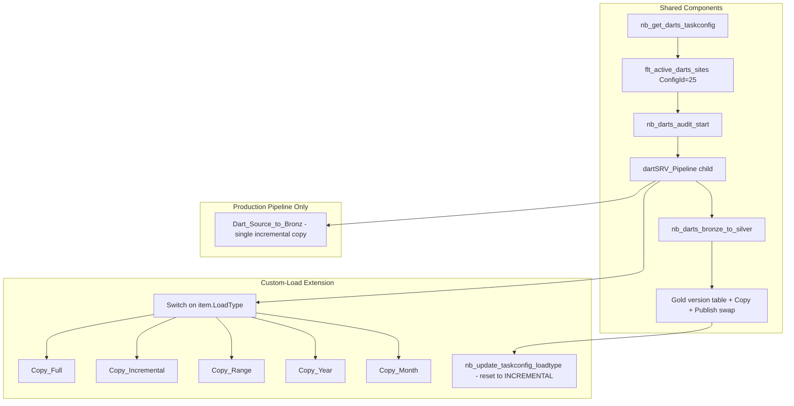

# P1 Reference & DartsSrv Custom Load — Technical Assessment

Consolidated analysis comparing the DartsSrv production pipeline (`dartdefintion.txt`) with the DartsSrv custom-load extension (`dartcustomloaddefintion.txt`), and evaluating feasibility of applying the custom-load pattern to P1 Reference (`pl_p1_reference.txt`).

---

## 1. DartsSrv: Production Pipeline vs Custom-Load Extension

### Purpose at a Glance

| Aspect | Production (`dartdefintion.txt`) | Custom Load (`dartcustomloaddefintion.txt`) |
|--------|--------------------------------|---------------------------------------------|
| **Goal** | Daily scheduled incremental load | Daily incremental load **plus** one-off backfills |
| **Load modes** | Single mode: incremental lookback (15 days) | Six modes: `FULL`, `INCREMENTAL`, `RANGE`, `YEAR`, `MONTH`, + fail default |
| **TaskConfig table** | `bhg_bronze.meta.taskconfig` | `bhg_bronze.meta.taskconfig_custom_load` |
| **After success** | Audit finalize → complete | Audit finalize **after auto-resetting** sites back to `INCREMENTAL` |
| **Published** | 2026-06-19 / 06-22 | 2026-07-01 / 07-10 |

### Architecture — Shared vs Different



**Shared:** Parent orchestration, audit start, Silver MERGE on `RowChkSum`, Gold versioned swap, optional-column lookup, CHECKSUM logic, site foreach (batch 5).

**Different:** Bronze extraction strategy and TaskConfig lifecycle.

### Child Pipeline — Primary Difference

#### Production pipeline (`dartSRV_Pipeline`)

One active copy activity: **`Dart_Source_to_Bronz`**

- Depends on `lkp_check_optional_columns_exist`
- Always uses **lookback-based incremental** filter:

```sql
WHERE dsClt IS NOT NULL
  AND (
       dsdtstart  >= today - p_lookback_days
    OR dsDtAdded  >= today - p_lookback_days
    OR dsUpdate  >= today - p_lookback_days
    OR dsBilled  >= today - p_lookback_days
    OR dsSigDate >= today - p_lookback_days
    OR dsClt <= 0          -- placeholder patients always included
  )
```

#### Custom-load extension (`dartSRV_Pipeline`)

The original copy activity is **retained but set to `Inactive`**. A **`Switch1`** activity routes on `@item().LoadType`:

| LoadType | Activity | WHERE logic |
|----------|----------|-------------|
| **FULL** | `Copy_Full_Bronze_DartSrv` | `dsClt IS NOT NULL` only — entire site history |
| **INCREMENTAL** | `Copy_Incremental_Bronze_DartSrv` | Same 5-date + lookback as production |
| **RANGE** | `Copy_Range_Bronze_DartSrv` | `FromDate` / `ToDate` from TaskConfig, `BETWEEN` on all 5 date columns |
| **YEAR** | `Copy_Year_Bronze_DartSrv` | `YearValue` — `YEAR(col) = YearValue` on each date column |
| **MONTH** | `Copy_Month_Bronze_DartSrv` | `YearValue` + `MonthValue` on each date column |
| **default** | `Fail Invalid Load` | Error 400 if LoadType is missing/invalid |

### TaskConfig — Standard vs Custom Load

| | Production | Custom Load |
|---|------------|-------------|
| Table | `meta.taskconfig` | `meta.taskconfig_custom_load` |
| Per-site columns | Site, DB, source table | + `LoadType`, `FromDate`, `ToDate`, `YearValue`, `MonthValue`, `IsIncremental`, `LookbackDays` |
| Post-run | None | `nb_update_taskconfig_loadtype` resets `FULL`/`RANGE`/`YEAR`/`MONTH` → `INCREMENTAL` |

### Parent Pipeline Additions (Custom Load)

```
Publish_DartsSrv_Versioned_Gold
    → nb_update_taskconfig_loadtype
        → nb_darts_audit_finalize_success
```

### Silver / Gold

- **Silver:** Nearly identical RowChkSum MERGE. The production pipeline includes additional defensive blank-column cleanup before MERGE.
- **Gold:** Same versioned swap pattern in both implementations.

### Summary

```
PRODUCTION PIPELINE              CUSTOM-LOAD EXTENSION
───────────────────              ─────────────────────
Daily incremental baseline       Backfill / ops control layer
Single extraction path           Six extraction paths via Switch
Standard taskconfig              Extended taskconfig_custom_load
Scheduled incremental only       FULL / RANGE / YEAR / MONTH support
                                 Auto-reset after successful backfill
```

---

## 2. Load Type Routing: Incremental vs Range

The pipeline does **not** auto-detect load type from data. It reads **`LoadType` from TaskConfig per site**.

```text
taskconfig_custom_load (DB row per site)
        ↓
nb_get_darts_taskconfig  (reads table at run time)
        ↓
flt_active_darts_sites   (filters ConfigId=25, active sites)
        ↓
child ForEach (one item per site)
        ↓
Switch1 on @item().LoadType
        ↓
Copy_Incremental  OR  Copy_Range  OR  Copy_Full  etc.
```

Decision point in child pipeline:

```json
"on": {
    "value": "@item().LoadType",
    "type": "Expression"
}
```

Each site in the foreach is routed **independently** within the same pipeline run.

### Example TaskConfig rows

**Daily scheduled run:**

| SiteCode | LoadType | FromDate | ToDate |
|----------|----------|----------|--------|
| ABC | INCREMENTAL | null | null |
| XYZ | INCREMENTAL | null | null |

**Targeted backfill for one site:**

| SiteCode | LoadType | FromDate | ToDate |
|----------|----------|----------|--------|
| ABC | RANGE | 2018-01-01 | 2018-12-31 |
| XYZ | INCREMENTAL | null | null |

Same run: ABC → `Copy_Range`, XYZ → `Copy_Incremental`.

### Post-backfill behavior

On success, **`nb_update_taskconfig_loadtype`** resets sites on `FULL`/`RANGE`/`YEAR`/`MONTH` back to **`INCREMENTAL`** and clears date fields.

### Production pipeline (`dartdefintion.txt`)

No Switch activity and no `LoadType` routing — every site always executes the single incremental copy path.

---

## 3. P1 Reference: Custom Load Feasibility

### Current P1 Reference Architecture

| Component | Details |
|-----------|---------|
| **Parent** | `pl_execute_reference` |
| **Bronze child** | `pl_reference` — 9 methods, each with Filter + ForEach |
| **Silver child** | `pl_reference_bronz_to_silver` — 9 Silver notebooks |
| **Sites** | 115 SAMMS clinics |
| **TaskConfig** | ConfigId **88** (Bronze), ~**1,062 rows** |
| **Terminal layer** | **Silver only** (no Gold publish in parent) |

### The 9 Reference Entities

| Method | Source table | Bronze load behavior today |
|--------|--------------|----------------------------|
| SaveClinic | tblClinic | **Full table** (`WHERE 1 = 1`) |
| Save3pSetup | tbl3PSETUP | **Full table** |
| SaveCodes | tblCodes | **Full table** |
| SaveServices | tblSERVICES | **Full table** |
| SavedropDownListItems | DroDownListItems | **Full table** |
| SaveCustomAnswers | tblCUSTOMANSWERS | **Full table** |
| SaveCustomQuestions | tblCUSTOMQUESTIONS | **Full table** |
| SavePreAdmissionV6 | SF_PatientPreAdmission | **Full table** (quality filters, not dates) |
| SavePreAdminReferrals | SF_PatientPreadmissionReferralSource | **Incremental** (515-day lookback) |

TaskConfig already includes `LoadType`, `IsIncremental`, and `LookbackDays` — but the **pipeline does not Switch on these values**.

### Why Custom Load Fits DartsSrv — Not P1 Reference

```text
DartsSrv                          P1 Reference
────────                          ────────────
1 entity (DartSrv)                9 entities
Date-based incremental            8/9 = full dimension extract every run
RANGE/YEAR/MONTH meaningful       RANGE/YEAR meaningless for Clinic/Codes
Bronze → Silver → Gold            Bronze → Silver only
1 Switch × 5 load types           9 Switches × 5 = 45 copy paths
```

For **Clinic, Codes, Services, Dropdowns, Custom Q&A** — these are small lookup/dimension tables. The pipeline already extracts the **entire table** on each run; **Silver RowChkSum MERGE** handles deduplication. `RANGE` / `YEAR` / `MONTH` load types do not apply without date-based watermarks at source.

---

## 4. Effort Estimate: Full Custom Load Port to P1 Reference

| Work item | Effort | Risk |
|-----------|--------|------|
| `taskconfig_custom_load` for 1,062+ rows | Medium | Schema drift |
| Switch per method (9) in Bronze child | **Very High** | JSON bloat (~6500 → 15,000+ lines) |
| Duplicate Copy SQL × 5 load types | **Very High** | Fabric activity limits |
| Extend `nb_get_p1_reference_taskconfig` | Low | — |
| Add reset notebook on parent | Low–Medium | ConfigId 88, 9 methods |
| Adapt audit notebook | Medium | Already method-aware |
| Silver notebooks | **None** | MERGE unchanged |
| Test 115 sites × 9 methods × load types | **Very High** | Weeks |

**Overall: High effort — approximately 3–5 weeks.**

**Difficulty: 8/10** (DartsSrv custom load is ~4/10 due to single-entity scope).

---

## 5. Recommendation

### Not recommended: full Darts-style custom-load framework

1. **8 of 9 tables are already full load** — Switch adds complexity without changing extraction behavior.
2. **RANGE/YEAR/MONTH require date columns** — not applicable to dimension/lookup tables.
3. **Pipeline is already at high complexity** — 9 ForEach blocks, 9 Silver notebooks, method-level audit.
4. **Silver layer is already idempotent** — RowChkSum MERGE makes full re-extract safe.
5. **Different terminal layer** — Reference terminates at Silver; DartsSrv publishes to Gold.

### Recommended: lighter alternatives (mostly available today)

| Need | Solution | Effort |
|------|----------|--------|
| Reload **one site** | Set `IsActive=1` only for that site's TaskConfig rows | **Low — supported today** |
| Reload **one method** | Deactivate other methods in TaskConfig | **Low — supported today** |
| Reload **one site + one method** | Combine above | **Low** |
| Full re-extract one method | All sites active; method already performs full table extract | **Default behavior** |
| Date-range backfill for **PreAdmin Referrals** | Add Switch **only** on `SavePreAdminReferrals` | **Medium — reasonable** |
| Date-range for **PreAdmission V6** | Add date filter to SQL, then optional Switch | **Medium** |

### Existing capabilities

```text
✓ TaskConfig-driven site list (nb_get_p1_reference_taskconfig)
✓ Per-method ForEach with table-exists lookup
✓ Site success marking (br_p1_reference_site_success)
✓ Method-level Bronze/Silver result JSON for audit
✓ RowChkSum MERGE in Silver
✓ LoadType / IsIncremental in TaskConfig (metadata only)
```

### Gaps relative to DartsSrv custom load

```text
✗ Switch on LoadType in Bronze pipeline
✗ taskconfig_custom_load separate table
✗ FromDate / ToDate / YearValue / MonthValue per site row
✗ Auto-reset to INCREMENTAL after successful backfill
```

For reference data, the first three gaps provide limited operational value.

---

## 6. Decision Matrix

| Option | Effort | Value | Verdict |
|--------|--------|-------|---------|
| Full custom load on all 9 methods | Very High | Low for 8/9 tables | **Not recommended** |
| IsActive site/method targeting | None | High for operations | **Recommended — use now** |
| Switch for PreAdminReferrals only | Medium | High if date backfills required | **Recommended — if needed** |
| FULL vs INCREMENTAL Switch for Clinic/Codes | Medium | Minimal (already full extract) | **Skip** |
| Shared reset notebook only | Low | Medium (framework consistency) | **Optional** |

---

## 7. Operational Examples

### Targeted backfill — one site, one method (no pipeline changes)

```sql
-- Backfill only site AHK for SaveCodes
UPDATE meta.taskconfig
SET IsActive = CASE
  WHEN ConfigId = 88 AND Method = 'SaveCodes' AND SiteCode = 'AHK' THEN 1
  WHEN ConfigId = 88 THEN 0
  ELSE IsActive
END;
```

Run pipeline, then reactivate all sites.

### DartsSrv date-range backfill (custom load)

```sql
UPDATE taskconfig_custom_load
SET LoadType = 'RANGE',
    FromDate = '2018-01-01',
    ToDate   = '2018-12-31'
WHERE SiteCode = 'ABC' AND ConfigId = 25;
```

Run pipeline → on success, configuration auto-resets to `INCREMENTAL`.

---

## 8. Conclusions

| Question | Answer |
|----------|--------|
| **DartsSrv: production vs custom load?** | Production pipeline implements daily incremental extraction. Custom-load extension adds backfill controls on Bronze and TaskConfig. Silver and Gold layers are shared. |
| **How is incremental vs range determined?** | `LoadType` on each site row in `taskconfig_custom_load`; Switch reads `@item().LoadType` per site. Not auto-detected from data. |
| **P1 Reference full custom load — effort?** | **High (8/10)**, ~3–5 weeks, significant ongoing maintenance. |
| **Recommended for P1 Reference?** | **Full framework: no.** **IsActive targeting: yes.** **Switch for Referrals only: yes, if required.** |
| **Recommended path** | Maintain current Reference pipeline; use TaskConfig `IsActive` for operational backfills; add Switch and reset logic only for date-driven methods if business requires historical range loads. |

---

## 9. Related Artifacts

| File | Description |
|------|-------------|
| `BCAppCode/SaveDartsSrvDocumentation/dartdefintion.txt` | DartsSrv production pipeline definition |
| `BCAppCode/SaveDartsSrvDocumentation/dartcustomloaddefintion.txt` | DartsSrv custom-load extension definition |
| `BCAppCode/P1-Implmentation/P1-reference/pl_p1_reference.txt` | P1 Reference parent and child pipeline JSON |
| `BCAppCode/P1-Implmentation/P1-reference/reference_module_taskconfig_pyspark.py` | Reference TaskConfig seed script |
| `BCAppCode/P1-Implmentation/P1-reference/nb_audit_reference` | Reference audit notebook |
| `BCAppCode/Framework/nb_get_active_taskconfig.md` | Shared TaskConfig reader pattern |

---

*Document version: 1.1 — 2026-07-13*
