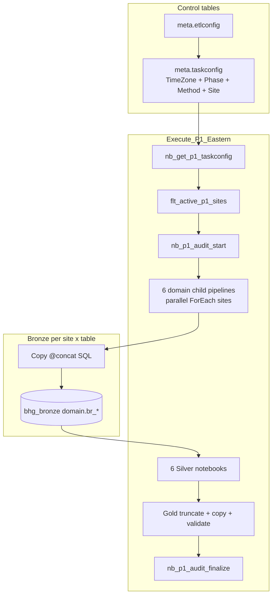

# Regional P1 — Fabric ETL Flow, Timezone Split, and Control Tables

How to migrate **Regional ETL P1** from the legacy C# scheduler/runner into **Microsoft Fabric**, using the same pattern already implemented for **Notes** (`Execute_Notes` / `pl_notes_samms_to_lakehouse`) and the shared **control/audit** framework in `bhg_bronze.meta.*`.

**Related docs:**

| File | Purpose |
|------|---------|
| `Regional_P1_P2_Source_to_Destination.md` | 57 P1 + 17 P2 source/destination mapping, row counts |
| `P1_Fabric_Pipeline_Implementation_Guide.md` | Domain-grouped Bronze/Silver/Gold design (6 child pipelines) |
| `BCAppCode/BHG-DR-LIB/Save3pElig-Documentation/notesdefinetion.txt` | Notes parent/child pipeline JSON (reference implementation) |
| `BCAppCode/Framework/nb_get_active_taskconfig.md` | Notebook to read `meta.taskconfig` without Lookup 4 MB limit |
| `BCAppCode/Framework/controlAudittables.txt` | Control table schemas and usage |

---

## 1. What the C# system does today

```
Scheduler.exe (daily)
  → creates parent tasks: Eastern/Central/Mountain/Pacific ETL P1
  → creates child tasks: one per (site × destination table) from dms.vw_MapAction
  → assigns batch via CASE in updatedSchedulerProgrma.cs (timezone + P1 exclude list)

BHGTaskRunner.exe 2 (one job)
  → picks up ALL four P1 parent batches
  → runs ~6,000+ child tasks sequentially (site × table)
  → each child: SELECT from clinic SAMMS → Save* upsert into shared BHG_DR table
```

**Site counts by timezone (approx.):**

| Timezone | Parent batch | Sites | P1 tables per site |
|----------|--------------|-------|---------------------|
| EST | Eastern ETL P1 | 43 | 52–53 |
| CST | Central ETL P1 | 56 | 52–53 |
| MST | Mountain ETL P1 | 12 | 54–55 |
| PST | Pacific ETL P1 | 4 | 54–55 |

**Important:** The same **BHG_DR table name** (e.g. `pats.tbl_CheckIn`) is processed in every timezone batch, but **each clinic runs only once** — in its own timezone parent. All rows land in one shared Gold table keyed by `SiteCode`.

---

## 2. Notes pattern — the Fabric template to copy

The Notes ETL (`notesdefinetion.txt`) is the **reference “normal ETL”** already in production:

```
Execute_Notes (parent pipeline)
│
├── nb_get_notes_taskconfig          ← Spark reads meta.taskconfig (ConfigId=34)
├── flt_active_notes_sites           ← Filter: IsActive=1, Method in (3pArnote, 3pClaimNote)
├── nb_notes_audit_start             ← START_LAYER_RUNS → pipelinerun, taskqueue, taskaudit
│
├── Executed_AfterBronz
│     └── pl_notes_samms_to_lakehouse (child)
│           ├── flt_child_arnote_sites / flt_child_claimnote_sites
│           ├── fe_each_samms_site_* (ForEach, batchCount: 5, parallel)
│           │     ├── lkp_check_*_globalbatchid_exists
│           │     └── cp_*_to_bronze  (@concat SQL → Bronze Append)
│
├── nb_3parnote_bronze_to_silver     ← parallel
├── nb_3pclaimnote_bronze_to_silver  ← parallel
├── Prepare_Notes_Versioned_Gold_Tables
├── copy_*_silver_to_gold
├── Publish_Notes_Versioned_Gold
├── nb_notes_audit_finalize_success
└── nb_notes_audit_finalize_failure
```

**Pipeline parameters (parent):**

| Parameter | Purpose |
|-----------|---------|
| `p_ingest_run_id` | `pipeline().RunId` — tags Bronze/Silver rows |
| `p_work_date` | C# `st.WorkDate` equivalent |
| `p_lookback_days` | Normally 15 |

**Control tables used:**

| Table | Role |
|-------|------|
| `meta.etlconfig` | One row per layer (Bronze / Silver / Gold) |
| `meta.taskconfig` | One row per executable task (site × method for Bronze) |
| `meta.pipelinerun` | One run row per layer per parent execution |
| `meta.taskqueue` | Per-task status during the run |
| `meta.taskaudit` | Per-site Bronze results |
| `meta.dataquality` | Row counts, validation after Silver/Gold |

Regional P1 follows the **same skeleton** — with more tables (57) grouped into **domain child pipelines** instead of one child with two methods.

---

## 3. C# → Fabric mapping

| Legacy C# | Fabric equivalent |
|-----------|-------------------|
| `updatedSchedulerProgrma.cs` CASE (timezone + P1/P2 lists) | Columns on `meta.taskconfig`: `TimeZone`, `Phase` |
| `dms.vw_MapAction` + `vw_MapSrc2Dsn` | `taskconfig` rows: `SiteCode`, `DataBaseName`, `SourceTable`, `Method`, `TargetTable` |
| `tsk.tbl_Tasks2` child queue | `meta.taskqueue` + ForEach over filtered `taskconfig` |
| `BHGTaskRunner.exe 2` | Parent pipeline `Execute_P1_*` (or single `Execute_P1`) |
| `SaveCheckIn`, `SaveBills`, etc. | Copy activity `@concat` SQL → Bronze; Silver notebook Delta MERGE |
| `RowChkSum` / EF upsert | Same CHECKSUM in Copy SQL; MERGE on `_site_code + PK + RowChkSum` |
| `tsk.tbl_RowTrax` | `meta.taskaudit` + `meta.dataquality` |

---

## 4. Two Fabric orchestration options

### Option A — Mirror C# (four timezone parent pipelines)

Use when operations needs **staggered run windows** (East before West, P2 after P1 per zone).

```
Execute_P1_Eastern    (trigger: e.g. 4:00 AM EST)
Execute_P1_Central    (trigger: e.g. 5:00 AM CST)
Execute_P1_Mountain   (trigger: e.g. 6:00 AM MST)
Execute_P1_Pacific    (trigger: e.g. 7:00 AM PST)
```

Each parent has **identical activity structure**; only the **site filter** changes (`TimeZone = EST|CST|MST|PST`).

Optional daily wrapper:

```
pl_daily_regional_p1
├── Execute_P1_Eastern   → waitOnCompletion
├── Execute_P1_Central   → waitOnCompletion
├── Execute_P1_Mountain  → waitOnCompletion
└── Execute_P1_Pacific   → waitOnCompletion
```

Then run `Execute_P2_*` parents after P1 completes (same pattern, `Phase = P2`).

### Option B — One national parent (recommended for initial build)

Use when **parallel Fabric execution** is preferred over timezone stagger.

```
Execute_P1  (one daily trigger)
├── nb_get_p1_taskconfig     ← all sites, Phase=P1 (no TimeZone filter)
├── flt_active_p1_sites
└── ... same domain children below
```

**Total work is the same** (~115 sites × ~53 tables). Option B does not duplicate data — it only changes **orchestration**. Add Option A later if stakeholders require timezone windows.

---

## 5. Parent pipeline structure (per timezone or national)

```
Execute_P1_Eastern   (or Execute_P1)
│
├── nb_get_p1_taskconfig
│     Parameters:
│       p_config_ids_json = "[40]"        ← P1 Bronze etlconfig ConfigId (TBD)
│       p_time_zone       = "EST"         ← omit for Option B
│       p_phase           = "P1"
│       p_only_active     = "true"
│
├── flt_active_p1_sites
│     items: @json(activity('nb_get_p1_taskconfig').output.result.exitValue)
│     condition (Eastern P1 example):
│       ConfigId=40 AND IsActive=1 AND TimeZone='EST' AND Phase='P1'
│       AND SiteCode/DataBaseName not null
│
├── nb_p1_audit_start
│     p_mode = START_LAYER_RUNS
│     p_config_name_prefix = SAMMS P1
│     p_sites_json = string(activity('flt_active_p1_sites').output.value)
│
├── [6 domain child pipelines — PARALLEL, waitOnCompletion=true]
│     ├── pl_p1_assessments_to_bronze
│     ├── pl_p1_clinical_to_bronze
│     ├── pl_p1_financial_to_bronze
│     ├── pl_p1_forms_to_bronze
│     ├── pl_p1_reference_to_bronze
│     └── pl_p1_bulk_to_bronze
│
├── [6 Silver notebooks — PARALLEL after all Bronze succeed]
│     ├── nb_p1_silver_assessments
│     ├── nb_p1_silver_clinical
│     ├── nb_p1_silver_financial
│     ├── nb_p1_silver_forms
│     ├── nb_p1_silver_reference
│     └── nb_p1_silver_bulk  (Script: stg.* MERGE for ClientDemo, Diag10)
│
├── Script: TRUNCATE Gold P1 tables  (after all Silver succeed)
├── ForEach Gold table → cp_silver_to_gold  (batchCount: 10, parallel)
├── Validate_P1_Gold_Load  (Script: COUNT_BIG all Gold tables)
│
├── nb_p1_audit_finalize_success  (depends on Validate succeeded)
└── nb_p1_audit_finalize_failure  (depends on Validate failed/skipped)
```

See `P1_Fabric_Pipeline_Implementation_Guide.md` for the **57-table domain split** across the six child pipelines.

---

## 6. Control tables — design for timezone and P1/P2

### 6.1 `meta.etlconfig` (layer definitions)

| ConfigId | ConfigName | TargetName | ExecutionSequence | Notes |
|----------|------------|------------|-------------------|-------|
| 40 (TBD) | SAMMS P1 Bronze | BR | 1 | Parent references this for Bronze taskconfig |
| 41 (TBD) | SAMMS P1 Silver | SL | 2 | One active row in taskconfig |
| 42 (TBD) | SAMMS P1 Gold | GL | 3 | One active row in taskconfig |

Use **one ConfigId set for all timezones** and filter by `TimeZone` on `taskconfig` rows. Alternatively, separate ConfigIds per zone (more audit separation, more maintenance).

### 6.2 `meta.taskconfig` (executable tasks)

**Extend existing columns** (or add via migration):

| Column | Example | Replaces |
|--------|---------|----------|
| `ConfigId` | `40` | Links to P1 Bronze etlconfig |
| `TimeZone` | `EST` / `CST` / `MST` / `PST` | `vw_MapAction.TimeZone` |
| `Phase` | `P1` or `P2` | `Eastern ETL P1` vs `Eastern ETL P2` |
| `Method` | `CheckIn`, `SaveBills`, … | C# Save method name |
| `SourceTable` | `tblCHECKIN` | SAMMS source object |
| `TargetSchema` | `Clinical` | Bronze Lakehouse schema (domain) |
| `TargetTable` | `br_tblCheckIn` | Bronze sink table |
| `SiteCode` | `AHK` | Clinic |
| `DataBaseName` | `SAMMS-Ahoskie` | SAMMS catalog name |
| `SiteName` | `Ahoskie` | Display / audit |
| `LookbackDays` | `15` | Default; 90 month-end Friday; 200 special dates |
| `IsActive` | `1` | Enable/disable per site or table |

**Row grain:** one row per **site × table** for Bronze (same as Darts Bronze pattern — one row per active site per task).

**Seed script:** generate from `dms.vw_MapAction` + `updatedSchedulerProgrma.cs` CASE logic (one-time upsert).

### 6.3 Five tables with timezone-dependent P1 vs P2

Encode **`Phase`** on each `taskconfig` row instead of scheduler CASE:

| BHG_DR destination | EST | CST | MST | PST |
|--------------------|-----|-----|-----|-----|
| `pats.tbl_Bills` | P2 | P2 | P1 | P1 |
| `pats.tbl_CheckIn` | P2 | P2 | P1 | P1 |
| `pats.tbl_EandMFormPregnancy` | P2 | P2 | P1 | P1 |
| `pats.tbl_Enrollment` | P1 | P2 | P2 | P2 |
| `pats.tbl_PayerCltHistory` | P2 | P1 | P2 | P2 |

**Execute_P1_* filters:** `Phase = 'P1'`  
**Execute_P2_* filters:** `Phase = 'P2'`

Each site+table still runs in **one phase only** per day — no double load.

### 6.4 Audit tables (unchanged from Notes/Darts)

| Activity | Audit mode |
|----------|------------|
| `nb_p1_audit_start` | `START_LAYER_RUNS` — creates pipelinerun (BR/SL/GL), taskqueue rows |
| `nb_p1_audit_finalize_success` | Updates taskqueue/taskaudit/dataquality as SUCCESS |
| `nb_p1_audit_finalize_failure` | FAILED/SKIPPED + error message chain |

Reuse the shared audit writer notebook pattern from `nb_notes_control_audit_writer.md` / Darts control audit guide.

---

## 7. `nb_get_active_taskconfig` — filter by timezone and phase

Base notebook: `BCAppCode/Framework/nb_get_active_taskconfig.md`

**Add optional parameters** for Regional P1:

```python
p_time_zone = "EST"   # pass from parent; empty = all zones
p_phase     = "P1"    # P1 or P2

if p_time_zone:
    df = df.where(F.col("TimeZone") == p_time_zone)
if p_phase:
    df = df.where(F.col("Phase") == p_phase)
```

**Parent reads result:**

```text
@json(activity('nb_get_p1_taskconfig').output.result.exitValue)
```

**Filter expression (Eastern P1):**

```text
@and(
  equals(item().ConfigId, 40),
  equals(item().IsActive, 1),
  equals(item().TimeZone, 'EST'),
  equals(item().Phase, 'P1'),
  not(equals(item().SiteCode, null)),
  not(equals(item().DataBaseName, null))
)
```

---

## 8. Domain child pipeline (inside each group)

Same structure as `pl_notes_samms_to_lakehouse`, scaled to 8–15 tables per domain.

**Example:** `pl_p1_clinical_to_bronze`

**Parameters from parent:**

| Parameter | Source |
|-----------|--------|
| `p_sites` | `activity('flt_active_p1_sites').output.value` |
| `p_ingest_run_id` | `pipeline().RunId` |
| `p_work_date` | Parent parameter |
| `p_lookback_days` | Parent parameter (default 15) |

**Structure:**

```
pl_p1_clinical_to_bronze
│
├── flt_child_checkin_sites      @equals(item().Method, 'CheckIn')
├── flt_child_uaresults_sites    @equals(item().Method, 'SaveUAResults')
├── ... (one Filter per Method/table in this domain)
│
└── fe_each_samms_site_<table>   (ForEach, isSequential: false, batchCount: 5)
      ├── lkp_check_<table>_exists   → sys.tables check (skip if site has no table)
      └── cp_<table>_to_bronze
            Source: SqlServerSource @concat(...) with RowChkSum, lookback, metadata cols
            Sink:   Lakehouse Append → e.g. Clinical.br_tblCheckIn
```

**Copy metadata columns (every Bronze extract):**

| Column | Purpose |
|--------|---------|
| `_site_code` | SiteCode |
| `_source_database` | SAMMS catalog |
| `_ingest_run_id` | Fabric pipeline run id |
| `_extracted_at` | GETDATE() at extract |
| `_source_query_date_anchor` | Work date minus lookback |
| `RowChkSum` | CHECKSUM(...) — same as C# |

---

## 9. Silver and Gold (summary)

| Layer | Pattern |
|-------|---------|
| **Silver** | One notebook per domain; read Bronze by `_ingest_run_id`; Delta MERGE on `_site_code + PK`; update when `RowChkSum` changed |
| **Bulk** | `stg.ClientDemo`, `pats.tbl_TblDiag10` — Script/exec MERGE SP after Bronze, not standard Delta MERGE |
| **Gold** | TRUNCATE all `pats.gd_*` P1 tables → ForEach Copy from Silver (parallel) → Validate COUNT_BIG |
| **Publish** | Optional versioned swap (same as Notes `Publish_Notes_Versioned_Gold`) |

Full table lists: `P1_Fabric_Pipeline_Implementation_Guide.md`.

---

## 10. End-to-end flow diagram



---

## 11. Schedules in Fabric

| Approach | Fabric setup |
|----------|--------------|
| **Four timezone jobs (Option A)** | Four pipeline triggers on `Execute_P1_Eastern`, `_Central`, `_Mountain`, `_Pacific` at staggered times |
| **One national job (Option B)** | Single trigger on `Execute_P1` |
| **P2 after P1** | Separate `Execute_P2_*` triggers with dependency on P1 success, or wrapper pipeline |

Legacy reference times (from `Scheduler_DEEP_ANALYSIS.md` — confirm in `tsk.tbl_Schedule`):

| Parent | Example NextRunTime |
|--------|---------------------|
| Eastern ETL P1 | ~06:00 |
| Eastern ETL P2 | ~09:00 |

Fabric triggers should match operational SLAs after migration.

---

## 12. Workload scale (why Fabric parallel helps)

| Batch | Approx. child extracts per run |
|-------|--------------------------------|
| Eastern P1 | 43 sites × 53 tables ≈ 2,300 |
| Central P1 | 56 × 53 ≈ 2,900 |
| Mountain P1 | 12 × 55 ≈ 660 |
| Pacific P1 | 4 × 55 ≈ 220 |
| **All P1** | **≈ 6,000+ Copy operations** |

C# runs these **sequentially** in one `BHGTaskRunner.exe 2` job. Fabric runs ForEach with **`batchCount: 5`** (parallel) per domain — same total work, much shorter wall-clock time.

**Not duplicated:** Each clinic’s data is extracted **once** per day into shared Gold tables.

---

## 13. Comparison — Notes vs Regional P1

| | Notes (implemented) | Regional P1 (proposed) |
|--|---------------------|-------------------------|
| Parent pipelines | 1 (`Execute_Notes`) | 1 national **or** 4 by timezone |
| ConfigId | 34 | 40 (TBD) |
| taskconfig rows | sites × 2 methods | sites × 52–55 methods |
| Child pipelines | 1 | 6 (by domain) |
| Copies per ForEach | 1–2 | 8–15 per domain child |
| Timezone logic | none | `TimeZone` + `Phase` on taskconfig |
| Bronze | `Notes.br_*` | `<Domain>.br_*` |
| Silver notebooks | 2 parallel | 6 parallel |
| Gold tables | 2 | 55+ |
| Audit writer | shared notebook | same shared pattern |
| JDBC for Bronze | No — Copy only | No — Copy only |

---

## 14. Implementation checklist

1. **Assign ConfigIds** in `meta.etlconfig` for P1 Bronze / Silver / Gold.
2. **Add columns** `TimeZone`, `Phase` to `meta.taskconfig` (if not present).
3. **Seed taskconfig** from `vw_MapAction` + scheduler CASE (include 5 split-table Phase rules).
4. **Extend** `nb_get_active_taskconfig` with `p_time_zone`, `p_phase`.
5. **Build** `Execute_P1` (Option B first) using Notes parent activity order.
6. **Build** six domain child pipelines with Copy + table-exists Lookup.
7. **Build** six Silver notebooks + bulk Script path for ClientDemo/Diag10.
8. **Build** Gold truncate / ForEach copy / validate Script.
9. **Wire** audit start/finalize notebooks.
10. **Test** one Eastern site × one table end-to-end, then one full domain, then full P1.
11. **Add** four timezone parents + staggered triggers (Option A) if required by ops.
12. **Repeat** for P2 (`Phase = P2`, 17 destinations, separate parent pipelines).

---

## 15. Related legacy code

| File | Purpose |
|------|---------|
| `BCAppCode/Scheduler/updatedSchedulerProgrma.cs` | Timezone + P1/P2 CASE routing |
| `BCAppCode/BHGTaskRunner/updatedProgram.cs` | Save method switch per destination table |
| `Scheduler_ETL_and_Tables.md` | Scheduler batches, P2 table lists per timezone |
| `ETL_Site_To_Region_Mapping.md` | Site counts and TimeZone assignment |
