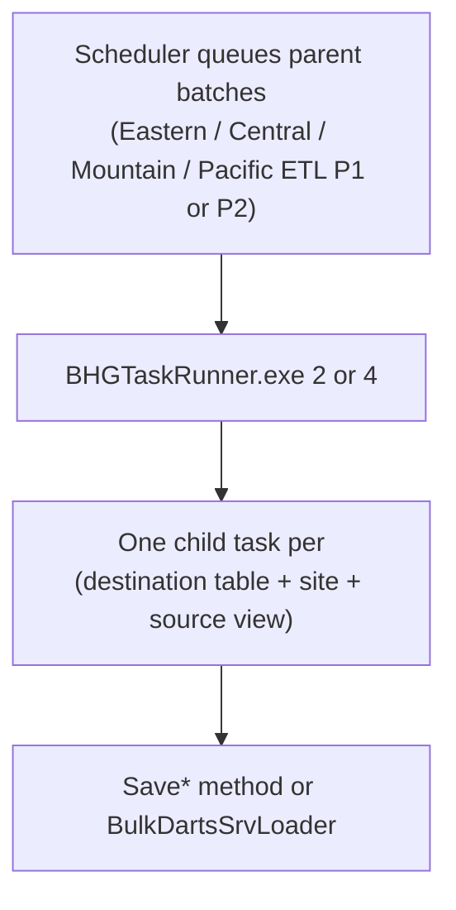

# Regional P1 / P2 / PPA — Source SAMMS to BHG_DR Destination Mapping

Maps **source objects** (clinic SAMMS databases) to **BHG_DR destination tables** using routing from `updatedSchedulerProgrma.cs`.

Derived from `dms.vw_MapAction` (`BCAppCode/Framework/vw_mapAction.csv`), `Enabled = 1`, `ConnectionID <> 3`.


| Column                 | Meaning                                                                     |
| ---------------------- | --------------------------------------------------------------------------- |
| **Source (SAMMS)**     | `SrcSchema.FromTblVw` in each site's source database                        |
| **BHG_DR Destination** | `DsnSchema.DsnTbl` in Azure `BHG_DR`                                        |
| **Save Method**        | `SaveData` method invoked in `BHGTaskRunner/updatedProgram.cs`              |
| **Save File**          | Partial class file in `BCAppCode/BHG-DR-LIB_updated`                        |
| **BHG_DR Row Count**   | Current row count in Azure `BHG_DR` (snapshot below); `—` = not queried yet |


**Updated scheduler notes (`updatedSchedulerProgrma.cs`):**

- `pats.tbl_SF_PatientPreAdmission` → `**SAMMS-ETL-PPA`** (runner arg **12**), not Regional P1.
- `pats.tbl_NewAdmissionAssessmentASAMDimension2/4/5` → **Regional P2** in all timezones (removed from P1).
- Combined P1 = **57** destinations; combined P2 = **17** destinations; PPA = **1** destination.
- Five tables appear in **both** P1 and P2 combined lists due to timezone routing — see [P1 / P2 overlap](#p1--p2-overlap-tables-in-both-combined-lists) below.

---

## SAMMS-ETL-PPA (1 destination)

Runner: `BHGTaskRunner.exe 12`


| #   | Source (SAMMS)               | BHG_DR Destination                | Save Method                 | Save File          |
| --- | ---------------------------- | --------------------------------- | --------------------------- | ------------------ |
| 1   | `dbo.SF_PatientPreAdmission` | `pats.tbl_SF_PatientPreAdmission` | `SaveSFPatientPreAdmission` | `SaveDataFeb26.cs` |


*Note: `dbo.SF_PatientPreAdmission` also loads `ayx.tbl_PreAdmission_V6` via Regional P1 (`SavePreAdmissionV6`).*

---

## Regional P1 — combined all timezones (57 destinations)

Runner: `BHGTaskRunner.exe 2`

*BHG_DR row counts: snapshot query on Azure `BHG_DR` (57 P1 destination tables). P1 total: **103,833,492** rows. `stg.ClientDemo` is staging-only and currently empty.*


| #   | Source (SAMMS)                                                | BHG_DR Destination                                | Save Method                                  | Save File               | BHG_DR Row Count |
| --- | ------------------------------------------------------------- | ------------------------------------------------- | -------------------------------------------- | ----------------------- | ---------------- |
| 1   | `dbo.SF_PatientPreAdmission`                                  | `ayx.tbl_PreAdmission_V6`                         | `SavePreAdmissionV6`                         | `SavePreAdmissionV6.cs` | 28,195           |
| 2   | `dbo.tbl3PSETUP`                                              | `ctrl.tbl_3PSETUP`                                | `Save3pSetup`                                | `Save3pElig.cs`         | 346              |
| 3   | `dbo.tblClinic`                                               | `ctrl.tbl_Clinic`                                 | `SaveClinic`                                 | `SaveClinic.cs`         | 118              |
| 4   | `dbo.DroDownListItems`                                        | `ctrl.tbl_DroDownListItems`                       | `SavedropDownListItems`                      | `SavePAData.cs`         | 501,720          |
| 5   | `dbo.Tbl3pElig`                                               | `pats.tbl_3pElig`                                 | `Save3pElig`                                 | `Save3pElig.cs`         | 583,989          |
| 6   | `dbo.admissionassessmentsubstanceusehistory`                  | `pats.tbl_Admissionassessmentsubstanceusehistory` | `SaveAdmissionAssessmentSubstanceuseHistory` | `SaveAssessments.cs`    | 71,110           |
| 7   | `dbo.AppointmentAttend`                                       | `pats.tbl_AppointmentAttend`                      | `SaveAppointmentAttend`                      | `SaveAppointments.cs`   | 25,905           |
| 8   | `dbo.BAMForm`                                                 | `pats.tbl_BAMForm`                                | `SaveBamForm`                                | `SaveBAM.cs`            | 63,650           |
| 9   | `dbo.BAMScore`                                                | `pats.tbl_BAMScore`                               | `SaveBamScore`                               | `SaveBAM.cs`            | 1,491,069        |
| 10  | `dbo.tblBill`                                                 | `pats.tbl_Bills`                                  | `SaveBills`                                  | `SaveBills.cs`          | 24,189,682       |
| 11  | `dbo.tblCHECKIN`                                              | `pats.tbl_CheckIn`                                | `SaveCheckIn`                                | `SaveCheckIn.cs`        | 32,196,304       |
| 12  | `dbo.tblCodes`                                                | `pats.tbl_Codes`                                  | `SaveCodes`                                  | `SaveCodes.cs`          | 37,249           |
| 13  | `dbo.ComprehensiveAssessmentForm`                             | `pats.tbl_ComprehensiveAssessmentForm`            | `SaveComprehensiveAssessmentForm`            | `SaveFormQAData.cs`     | 46,773           |
| 14  | `dbo.consenttomarketing`                                      | `pats.tbl_consenttomarketing`                     | `SaveConsenttoMarketing`                     | `SaveDataFeb26.cs`      | 9,546            |
| 15  | `dbo.SF_COWS`                                                 | `pats.tbl_Cows_V6`                                | `SaveCows_v6`                                | `SaveCows.cs`           | 683,813          |
| 16  | `dbo.tblCUSTOMANSWERS`                                        | `pats.tbl_CustomAnswers`                          | `SaveCustomAnswers`                          | `SaveCustomQA.cs`       | 198,118          |
| 17  | `dbo.tblCUSTOMQUESTIONS`                                      | `pats.tbl_CustomQuestions`                        | `SaveCustomQuestions`                        | `SaveCustomQA.cs`       | 2,009            |
| 18  | `dbo.EandMFormPregnancy`                                      | `pats.tbl_EandMFormPregnancy`                     | `SaveEMFormPregnancy`                        | `SaveFormQAData.cs`     | 58,465           |
| 19  | `bhg.vw_Enrollment`; `dbo.tblENROLL`; `oak.vw_pt_Enrollments` | `pats.tbl_Enrollment`                             | `SaveEnrollment`                             | `SaveEnrollment.cs`     | 879,044          |
| 20  | `dbo.FinancialHardshipApplication`                            | `pats.tbl_FinancialHardshipApplication`           | `SaveFinancialHardshipApplication`           | `SavePAData.cs`         | 68,927           |
| 21  | `dbo.tblFMP`                                                  | `pats.tbl_Fmp`                                    | `SaveFmp`                                    | `SaveFmp.cs`            | 176,932          |
| 22  | `dbo.MNComprehensiveAssessment`                               | `pats.tbl_MNComprehensiveAssessment`              | `SaveMNCA`                                   | `SaveCA.cs`             | 990              |
| 23  | `dbo.MNComprehensiveAssessmentLevelOfCare`                    | `pats.tbl_MNComprehensiveAssessmentLevelOfCare`   | `SaveMNCALOC`                                | `SaveCA.cs`             | 926              |
| 24  | `dbo.mntreatmentservicereview`                                | `pats.tbl_mntreatmentservicereview`               | `SaveMNTreatmentServiceReview`               | `SaveDataFeb26.cs`      | 42,038           |
| 25  | `dbo.NewAdmissionAssessment`                                  | `pats.tbl_NewAdmissionassessment`                 | `SaveNewAdmissionAssessment`                 | `SaveCA.cs`             | 2,842            |
| 26  | `dbo.NewAdmissionAssessmentASAMDimension6`                    | `pats.tbl_NewAdmissionAssessmentASAMDimension6`   | `SaveNewAdmissionAssessmentASAMDimension6`   | `SaveCA.cs`             | 2,800            |
| 27  | `dbo.newdischargetransferplanform`                            | `pats.tbl_newdischargetransferplanform`           | `SaveNewDischargeTransferPlanForm`           | `SaveDataFeb26.cs`      | 72,022           |
| 28  | `dbo.NewPeriodicReassessment`                                 | `pats.tbl_NewPeriodicReassessment`                | `SaveNewPeriodicReassessment`                | `SaveCA.cs`             | 4,743            |
| 29  | `dbo.NewPeriodicReassessmentCounselorReview`                  | `pats.tbl_NewPeriodicReassessmentCounselorReview` | `Savenewperiodicreassessmentcounselorreview` | `SaveCA.cs`             | 4,713            |
| 30  | `dbo.newperiodicreassessmentd2`                               | `pats.tbl_newperiodicreassessmentd2`              | `SaveNewPeriodicReassessmentD2`              | `SaveCA.cs`             | 4,716            |
| 31  | `dbo.newperiodicreassessmentd3`                               | `pats.tbl_newperiodicreassessmentd3`              | `SaveNewPeriodicReassessmentD3`              | `SaveCA.cs`             | 4,711            |
| 32  | `dbo.newperiodicreassessmentd4`                               | `pats.tbl_newperiodicreassessmentd4`              | `SaveNewPeriodicReassessmentD4`              | `SaveCA.cs`             | 4,709            |
| 33  | `dbo.newperiodicreassessmentd5`                               | `pats.tbl_newperiodicreassessmentd5`              | `SaveNewPeriodicReassessmentD5`              | `SaveCA.cs`             | 4,707            |
| 34  | `dbo.newperiodicreassessmentd6`                               | `pats.tbl_newperiodicreassessmentd6`              | `SaveNewPeriodicReassessmentD6`              | `SaveCA.cs`             | 4,713            |
| 35  | `dbo.PeriodicReassessment`                                    | `pats.tbl_PA`                                     | `SavePA`                                     | `SavePAData.cs`         | 112,793          |
| 36  | `dbo.PACounselorReview`                                       | `pats.tbl_PACounselorReview`                      | `SavePACounselorReview`                      | `SavePAData.cs`         | 111,919          |
| 37  | `dbo.PADimension1`                                            | `pats.tbl_PADimension1`                           | `SavePADimension1`                           | `SavePAData.cs`         | 112,792          |
| 38  | `dbo.PADimension2`                                            | `pats.tbl_PADimension2`                           | `SavePADimension2`                           | `SavePAData.cs`         | 111,792          |
| 39  | `dbo.PADimension3`                                            | `pats.tbl_PADimension3`                           | `SavePADimension3`                           | `SavePAData.cs`         | 111,656          |
| 40  | `dbo.PADimension4`                                            | `pats.tbl_PADimension4`                           | `SavePADimension4`                           | `SavePAData.cs`         | 111,584          |
| 41  | `dbo.PADimension5`                                            | `pats.tbl_PADimension5`                           | `SavePADimension5`                           | `SavePAData.cs`         | 111,521          |
| 42  | `dbo.PADimension6`                                            | `pats.tbl_PADimension6`                           | `SavePADimension6`                           | `SavePAData.cs`         | 111,495          |
| 43  | `dbo.tblPayerCltHistory`                                      | `pats.tbl_PayerCltHistory`                        | `SavePayerCltHistory`                        | `SavePayorClient.cs`    | 724,155          |
| 44  | `dbo.tbl3PAYauth`                                             | `pats.tbl_pbi3PayAuth`                            | `SaveAuths`                                  | `SaveAuths.cs`          | 133,601          |
| 45  | `dbo.SF_PatientPreadmissionReferralSource`                    | `pats.tbl_PreadmissionReferralSource`             | `SavePreAdminReferrals`                      | `SavePreAdmissionV6.cs` | 47,452           |
| 46  | `dbo.tblSERVICES`                                             | `pats.tbl_SERVICES`                               | `SaveServices`                               | `SaveGlobal.cs`         | 7,636            |
| 47  | `dbo.SF_DataForms`                                            | `pats.tbl_SF_DataForms`                           | `SaveDataForms`                              | `SaveDataFeb26.cs`      | 4,220,365        |
| 48  | `dbo.SMSTextConsentForm`                                      | `pats.tbl_SMSTextConsentForm`                     | `SaveSMSTextConsentForm`                     | `SaveDataFeb26.cs`      | 10,046           |
| 49  | `dbo.takehomeagreementanddiversioncontrol`                    | `pats.tbl_takehomeagreementanddiversioncontrol`   | `SaveTakeHomeAgreementandDiversionControl`   | `SaveDataFeb26.cs`      | 14,557           |
| 50  | `dbo.TakeHomeRiskAssessment`                                  | `pats.tbl_TakeHomeRiskAssessment`                 | `SaveTakeHomeRiskAssessment`                 | `SaveDataFeb26.cs`      | 91,736           |
| 51  | `dbo.Tbldiag10`                                               | `pats.tbl_TblDiag10`                              | `BulkDartsSrvLoader`                         | `BulkDartsSvc.cs`       | 195,791          |
| 52  | `dbo.tblUAResult`                                             | `pats.tbl_UAResults`                              | `SaveUAResults`                              | `SaveUAResults.cs`      | 13,066,213       |
| 53  | `dbo.tblUASched`                                              | `pats.tbl_UASched`                                | `SaveUASched`                                | `SaveUAResults.cs`      | 10,182,563       |
| 54  | `dbo.VAComprehensiveAssessment`                               | `pats.tbl_VAComprehensiveAssessment`              | `SaveVACA`                                   | `SaveCA.cs`             | 1,647            |
| 55  | `dbo.vacomprehensiveassessmentsummary`                        | `pats.tbl_vacomprehensiveassessmentsummary`       | `SaveVACASummary`                            | `SaveCA.cs`             | 1,602            |
| 56  | `dbo.vw3pBillSub`                                             | `pats.tbl_vw3pBillSub`                            | `SaveAuthBillsub`                            | `SaveAuths.cs`          | 12,772,982       |
| 57  | `dbo.tblclient`                                               | `stg.ClientDemo`                                  | `BulkDartsSrvLoader`                         | `BulkDartsSvc.cs`       | 0                |


### P1 destinations by BHG_DR row count (migration priority)

Sorted largest first. Top 5 = **~89%** of P1 row volume.


| Rank | BHG_DR Destination             | BHG_DR Row Count | % of P1 total |
| ---- | ------------------------------ | ---------------- | ------------- |
| 1    | `pats.tbl_CheckIn`             | 32,196,304       | 31.0%         |
| 2    | `pats.tbl_Bills`               | 24,189,682       | 23.3%         |
| 3    | `pats.tbl_UAResults`           | 13,066,213       | 12.6%         |
| 4    | `pats.tbl_vw3pBillSub`         | 12,772,982       | 12.3%         |
| 5    | `pats.tbl_UASched`             | 10,182,563       | 9.8%          |
| 6    | `pats.tbl_SF_DataForms`        | 4,220,365        | 4.1%          |
| 7    | `pats.tbl_BAMScore`            | 1,491,069        | 1.4%          |
| 8    | `pats.tbl_Enrollment`          | 879,044          | 0.8%          |
| 9    | `pats.tbl_PayerCltHistory`     | 724,155          | 0.7%          |
| 10   | `pats.tbl_Cows_V6`             | 683,813          | 0.7%          |
| …    | *(47 remaining P1 tables)*     | *≤ 583,989 each* | *≤ 0.6% each* |
| —    | **P1 grand total (57 tables)** | **103,833,492**  | **100%**      |


---

## Regional P2 — combined all timezones (17 destinations)

Runner: `BHGTaskRunner.exe 4`

*P2-only destinations (12 tables) — row counts not yet queried (`—`). Overlap tables share the same BHG_DR count as P1.*


| #   | Source (SAMMS)                                                                      | BHG_DR Destination                              | Save Method                                                           | Save File                           | BHG_DR Row Count |
| --- | ----------------------------------------------------------------------------------- | ----------------------------------------------- | --------------------------------------------------------------------- | ----------------------------------- | ---------------- |
| 1   | `dbo.tblBill`                                                                       | `pats.tbl_Bills`                                | `SaveBills`                                                           | `SaveBills.cs`                      | 24,189,682       |
| 2   | `dbo.tblCHECKIN`                                                                    | `pats.tbl_CheckIn`                              | `SaveCheckIn`                                                         | `SaveCheckIn.cs`                    | 32,196,304       |
| 3   | `dbo.tbl3pClaimLineItem`                                                            | `pats.tbl_ClaimLineItem`                        | `BulkDartsSrvLoader`                                                  | `BulkDartsSvc.cs`                   | —                |
| 4   | `dbo.tbl3pClaimLineItemActivity`                                                    | `pats.tbl_ClaimLineItemActivity`                | `BulkDartsSrvLoader`                                                  | `BulkDartsSvc.cs`                   | —                |
| 5   | `dbo.tbl3pClaim`                                                                    | `pats.tbl_Claims`                               | `BulkDartsSrvLoader` (most sites); `SaveClaims` (VBRA/VMIN/VWBY/VBRP) | `BulkDartsSvc.cs` / `SaveClaims.cs` | —                |
| 6   | `dbo.EandMForm`                                                                     | `pats.tbl_EandMFormMDM`                         | `SaveEMFormMDM`                                                       | `SaveFormQAData.cs`                 | —                |
| 7   | `dbo.EandMFormPregnancy`                                                            | `pats.tbl_EandMFormPregnancy`                   | `SaveEMFormPregnancy`                                                 | `SaveFormQAData.cs`                 | 58,465           |
| 8   | `bhg.vw_Enrollment`; `dbo.tblENROLL`; `oak.vw_pt_Enrollments`                       | `pats.tbl_Enrollment`                           | `SaveEnrollment`                                                      | `SaveEnrollment.cs`                 | 879,044          |
| 9   | `bhg.vw_FeeSched`; `dbo.tblFEESCHED`                                                | `pats.tbl_FeeSched`                             | `SaveFeeSchedules`                                                    | `SaveGlobal.cs`                     | —                |
| 10  | `bhg.vw_GlobalPayor`; `dbo.tblPAYER`; `oak.vw_GlobalPayor`                          | `pats.tbl_GlobalPayor`                          | `SaveGlobalPayer`                                                     | `SaveGlobal.cs`                     | —                |
| 11  | `dbo.NewAdmissionAssessmentASAMDimension2`                                          | `pats.tbl_NewAdmissionAssessmentASAMDimension2` | `SaveNewAdmissionAssessmentASAMDimension2`                            | `SaveCA.cs`                         | —                |
| 12  | `dbo.NewAdmissionAssessmentASAMDimension4`                                          | `pats.tbl_NewAdmissionAssessmentASAMDimension4` | `SaveNewAdmissionAssessmentASAMDimension4`                            | `SaveCA.cs`                         | —                |
| 13  | `dbo.NewAdmissionAssessmentASAMDimension5`                                          | `pats.tbl_NewAdmissionAssessmentASAMDimension5` | `SaveNewAdmissionAssessmentASAMDimension5`                            | `SaveCA.cs`                         | —                |
| 14  | `bhg.vw_PayerClt`; `bhg.vw_PayerClt_INACTIVE`; `dbo.tblPayerClt`; `oak.vw_PayerClt` | `pats.tbl_PayerClient`                          | `SavePayerClient`                                                     | `SavePayorClient.cs`                | —                |
| 15  | `dbo.tblPayerCltHistory`                                                            | `pats.tbl_PayerCltHistory`                      | `SavePayerCltHistory`                                                 | `SavePayorClient.cs`                | 724,155          |
| 16  | `dbo.tblTreatmentLevel`                                                             | `pats.tbl_TreatmentLevel`                       | `SaveTreatmentLevel`                                                  | `SaveTreatmentLevel.cs`             | —                |
| 17  | `dbo.tblUAResultDetail`                                                             | `pats.tbl_UAResultDetail`                       | `BulkDartsSrvLoader`                                                  | `BulkDartsSvc.cs`                   | —                |


**Bulk vs EF notes:**

- `BulkDartsSrvLoader` (`BulkDartsSvc.cs`) uses `SqlBulkCopy` into `stg.`*, then MERGE stored procedures load `pats.*`.
- `SaveTblDiags` in `SaveBAM.cs` and `SaveUAResultDetail` in `SaveUAResults.cs` exist but are commented out in the runner; bulk path is active for those tables.

---

## P1 / P2 overlap — tables in both combined lists

Five BHG_DR destination tables appear in **both** the combined P1 list (57) and combined P2 list (17). This is **timezone routing**, not a dependency: each **site + table** is queued into **one batch only** per day — never both P1 and P2 for the same site.


| #   | Source (SAMMS)                                                | BHG_DR Destination            | Save Method           | Save File            | BHG_DR Row Count | P1 timezones      | P2 timezones               |
| --- | ------------------------------------------------------------- | ----------------------------- | --------------------- | -------------------- | ---------------- | ----------------- | -------------------------- |
| 1   | `dbo.tblBill`                                                 | `pats.tbl_Bills`              | `SaveBills`           | `SaveBills.cs`       | 24,189,682       | Mountain, Pacific | Eastern, Central           |
| 2   | `dbo.tblCHECKIN`                                              | `pats.tbl_CheckIn`            | `SaveCheckIn`         | `SaveCheckIn.cs`     | 32,196,304       | Mountain, Pacific | Eastern, Central           |
| 3   | `dbo.EandMFormPregnancy`                                      | `pats.tbl_EandMFormPregnancy` | `SaveEMFormPregnancy` | `SaveFormQAData.cs`  | 58,465           | Mountain, Pacific | Eastern, Central           |
| 4   | `bhg.vw_Enrollment`; `dbo.tblENROLL`; `oak.vw_pt_Enrollments` | `pats.tbl_Enrollment`         | `SaveEnrollment`      | `SaveEnrollment.cs`  | 879,044          | Eastern           | Central, Mountain, Pacific |
| 5   | `dbo.tblPayerCltHistory`                                      | `pats.tbl_PayerCltHistory`    | `SavePayerCltHistory` | `SavePayorClient.cs` | 724,155          | Central           | Eastern, Mountain, Pacific |


**Why:** `updatedSchedulerProgrma.cs` uses different P1 exclude lists and P2 include lists per timezone (EST, CST, MST, PST). The same Azure table can route to P1 for one timezone and P2 for another.

**Examples:**

```
Site AH (EST)   + pats.tbl_Bills      →  Eastern ETL P2 only
Site CBBO (MST) + pats.tbl_Bills      →  Mountain ETL P1 only

Site (EST)      + pats.tbl_Enrollment →  Eastern ETL P1 only
Site (CST)      + pats.tbl_Enrollment →  Central ETL P2 only
```

All other P1-only or P2-only tables route to a single phase in every timezone (e.g. ASAM Dimension 2/4/5 → P2 only; `pats.tbl_Claims` → P2 only).

See `Scheduler_ETL_and_Tables.md` for the full per-timezone CASE logic and overlap query.

---

## BHG_DR query — source to destination for P1/P2/PPA tables

```sql
SELECT DISTINCT
    ma.SrcSchema + '.' + ma.FromTblVw AS source_samms,
    ma.DsnSchema + '.' + ma.DsnTbl     AS bhg_dr_destination
FROM dms.vw_MapAction ma
WHERE ma.Enabled = 1
  AND ma.ConnectionID <> 3
  AND ma.DsnSchema + '.' + ma.DsnTbl IN (
      -- PPA (1)
      'pats.tbl_SF_PatientPreAdmission',
      -- P1 combined (57)
      'ayx.tbl_PreAdmission_V6','ctrl.tbl_3PSETUP','ctrl.tbl_Clinic','ctrl.tbl_DroDownListItems',
      'pats.tbl_3pElig','pats.tbl_Admissionassessmentsubstanceusehistory','pats.tbl_AppointmentAttend',
      'pats.tbl_BAMForm','pats.tbl_BAMScore','pats.tbl_Bills','pats.tbl_CheckIn','pats.tbl_Codes',
      'pats.tbl_ComprehensiveAssessmentForm','pats.tbl_consenttomarketing','pats.tbl_Cows_V6',
      'pats.tbl_CustomAnswers','pats.tbl_CustomQuestions','pats.tbl_EandMFormPregnancy','pats.tbl_Enrollment',
      'pats.tbl_FinancialHardshipApplication','pats.tbl_Fmp','pats.tbl_MNComprehensiveAssessment',
      'pats.tbl_MNComprehensiveAssessmentLevelOfCare','pats.tbl_mntreatmentservicereview',
      'pats.tbl_NewAdmissionassessment','pats.tbl_NewAdmissionAssessmentASAMDimension6',
      'pats.tbl_newdischargetransferplanform','pats.tbl_NewPeriodicReassessment',
      'pats.tbl_NewPeriodicReassessmentCounselorReview','pats.tbl_newperiodicreassessmentd2',
      'pats.tbl_newperiodicreassessmentd3','pats.tbl_newperiodicreassessmentd4','pats.tbl_newperiodicreassessmentd5',
      'pats.tbl_newperiodicreassessmentd6','pats.tbl_PA','pats.tbl_PACounselorReview',
      'pats.tbl_PADimension1','pats.tbl_PADimension2','pats.tbl_PADimension3','pats.tbl_PADimension4',
      'pats.tbl_PADimension5','pats.tbl_PADimension6','pats.tbl_PayerCltHistory','pats.tbl_pbi3PayAuth',
      'pats.tbl_PreadmissionReferralSource','pats.tbl_SERVICES','pats.tbl_SF_DataForms',
      'pats.tbl_SMSTextConsentForm','pats.tbl_takehomeagreementanddiversioncontrol',
      'pats.tbl_TakeHomeRiskAssessment','pats.tbl_TblDiag10','pats.tbl_UAResults','pats.tbl_UASched',
      'pats.tbl_VAComprehensiveAssessment','pats.tbl_vacomprehensiveassessmentsummary','pats.tbl_vw3pBillSub',
      'stg.ClientDemo',
      -- P2-only destinations (not already in P1 list)
      'pats.tbl_ClaimLineItem','pats.tbl_ClaimLineItemActivity','pats.tbl_Claims','pats.tbl_EandMFormMDM',
      'pats.tbl_FeeSched','pats.tbl_GlobalPayor','pats.tbl_NewAdmissionAssessmentASAMDimension2',
      'pats.tbl_NewAdmissionAssessmentASAMDimension4','pats.tbl_NewAdmissionAssessmentASAMDimension5',
      'pats.tbl_PayerClient','pats.tbl_TreatmentLevel','pats.tbl_UAResultDetail'
  )
ORDER BY bhg_dr_destination, source_samms;
```

---

## Related files


| File                                    | Purpose                                                     |
| --------------------------------------- | ----------------------------------------------------------- |
| `Scheduler_ETL_and_Tables.md`           | Full scheduler batches, routing CASE, exclusions            |
| `updatedSchedulerProgrma.cs`            | Current scheduler SQL                                       |
| `BHGTaskRunner/updatedProgram.cs`       | Task runner switch — maps destination table to Save method  |
| `BCAppCode/BHG-DR-LIB_updated/`         | Save method implementations (`Save*.cs`, `BulkDartsSvc.cs`) |
| `BCAppCode/Framework/vw_mapAction.csv`  | Source of truth for mappings                                |
| `BCAppCode/Framework/vw_MapSrc2Dsn.csv` | Column-level field mapping                                  |
| `BCAppCode/P1/P2-Analysis/Regional_P1_Fabric_Timezone_And_Control_Tables_Flow.md` | Fabric P1 flow, timezone split, control tables (Notes pattern) |
| `BCAppCode/P1/P2-Analysis/P1_Fabric_Pipeline_Implementation_Guide.md` | Domain-grouped Bronze/Silver/Gold pipeline design             |


---

## P1 / P2 task dependencies — do tables depend on each other?

**Short answer:** Within Regional P1 and P2, there is **no designed “Table A must finish before Table B” dependency**. Each destination is its own child task: read from that site’s SAMMS source → save to BHG_DR. Tasks are **not** chained with `onCompletion` / `onError` or explicit wait-for-other-table logic.

### How P1 / P2 actually run




1. **Scheduler** (`updatedSchedulerProgrma.cs`) creates one **parent** per timezone batch (e.g. `Eastern ETL P1`) and many **child** rows (one per table/site mapping). Child insert order is `ActionKey, DsnTbl, SiteCode` — that is **not** a dependency order.
2. **Runner** (`BHGTaskRunner/updatedProgram.cs`) loads parent tasks, then runs children **one after another** in this order:
  - `TaskName` (destination table name, alphabetical)
  - `SiteCode`
  - `FromTblVw`
   There **is** a fixed run sequence inside a batch, but it is for **processing convenience**, not because the code requires one table to load before another.
3. `**onCompletion` / `onError`** are always set to `0` when tasks are created — no task chaining in the queue.
4. Each child only uses:
  - That clinic’s **SAMMS connection** (source)
  - `**dms.tbl_MapSrc2Dsn`** metadata for column mapping
  - Its own `**Save***` method (or bulk loader)
   Save methods do **not** call other Save methods for other P1/P2 tables.

### Each table = its own job


| Layer       | Role                                      |
| ----------- | ----------------------------------------- |
| **Source**  | SAMMS table/view at the clinic            |
| **Mapping** | `vw_MapAction` + `vw_MapSrc2Dsn`          |
| **Load**    | One Save method (or `BulkDartsSrvLoader`) |
| **Target**  | One BHG_DR table (or `stg.`* then MERGE)  |


Example: `SaveCheckIn` reads `dbo.tblCHECKIN` from SAMMS and upserts `pats.tbl_CheckIn`. It does not require `stg.ClientDemo` or `pats.tbl_Enrollment` to have run first in code.

### Exceptions (not full P1/P2 dependency chains)

**1. One task with an internal follow-up step**

Only `pats.tbl_NewPeriodicReassessmentCounselorReview` runs something extra **after its own save** (same child task, not a cross-table gate):

```csharp
rCodes = sd.Savenewperiodicreassessmentcounselorreview(...);
_ = sm.ExeSqlCmd("exec [pats].[MergeFormSignaturesPeriodicReassessments] '" + st.SiteCode + "'", ...);
```

**2. Business relationships, not ETL gates**

In the real world, related tables share logical links (e.g. `PADimension1`–`6` with `pats.tbl_PA`, ASAM dimensions with `NewAdmissionAssessment`, client IDs on many rows). Those links exist in **SAMMS source data** and in **Azure reporting/joins**, but the ETL does **not** enforce “load parent before child.” Each is extracted independently if the source table exists.

**3. Cross-batch overlap (routing, not dependency)**

Tables like `pats.tbl_Bills` and `pats.tbl_CheckIn` appear in **both** P1 and P2 combined lists, but **per site/timezone** the scheduler assigns each table to **one** batch only. That is **timezone routing**, not “P2 must run after P1.”

**4. Outside P1/P2 (worth knowing)**

- `ctrl.tbl_Clinic`, `pats.tbl_GlobalPayor`, `pats.tbl_FeeSched` may also load via **SAMMSGlobal** or **Regional P2** — reference data overlap, not a hard prerequisite for P1.
- `**stg.ClientDemo`** is bulk-staged client data; other P1 saves do not block on it in code.

### Summary


| Question                                                        | Answer                                                                        |
| --------------------------------------------------------------- | ----------------------------------------------------------------------------- |
| Do P1/P2 tables run as independent ETL units?                   | **Yes** — one task per table/site, own source → own destination               |
| Is there a documented “run this after that” order within P1/P2? | **No**                                                                        |
| Do they run in parallel?                                        | **No** — sequential within each parent batch, but not because of dependencies |
| Any hard dependency at all?                                     | Only **within** the counselor-review task (save + merge stored procedure)     |


**Mental model:** Each P1/P2 table has its own duty. Related tables may join later in reports or in Azure SQL, but the Regional P1/P2 pipeline does not implement a dependency graph between those loads.

---

## Domain-wise catalog (all batches)

All P1, P2, and PPA destinations grouped into **6 business domains**. P2-only and PPA tables are included under the same domain as their related P1 tables.


| Domain      | P1  | P2-only                            | PPA                        | Notes                                                   |
| ----------- | --- | ---------------------------------- | -------------------------- | ------------------------------------------------------- |
| Assessments | 18  | 3 (ASAM Dim 2/4/5)                 | —                          | PA, new periodic, admission ASAM                        |
| Clinical    | 11  | 2 (TreatmentLevel, UAResultDetail) | —                          | Check-in, UA, BAM, enrollment, MN/VA                    |
| Financial   | 6   | 6 (claims, payers, fee sched)      | —                          | Bills, auths, 3P elig; overlap on Bills/PayerCltHistory |
| Forms       | 8   | 1 (EandMFormMDM)                   | —                          | Consents, take-home, E&M pregnancy                      |
| Reference   | 9   | —                                  | 1 (SF_PatientPreAdmission) | Clinic, codes, setup, pre-admission                     |
| Bulk load   | 2   | —                                  | —                          | `BulkDartsSrvLoader` — ClientDemo, Diag10               |


### Combined P1 + P2 — unique destinations by domain

**Scope:** Regional P1 + Regional P2 only (excludes PPA). **69** unique BHG_DR destination tables = 57 (P1) + 17 (P2) − **5 overlap** (same Azure table, timezone routing — counted once).

**Row counts:** Summed **once per Azure table** from the P1 snapshot below. The five overlap tables share the same count whether routed via P1 or P2. **12 P2-only tables** (Claims, FeeSched, GlobalPayor, ASAM Dim 2/4/5, etc.) are not yet queried — they are **not** included in the known total.


| Domain      | Tables (P1+P2 unique) | BHG_DR row count (known) | % of known total |
| ----------- | --------------------- | ------------------------ | ---------------- |
| Assessments | 21                    | 1,005,316                | 1.0%             |
| Clinical    | 15                    | 58,635,764               | 56.5%            |
| Financial   | 13                    | 38,650,268               | 37.2%            |
| Forms       | 9                     | 4,523,510                | 4.4%             |
| Reference   | 9                     | 823,843                  | 0.8%             |
| Bulk load   | 2                     | 195,791                  | 0.2%             |
| —           | **69**                | **103,833,492**          | **100%**         |


*P2-only row volume (12 tables, all `—` in doc today):* `pats.tbl_ClaimLineItem`, `pats.tbl_ClaimLineItemActivity`, `pats.tbl_Claims`, `pats.tbl_FeeSched`, `pats.tbl_GlobalPayor`, `pats.tbl_PayerClient`, `pats.tbl_NewAdmissionAssessmentASAMDimension2/4/5`, `pats.tbl_TreatmentLevel`, `pats.tbl_UAResultDetail`, `pats.tbl_EandMFormMDM`. Once queried, add those counts to the domain rows above for a full **P1+P2 grand total**.

---

### 1. Assessments


| Source (SAMMS)                               | BHG_DR Destination                                | Save Method                                  | Save File            | Batch |
| -------------------------------------------- | ------------------------------------------------- | -------------------------------------------- | -------------------- | ----- |
| `dbo.PeriodicReassessment`                   | `pats.tbl_PA`                                     | `SavePA`                                     | `SavePAData.cs`      | P1    |
| `dbo.PACounselorReview`                      | `pats.tbl_PACounselorReview`                      | `SavePACounselorReview`                      | `SavePAData.cs`      | P1    |
| `dbo.PADimension1`                           | `pats.tbl_PADimension1`                           | `SavePADimension1`                           | `SavePAData.cs`      | P1    |
| `dbo.PADimension2`                           | `pats.tbl_PADimension2`                           | `SavePADimension2`                           | `SavePAData.cs`      | P1    |
| `dbo.PADimension3`                           | `pats.tbl_PADimension3`                           | `SavePADimension3`                           | `SavePAData.cs`      | P1    |
| `dbo.PADimension4`                           | `pats.tbl_PADimension4`                           | `SavePADimension4`                           | `SavePAData.cs`      | P1    |
| `dbo.PADimension5`                           | `pats.tbl_PADimension5`                           | `SavePADimension5`                           | `SavePAData.cs`      | P1    |
| `dbo.PADimension6`                           | `pats.tbl_PADimension6`                           | `SavePADimension6`                           | `SavePAData.cs`      | P1    |
| `dbo.NewAdmissionAssessment`                 | `pats.tbl_NewAdmissionassessment`                 | `SaveNewAdmissionAssessment`                 | `SaveCA.cs`          | P1    |
| `dbo.NewAdmissionAssessmentASAMDimension6`   | `pats.tbl_NewAdmissionAssessmentASAMDimension6`   | `SaveNewAdmissionAssessmentASAMDimension6`   | `SaveCA.cs`          | P1    |
| `dbo.NewAdmissionAssessmentASAMDimension2`   | `pats.tbl_NewAdmissionAssessmentASAMDimension2`   | `SaveNewAdmissionAssessmentASAMDimension2`   | `SaveCA.cs`          | P2    |
| `dbo.NewAdmissionAssessmentASAMDimension4`   | `pats.tbl_NewAdmissionAssessmentASAMDimension4`   | `SaveNewAdmissionAssessmentASAMDimension4`   | `SaveCA.cs`          | P2    |
| `dbo.NewAdmissionAssessmentASAMDimension5`   | `pats.tbl_NewAdmissionAssessmentASAMDimension5`   | `SaveNewAdmissionAssessmentASAMDimension5`   | `SaveCA.cs`          | P2    |
| `dbo.NewPeriodicReassessment`                | `pats.tbl_NewPeriodicReassessment`                | `SaveNewPeriodicReassessment`                | `SaveCA.cs`          | P1    |
| `dbo.NewPeriodicReassessmentCounselorReview` | `pats.tbl_NewPeriodicReassessmentCounselorReview` | `Savenewperiodicreassessmentcounselorreview` | `SaveCA.cs`          | P1    |
| `dbo.newperiodicreassessmentd2`              | `pats.tbl_newperiodicreassessmentd2`              | `SaveNewPeriodicReassessmentD2`              | `SaveCA.cs`          | P1    |
| `dbo.newperiodicreassessmentd3`              | `pats.tbl_newperiodicreassessmentd3`              | `SaveNewPeriodicReassessmentD3`              | `SaveCA.cs`          | P1    |
| `dbo.newperiodicreassessmentd4`              | `pats.tbl_newperiodicreassessmentd4`              | `SaveNewPeriodicReassessmentD4`              | `SaveCA.cs`          | P1    |
| `dbo.newperiodicreassessmentd5`              | `pats.tbl_newperiodicreassessmentd5`              | `SaveNewPeriodicReassessmentD5`              | `SaveCA.cs`          | P1    |
| `dbo.newperiodicreassessmentd6`              | `pats.tbl_newperiodicreassessmentd6`              | `SaveNewPeriodicReassessmentD6`              | `SaveCA.cs`          | P1    |
| `dbo.admissionassessmentsubstanceusehistory` | `pats.tbl_Admissionassessmentsubstanceusehistory` | `SaveAdmissionAssessmentSubstanceuseHistory` | `SaveAssessments.cs` | P1    |


---

### 2. Clinical


| Source (SAMMS)                                                | BHG_DR Destination                              | Save Method                    | Save File               | Batch |
| ------------------------------------------------------------- | ----------------------------------------------- | ------------------------------ | ----------------------- | ----- |
| `dbo.tblCHECKIN`                                              | `pats.tbl_CheckIn`                              | `SaveCheckIn`                  | `SaveCheckIn.cs`        | P1+P2 |
| `dbo.BAMForm`                                                 | `pats.tbl_BAMForm`                              | `SaveBamForm`                  | `SaveBAM.cs`            | P1    |
| `dbo.BAMScore`                                                | `pats.tbl_BAMScore`                             | `SaveBamScore`                 | `SaveBAM.cs`            | P1    |
| `dbo.SF_COWS`                                                 | `pats.tbl_Cows_V6`                              | `SaveCows_v6`                  | `SaveCows.cs`           | P1    |
| `dbo.tblUAResult`                                             | `pats.tbl_UAResults`                            | `SaveUAResults`                | `SaveUAResults.cs`      | P1    |
| `dbo.tblUASched`                                              | `pats.tbl_UASched`                              | `SaveUASched`                  | `SaveUAResults.cs`      | P1    |
| `dbo.tblUAResultDetail`                                       | `pats.tbl_UAResultDetail`                       | `BulkDartsSrvLoader`           | `BulkDartsSvc.cs`       | P2    |
| `dbo.AppointmentAttend`                                       | `pats.tbl_AppointmentAttend`                    | `SaveAppointmentAttend`        | `SaveAppointments.cs`   | P1    |
| `dbo.MNComprehensiveAssessment`                               | `pats.tbl_MNComprehensiveAssessment`            | `SaveMNCA`                     | `SaveCA.cs`             | P1    |
| `dbo.MNComprehensiveAssessmentLevelOfCare`                    | `pats.tbl_MNComprehensiveAssessmentLevelOfCare` | `SaveMNCALOC`                  | `SaveCA.cs`             | P1    |
| `dbo.mntreatmentservicereview`                                | `pats.tbl_mntreatmentservicereview`             | `SaveMNTreatmentServiceReview` | `SaveDataFeb26.cs`      | P1    |
| `bhg.vw_Enrollment`; `dbo.tblENROLL`; `oak.vw_pt_Enrollments` | `pats.tbl_Enrollment`                           | `SaveEnrollment`               | `SaveEnrollment.cs`     | P1+P2 |
| `dbo.VAComprehensiveAssessment`                               | `pats.tbl_VAComprehensiveAssessment`            | `SaveVACA`                     | `SaveCA.cs`             | P1    |
| `dbo.vacomprehensiveassessmentsummary`                        | `pats.tbl_vacomprehensiveassessmentsummary`     | `SaveVACASummary`              | `SaveCA.cs`             | P1    |
| `dbo.tblTreatmentLevel`                                       | `pats.tbl_TreatmentLevel`                       | `SaveTreatmentLevel`           | `SaveTreatmentLevel.cs` | P2    |


---

### 3. Financial


| Source (SAMMS)                                                                      | BHG_DR Destination                      | Save Method                         | Save File                           | Batch |
| ----------------------------------------------------------------------------------- | --------------------------------------- | ----------------------------------- | ----------------------------------- | ----- |
| `dbo.tblBill`                                                                       | `pats.tbl_Bills`                        | `SaveBills`                         | `SaveBills.cs`                      | P1+P2 |
| `dbo.tbl3PAYauth`                                                                   | `pats.tbl_pbi3PayAuth`                  | `SaveAuths`                         | `SaveAuths.cs`                      | P1    |
| `dbo.vw3pBillSub`                                                                   | `pats.tbl_vw3pBillSub`                  | `SaveAuthBillsub`                   | `SaveAuths.cs`                      | P1    |
| `dbo.tblFMP`                                                                        | `pats.tbl_Fmp`                          | `SaveFmp`                           | `SaveFmp.cs`                        | P1    |
| `dbo.tblPayerCltHistory`                                                            | `pats.tbl_PayerCltHistory`              | `SavePayerCltHistory`               | `SavePayorClient.cs`                | P1+P2 |
| `dbo.FinancialHardshipApplication`                                                  | `pats.tbl_FinancialHardshipApplication` | `SaveFinancialHardshipApplication`  | `SavePAData.cs`                     | P1    |
| `dbo.Tbl3pElig`                                                                     | `pats.tbl_3pElig`                       | `Save3pElig`                        | `Save3pElig.cs`                     | P1    |
| `dbo.tbl3pClaimLineItem`                                                            | `pats.tbl_ClaimLineItem`                | `BulkDartsSrvLoader`                | `BulkDartsSvc.cs`                   | P2    |
| `dbo.tbl3pClaimLineItemActivity`                                                    | `pats.tbl_ClaimLineItemActivity`        | `BulkDartsSrvLoader`                | `BulkDartsSvc.cs`                   | P2    |
| `dbo.tbl3pClaim`                                                                    | `pats.tbl_Claims`                       | `BulkDartsSrvLoader` / `SaveClaims` | `BulkDartsSvc.cs` / `SaveClaims.cs` | P2    |
| `bhg.vw_FeeSched`; `dbo.tblFEESCHED`                                                | `pats.tbl_FeeSched`                     | `SaveFeeSchedules`                  | `SaveGlobal.cs`                     | P2    |
| `bhg.vw_GlobalPayor`; `dbo.tblPAYER`; `oak.vw_GlobalPayor`                          | `pats.tbl_GlobalPayor`                  | `SaveGlobalPayer`                   | `SaveGlobal.cs`                     | P2    |
| `bhg.vw_PayerClt`; `bhg.vw_PayerClt_INACTIVE`; `dbo.tblPayerClt`; `oak.vw_PayerClt` | `pats.tbl_PayerClient`                  | `SavePayerClient`                   | `SavePayorClient.cs`                | P2    |


---

### 4. Forms


| Source (SAMMS)                             | BHG_DR Destination                              | Save Method                                | Save File           | Batch |
| ------------------------------------------ | ----------------------------------------------- | ------------------------------------------ | ------------------- | ----- |
| `dbo.ComprehensiveAssessmentForm`          | `pats.tbl_ComprehensiveAssessmentForm`          | `SaveComprehensiveAssessmentForm`          | `SaveFormQAData.cs` | P1    |
| `dbo.EandMFormPregnancy`                   | `pats.tbl_EandMFormPregnancy`                   | `SaveEMFormPregnancy`                      | `SaveFormQAData.cs` | P1+P2 |
| `dbo.EandMForm`                            | `pats.tbl_EandMFormMDM`                         | `SaveEMFormMDM`                            | `SaveFormQAData.cs` | P2    |
| `dbo.SF_DataForms`                         | `pats.tbl_SF_DataForms`                         | `SaveDataForms`                            | `SaveDataFeb26.cs`  | P1    |
| `dbo.SMSTextConsentForm`                   | `pats.tbl_SMSTextConsentForm`                   | `SaveSMSTextConsentForm`                   | `SaveDataFeb26.cs`  | P1    |
| `dbo.consenttomarketing`                   | `pats.tbl_consenttomarketing`                   | `SaveConsenttoMarketing`                   | `SaveDataFeb26.cs`  | P1    |
| `dbo.takehomeagreementanddiversioncontrol` | `pats.tbl_takehomeagreementanddiversioncontrol` | `SaveTakeHomeAgreementandDiversionControl` | `SaveDataFeb26.cs`  | P1    |
| `dbo.TakeHomeRiskAssessment`               | `pats.tbl_TakeHomeRiskAssessment`               | `SaveTakeHomeRiskAssessment`               | `SaveDataFeb26.cs`  | P1    |
| `dbo.newdischargetransferplanform`         | `pats.tbl_newdischargetransferplanform`         | `SaveNewDischargeTransferPlanForm`         | `SaveDataFeb26.cs`  | P1    |


---

### 5. Reference


| Source (SAMMS)                             | BHG_DR Destination                    | Save Method                 | Save File               | Batch |
| ------------------------------------------ | ------------------------------------- | --------------------------- | ----------------------- | ----- |
| `dbo.tblClinic`                            | `ctrl.tbl_Clinic`                     | `SaveClinic`                | `SaveClinic.cs`         | P1    |
| `dbo.tbl3PSETUP`                           | `ctrl.tbl_3PSETUP`                    | `Save3pSetup`               | `Save3pElig.cs`         | P1    |
| `dbo.tblCodes`                             | `pats.tbl_Codes`                      | `SaveCodes`                 | `SaveCodes.cs`          | P1    |
| `dbo.tblSERVICES`                          | `pats.tbl_SERVICES`                   | `SaveServices`              | `SaveGlobal.cs`         | P1    |
| `dbo.DroDownListItems`                     | `ctrl.tbl_DroDownListItems`           | `SavedropDownListItems`     | `SavePAData.cs`         | P1    |
| `dbo.tblCUSTOMANSWERS`                     | `pats.tbl_CustomAnswers`              | `SaveCustomAnswers`         | `SaveCustomQA.cs`       | P1    |
| `dbo.tblCUSTOMQUESTIONS`                   | `pats.tbl_CustomQuestions`            | `SaveCustomQuestions`       | `SaveCustomQA.cs`       | P1    |
| `dbo.SF_PatientPreAdmission`               | `ayx.tbl_PreAdmission_V6`             | `SavePreAdmissionV6`        | `SavePreAdmissionV6.cs` | P1    |
| `dbo.SF_PatientPreadmissionReferralSource` | `pats.tbl_PreadmissionReferralSource` | `SavePreAdminReferrals`     | `SavePreAdmissionV6.cs` | P1    |
| `dbo.SF_PatientPreAdmission`               | `pats.tbl_SF_PatientPreAdmission`     | `SaveSFPatientPreAdmission` | `SaveDataFeb26.cs`      | PPA   |


---

### 6. Bulk load

Uses `BulkDartsSrvLoader` (`BulkDartsSvc.cs`) — `SqlBulkCopy` into `stg.`*, then MERGE stored procedures.


| Source (SAMMS)  | BHG_DR Destination   | Save Method          | Save File         | Batch |
| --------------- | -------------------- | -------------------- | ----------------- | ----- |
| `dbo.Tbldiag10` | `pats.tbl_TblDiag10` | `BulkDartsSrvLoader` | `BulkDartsSvc.cs` | P1    |
| `dbo.tblclient` | `stg.ClientDemo`     | `BulkDartsSrvLoader` | `BulkDartsSvc.cs` | P1    |


