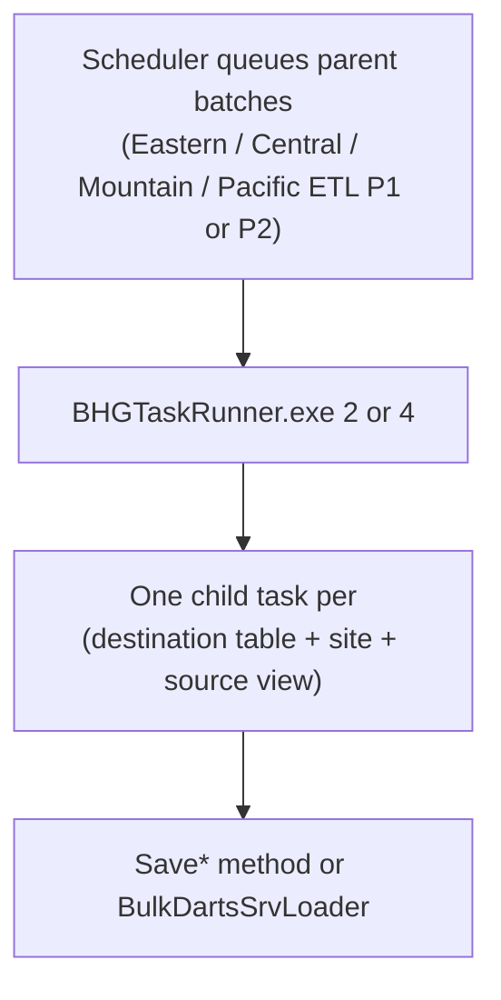

# Regional P1 / P2 / PPA — Source SAMMS to BHG_DR Destination Mapping

Maps **source objects** (clinic SAMMS databases) to **BHG_DR destination tables** using routing from `updatedSchedulerProgrma.cs`.

Derived from `dms.vw_MapAction` (`BCAppCode/Framework/vw_mapAction.csv`), `Enabled = 1`, `ConnectionID <> 3`.

| Column | Meaning |
|--------|---------|
| **Source (SAMMS)** | `SrcSchema.FromTblVw` in each site's source database |
| **BHG_DR Destination** | `DsnSchema.DsnTbl` in Azure `BHG_DR` |
| **Save Method** | `SaveData` method invoked in `BHGTaskRunner/updatedProgram.cs` |
| **Save File** | Partial class file in `BCAppCode/BHG-DR-LIB_updated` |

**Updated scheduler notes (`updatedSchedulerProgrma.cs`):**
- `pats.tbl_SF_PatientPreAdmission` → **`SAMMS-ETL-PPA`** (runner arg **12**), not Regional P1.
- `pats.tbl_NewAdmissionAssessmentASAMDimension2/4/5` → **Regional P2** in all timezones (removed from P1).
- Combined P1 = **57** destinations; combined P2 = **17** destinations; PPA = **1** destination.
- Five tables appear in **both** P1 and P2 lists due to timezone routing — see `Scheduler_ETL_and_Tables.md`.

---

## SAMMS-ETL-PPA (1 destination)

Runner: `BHGTaskRunner.exe 12`

| # | Source (SAMMS) | BHG_DR Destination | Save Method | Save File |
|---|----------------|-------------------|-------------|-----------|
| 1 | `dbo.SF_PatientPreAdmission` | `pats.tbl_SF_PatientPreAdmission` | `SaveSFPatientPreAdmission` | `SaveDataFeb26.cs` |

*Note: `dbo.SF_PatientPreAdmission` also loads `ayx.tbl_PreAdmission_V6` via Regional P1 (`SavePreAdmissionV6`).*

---

## Regional P1 — combined all timezones (57 destinations)

Runner: `BHGTaskRunner.exe 2`

| # | Source (SAMMS) | BHG_DR Destination | Save Method | Save File |
|---|----------------|-------------------|-------------|-----------|
| 1 | `dbo.SF_PatientPreAdmission` | `ayx.tbl_PreAdmission_V6` | `SavePreAdmissionV6` | `SavePreAdmissionV6.cs` |
| 2 | `dbo.tbl3PSETUP` | `ctrl.tbl_3PSETUP` | `Save3pSetup` | `Save3pElig.cs` |
| 3 | `dbo.tblClinic` | `ctrl.tbl_Clinic` | `SaveClinic` | `SaveClinic.cs` |
| 4 | `dbo.DroDownListItems` | `ctrl.tbl_DroDownListItems` | `SavedropDownListItems` | `SavePAData.cs` |
| 5 | `dbo.Tbl3pElig` | `pats.tbl_3pElig` | `Save3pElig` | `Save3pElig.cs` |
| 6 | `dbo.admissionassessmentsubstanceusehistory` | `pats.tbl_Admissionassessmentsubstanceusehistory` | `SaveAdmissionAssessmentSubstanceuseHistory` | `SaveAssessments.cs` |
| 7 | `dbo.AppointmentAttend` | `pats.tbl_AppointmentAttend` | `SaveAppointmentAttend` | `SaveAppointments.cs` |
| 8 | `dbo.BAMForm` | `pats.tbl_BAMForm` | `SaveBamForm` | `SaveBAM.cs` |
| 9 | `dbo.BAMScore` | `pats.tbl_BAMScore` | `SaveBamScore` | `SaveBAM.cs` |
| 10 | `dbo.tblBill` | `pats.tbl_Bills` | `SaveBills` | `SaveBills.cs` |
| 11 | `dbo.tblCHECKIN` | `pats.tbl_CheckIn` | `SaveCheckIn` | `SaveCheckIn.cs` |
| 12 | `dbo.tblCodes` | `pats.tbl_Codes` | `SaveCodes` | `SaveCodes.cs` |
| 13 | `dbo.ComprehensiveAssessmentForm` | `pats.tbl_ComprehensiveAssessmentForm` | `SaveComprehensiveAssessmentForm` | `SaveFormQAData.cs` |
| 14 | `dbo.consenttomarketing` | `pats.tbl_consenttomarketing` | `SaveConsenttoMarketing` | `SaveDataFeb26.cs` |
| 15 | `dbo.SF_COWS` | `pats.tbl_Cows_V6` | `SaveCows_v6` | `SaveCows.cs` |
| 16 | `dbo.tblCUSTOMANSWERS` | `pats.tbl_CustomAnswers` | `SaveCustomAnswers` | `SaveCustomQA.cs` |
| 17 | `dbo.tblCUSTOMQUESTIONS` | `pats.tbl_CustomQuestions` | `SaveCustomQuestions` | `SaveCustomQA.cs` |
| 18 | `dbo.EandMFormPregnancy` | `pats.tbl_EandMFormPregnancy` | `SaveEMFormPregnancy` | `SaveFormQAData.cs` |
| 19 | `bhg.vw_Enrollment`; `dbo.tblENROLL`; `oak.vw_pt_Enrollments` | `pats.tbl_Enrollment` | `SaveEnrollment` | `SaveEnrollment.cs` |
| 20 | `dbo.FinancialHardshipApplication` | `pats.tbl_FinancialHardshipApplication` | `SaveFinancialHardshipApplication` | `SavePAData.cs` |
| 21 | `dbo.tblFMP` | `pats.tbl_Fmp` | `SaveFmp` | `SaveFmp.cs` |
| 22 | `dbo.MNComprehensiveAssessment` | `pats.tbl_MNComprehensiveAssessment` | `SaveMNCA` | `SaveCA.cs` |
| 23 | `dbo.MNComprehensiveAssessmentLevelOfCare` | `pats.tbl_MNComprehensiveAssessmentLevelOfCare` | `SaveMNCALOC` | `SaveCA.cs` |
| 24 | `dbo.mntreatmentservicereview` | `pats.tbl_mntreatmentservicereview` | `SaveMNTreatmentServiceReview` | `SaveDataFeb26.cs` |
| 25 | `dbo.NewAdmissionAssessment` | `pats.tbl_NewAdmissionassessment` | `SaveNewAdmissionAssessment` | `SaveCA.cs` |
| 26 | `dbo.NewAdmissionAssessmentASAMDimension6` | `pats.tbl_NewAdmissionAssessmentASAMDimension6` | `SaveNewAdmissionAssessmentASAMDimension6` | `SaveCA.cs` |
| 27 | `dbo.newdischargetransferplanform` | `pats.tbl_newdischargetransferplanform` | `SaveNewDischargeTransferPlanForm` | `SaveDataFeb26.cs` |
| 28 | `dbo.NewPeriodicReassessment` | `pats.tbl_NewPeriodicReassessment` | `SaveNewPeriodicReassessment` | `SaveCA.cs` |
| 29 | `dbo.NewPeriodicReassessmentCounselorReview` | `pats.tbl_NewPeriodicReassessmentCounselorReview` | `Savenewperiodicreassessmentcounselorreview` | `SaveCA.cs` |
| 30 | `dbo.newperiodicreassessmentd2` | `pats.tbl_newperiodicreassessmentd2` | `SaveNewPeriodicReassessmentD2` | `SaveCA.cs` |
| 31 | `dbo.newperiodicreassessmentd3` | `pats.tbl_newperiodicreassessmentd3` | `SaveNewPeriodicReassessmentD3` | `SaveCA.cs` |
| 32 | `dbo.newperiodicreassessmentd4` | `pats.tbl_newperiodicreassessmentd4` | `SaveNewPeriodicReassessmentD4` | `SaveCA.cs` |
| 33 | `dbo.newperiodicreassessmentd5` | `pats.tbl_newperiodicreassessmentd5` | `SaveNewPeriodicReassessmentD5` | `SaveCA.cs` |
| 34 | `dbo.newperiodicreassessmentd6` | `pats.tbl_newperiodicreassessmentd6` | `SaveNewPeriodicReassessmentD6` | `SaveCA.cs` |
| 35 | `dbo.PeriodicReassessment` | `pats.tbl_PA` | `SavePA` | `SavePAData.cs` |
| 36 | `dbo.PACounselorReview` | `pats.tbl_PACounselorReview` | `SavePACounselorReview` | `SavePAData.cs` |
| 37 | `dbo.PADimension1` | `pats.tbl_PADimension1` | `SavePADimension1` | `SavePAData.cs` |
| 38 | `dbo.PADimension2` | `pats.tbl_PADimension2` | `SavePADimension2` | `SavePAData.cs` |
| 39 | `dbo.PADimension3` | `pats.tbl_PADimension3` | `SavePADimension3` | `SavePAData.cs` |
| 40 | `dbo.PADimension4` | `pats.tbl_PADimension4` | `SavePADimension4` | `SavePAData.cs` |
| 41 | `dbo.PADimension5` | `pats.tbl_PADimension5` | `SavePADimension5` | `SavePAData.cs` |
| 42 | `dbo.PADimension6` | `pats.tbl_PADimension6` | `SavePADimension6` | `SavePAData.cs` |
| 43 | `dbo.tblPayerCltHistory` | `pats.tbl_PayerCltHistory` | `SavePayerCltHistory` | `SavePayorClient.cs` |
| 44 | `dbo.tbl3PAYauth` | `pats.tbl_pbi3PayAuth` | `SaveAuths` | `SaveAuths.cs` |
| 45 | `dbo.SF_PatientPreadmissionReferralSource` | `pats.tbl_PreadmissionReferralSource` | `SavePreAdminReferrals` | `SavePreAdmissionV6.cs` |
| 46 | `dbo.tblSERVICES` | `pats.tbl_SERVICES` | `SaveServices` | `SaveGlobal.cs` |
| 47 | `dbo.SF_DataForms` | `pats.tbl_SF_DataForms` | `SaveDataForms` | `SaveDataFeb26.cs` |
| 48 | `dbo.SMSTextConsentForm` | `pats.tbl_SMSTextConsentForm` | `SaveSMSTextConsentForm` | `SaveDataFeb26.cs` |
| 49 | `dbo.takehomeagreementanddiversioncontrol` | `pats.tbl_takehomeagreementanddiversioncontrol` | `SaveTakeHomeAgreementandDiversionControl` | `SaveDataFeb26.cs` |
| 50 | `dbo.TakeHomeRiskAssessment` | `pats.tbl_TakeHomeRiskAssessment` | `SaveTakeHomeRiskAssessment` | `SaveDataFeb26.cs` |
| 51 | `dbo.Tbldiag10` | `pats.tbl_TblDiag10` | `BulkDartsSrvLoader` | `BulkDartsSvc.cs` |
| 52 | `dbo.tblUAResult` | `pats.tbl_UAResults` | `SaveUAResults` | `SaveUAResults.cs` |
| 53 | `dbo.tblUASched` | `pats.tbl_UASched` | `SaveUASched` | `SaveUAResults.cs` |
| 54 | `dbo.VAComprehensiveAssessment` | `pats.tbl_VAComprehensiveAssessment` | `SaveVACA` | `SaveCA.cs` |
| 55 | `dbo.vacomprehensiveassessmentsummary` | `pats.tbl_vacomprehensiveassessmentsummary` | `SaveVACASummary` | `SaveCA.cs` |
| 56 | `dbo.vw3pBillSub` | `pats.tbl_vw3pBillSub` | `SaveAuthBillsub` | `SaveAuths.cs` |
| 57 | `dbo.tblclient` | `stg.ClientDemo` | `BulkDartsSrvLoader` | `BulkDartsSvc.cs` |

---

## Regional P2 — combined all timezones (17 destinations)

Runner: `BHGTaskRunner.exe 4`

| # | Source (SAMMS) | BHG_DR Destination | Save Method | Save File |
|---|----------------|-------------------|-------------|-----------|
| 1 | `dbo.tblBill` | `pats.tbl_Bills` | `SaveBills` | `SaveBills.cs` |
| 2 | `dbo.tblCHECKIN` | `pats.tbl_CheckIn` | `SaveCheckIn` | `SaveCheckIn.cs` |
| 3 | `dbo.tbl3pClaimLineItem` | `pats.tbl_ClaimLineItem` | `BulkDartsSrvLoader` | `BulkDartsSvc.cs` |
| 4 | `dbo.tbl3pClaimLineItemActivity` | `pats.tbl_ClaimLineItemActivity` | `BulkDartsSrvLoader` | `BulkDartsSvc.cs` |
| 5 | `dbo.tbl3pClaim` | `pats.tbl_Claims` | `BulkDartsSrvLoader` (most sites); `SaveClaims` (VBRA/VMIN/VWBY/VBRP) | `BulkDartsSvc.cs` / `SaveClaims.cs` |
| 6 | `dbo.EandMForm` | `pats.tbl_EandMFormMDM` | `SaveEMFormMDM` | `SaveFormQAData.cs` |
| 7 | `dbo.EandMFormPregnancy` | `pats.tbl_EandMFormPregnancy` | `SaveEMFormPregnancy` | `SaveFormQAData.cs` |
| 8 | `bhg.vw_Enrollment`; `dbo.tblENROLL`; `oak.vw_pt_Enrollments` | `pats.tbl_Enrollment` | `SaveEnrollment` | `SaveEnrollment.cs` |
| 9 | `bhg.vw_FeeSched`; `dbo.tblFEESCHED` | `pats.tbl_FeeSched` | `SaveFeeSchedules` | `SaveGlobal.cs` |
| 10 | `bhg.vw_GlobalPayor`; `dbo.tblPAYER`; `oak.vw_GlobalPayor` | `pats.tbl_GlobalPayor` | `SaveGlobalPayer` | `SaveGlobal.cs` |
| 11 | `dbo.NewAdmissionAssessmentASAMDimension2` | `pats.tbl_NewAdmissionAssessmentASAMDimension2` | `SaveNewAdmissionAssessmentASAMDimension2` | `SaveCA.cs` |
| 12 | `dbo.NewAdmissionAssessmentASAMDimension4` | `pats.tbl_NewAdmissionAssessmentASAMDimension4` | `SaveNewAdmissionAssessmentASAMDimension4` | `SaveCA.cs` |
| 13 | `dbo.NewAdmissionAssessmentASAMDimension5` | `pats.tbl_NewAdmissionAssessmentASAMDimension5` | `SaveNewAdmissionAssessmentASAMDimension5` | `SaveCA.cs` |
| 14 | `bhg.vw_PayerClt`; `bhg.vw_PayerClt_INACTIVE`; `dbo.tblPayerClt`; `oak.vw_PayerClt` | `pats.tbl_PayerClient` | `SavePayerClient` | `SavePayorClient.cs` |
| 15 | `dbo.tblPayerCltHistory` | `pats.tbl_PayerCltHistory` | `SavePayerCltHistory` | `SavePayorClient.cs` |
| 16 | `dbo.tblTreatmentLevel` | `pats.tbl_TreatmentLevel` | `SaveTreatmentLevel` | `SaveTreatmentLevel.cs` |
| 17 | `dbo.tblUAResultDetail` | `pats.tbl_UAResultDetail` | `BulkDartsSrvLoader` | `BulkDartsSvc.cs` |

**Bulk vs EF notes:**
- `BulkDartsSrvLoader` (`BulkDartsSvc.cs`) uses `SqlBulkCopy` into `stg.*`, then MERGE stored procedures load `pats.*`.
- `SaveTblDiags` in `SaveBAM.cs` and `SaveUAResultDetail` in `SaveUAResults.cs` exist but are commented out in the runner; bulk path is active for those tables.

---

## BHG_DR query — source to destination for P1/P2/PPA tables

```sql
SELECT DISTINCT
    ma.SrcSchema + '.' + ma.FromTblVw AS source_samms,
    ma.DsnSchema + '.' + ma.DsnTbl     AS bhg_dr_destination
FROM dms.vw_MapAction ma
WHERE ma.Enabled = 1
  AND ma.ConnectionID <> 3
  AND ma.DsnSchema + '.' + ma.DsnTbl IN (
      -- PPA (1)
      'pats.tbl_SF_PatientPreAdmission',
      -- P1 combined (57)
      'ayx.tbl_PreAdmission_V6','ctrl.tbl_3PSETUP','ctrl.tbl_Clinic','ctrl.tbl_DroDownListItems',
      'pats.tbl_3pElig','pats.tbl_Admissionassessmentsubstanceusehistory','pats.tbl_AppointmentAttend',
      'pats.tbl_BAMForm','pats.tbl_BAMScore','pats.tbl_Bills','pats.tbl_CheckIn','pats.tbl_Codes',
      'pats.tbl_ComprehensiveAssessmentForm','pats.tbl_consenttomarketing','pats.tbl_Cows_V6',
      'pats.tbl_CustomAnswers','pats.tbl_CustomQuestions','pats.tbl_EandMFormPregnancy','pats.tbl_Enrollment',
      'pats.tbl_FinancialHardshipApplication','pats.tbl_Fmp','pats.tbl_MNComprehensiveAssessment',
      'pats.tbl_MNComprehensiveAssessmentLevelOfCare','pats.tbl_mntreatmentservicereview',
      'pats.tbl_NewAdmissionassessment','pats.tbl_NewAdmissionAssessmentASAMDimension6',
      'pats.tbl_newdischargetransferplanform','pats.tbl_NewPeriodicReassessment',
      'pats.tbl_NewPeriodicReassessmentCounselorReview','pats.tbl_newperiodicreassessmentd2',
      'pats.tbl_newperiodicreassessmentd3','pats.tbl_newperiodicreassessmentd4','pats.tbl_newperiodicreassessmentd5',
      'pats.tbl_newperiodicreassessmentd6','pats.tbl_PA','pats.tbl_PACounselorReview',
      'pats.tbl_PADimension1','pats.tbl_PADimension2','pats.tbl_PADimension3','pats.tbl_PADimension4',
      'pats.tbl_PADimension5','pats.tbl_PADimension6','pats.tbl_PayerCltHistory','pats.tbl_pbi3PayAuth',
      'pats.tbl_PreadmissionReferralSource','pats.tbl_SERVICES','pats.tbl_SF_DataForms',
      'pats.tbl_SMSTextConsentForm','pats.tbl_takehomeagreementanddiversioncontrol',
      'pats.tbl_TakeHomeRiskAssessment','pats.tbl_TblDiag10','pats.tbl_UAResults','pats.tbl_UASched',
      'pats.tbl_VAComprehensiveAssessment','pats.tbl_vacomprehensiveassessmentsummary','pats.tbl_vw3pBillSub',
      'stg.ClientDemo',
      -- P2-only destinations (not already in P1 list)
      'pats.tbl_ClaimLineItem','pats.tbl_ClaimLineItemActivity','pats.tbl_Claims','pats.tbl_EandMFormMDM',
      'pats.tbl_FeeSched','pats.tbl_GlobalPayor','pats.tbl_NewAdmissionAssessmentASAMDimension2',
      'pats.tbl_NewAdmissionAssessmentASAMDimension4','pats.tbl_NewAdmissionAssessmentASAMDimension5',
      'pats.tbl_PayerClient','pats.tbl_TreatmentLevel','pats.tbl_UAResultDetail'
  )
ORDER BY bhg_dr_destination, source_samms;
```

---

## Related files

| File | Purpose |
|------|---------|
| `Scheduler_ETL_and_Tables.md` | Full scheduler batches, routing CASE, exclusions |
| `updatedSchedulerProgrma.cs` | Current scheduler SQL |
| `BHGTaskRunner/updatedProgram.cs` | Task runner switch — maps destination table to Save method |
| `BCAppCode/BHG-DR-LIB_updated/` | Save method implementations (`Save*.cs`, `BulkDartsSvc.cs`) |
| `BCAppCode/Framework/vw_mapAction.csv` | Source of truth for mappings |
| `BCAppCode/Framework/vw_MapSrc2Dsn.csv` | Column-level field mapping |

---

## P1 / P2 task dependencies — do tables depend on each other?

**Short answer:** Within Regional P1 and P2, there is **no designed “Table A must finish before Table B” dependency**. Each destination is its own child task: read from that site’s SAMMS source → save to BHG_DR. Tasks are **not** chained with `onCompletion` / `onError` or explicit wait-for-other-table logic.

### How P1 / P2 actually run



1. **Scheduler** (`updatedSchedulerProgrma.cs`) creates one **parent** per timezone batch (e.g. `Eastern ETL P1`) and many **child** rows (one per table/site mapping). Child insert order is `ActionKey, DsnTbl, SiteCode` — that is **not** a dependency order.

2. **Runner** (`BHGTaskRunner/updatedProgram.cs`) loads parent tasks, then runs children **one after another** in this order:
   - `TaskName` (destination table name, alphabetical)
   - `SiteCode`
   - `FromTblVw`

   There **is** a fixed run sequence inside a batch, but it is for **processing convenience**, not because the code requires one table to load before another.

3. **`onCompletion` / `onError`** are always set to `0` when tasks are created — no task chaining in the queue.

4. Each child only uses:
   - That clinic’s **SAMMS connection** (source)
   - **`dms.tbl_MapSrc2Dsn`** metadata for column mapping
   - Its own **`Save*`** method (or bulk loader)

   Save methods do **not** call other Save methods for other P1/P2 tables.

### Each table = its own job

| Layer | Role |
|--------|------|
| **Source** | SAMMS table/view at the clinic |
| **Mapping** | `vw_MapAction` + `vw_MapSrc2Dsn` |
| **Load** | One Save method (or `BulkDartsSrvLoader`) |
| **Target** | One BHG_DR table (or `stg.*` then MERGE) |

Example: `SaveCheckIn` reads `dbo.tblCHECKIN` from SAMMS and upserts `pats.tbl_CheckIn`. It does not require `stg.ClientDemo` or `pats.tbl_Enrollment` to have run first in code.

### Exceptions (not full P1/P2 dependency chains)

**1. One task with an internal follow-up step**

Only `pats.tbl_NewPeriodicReassessmentCounselorReview` runs something extra **after its own save** (same child task, not a cross-table gate):

```csharp
rCodes = sd.Savenewperiodicreassessmentcounselorreview(...);
_ = sm.ExeSqlCmd("exec [pats].[MergeFormSignaturesPeriodicReassessments] '" + st.SiteCode + "'", ...);
```

**2. Business relationships, not ETL gates**

In the real world, related tables share logical links (e.g. `PADimension1`–`6` with `pats.tbl_PA`, ASAM dimensions with `NewAdmissionAssessment`, client IDs on many rows). Those links exist in **SAMMS source data** and in **Azure reporting/joins**, but the ETL does **not** enforce “load parent before child.” Each is extracted independently if the source table exists.

**3. Cross-batch overlap (routing, not dependency)**

Tables like `pats.tbl_Bills` and `pats.tbl_CheckIn` appear in **both** P1 and P2 combined lists, but **per site/timezone** the scheduler assigns each table to **one** batch only. That is **timezone routing**, not “P2 must run after P1.”

**4. Outside P1/P2 (worth knowing)**

- `ctrl.tbl_Clinic`, `pats.tbl_GlobalPayor`, `pats.tbl_FeeSched` may also load via **SAMMSGlobal** or **Regional P2** — reference data overlap, not a hard prerequisite for P1.
- **`stg.ClientDemo`** is bulk-staged client data; other P1 saves do not block on it in code.

### Summary

| Question | Answer |
|----------|--------|
| Do P1/P2 tables run as independent ETL units? | **Yes** — one task per table/site, own source → own destination |
| Is there a documented “run this after that” order within P1/P2? | **No** |
| Do they run in parallel? | **No** — sequential within each parent batch, but not because of dependencies |
| Any hard dependency at all? | Only **within** the counselor-review task (save + merge stored procedure) |

**Mental model:** Each P1/P2 table has its own duty. Related tables may join later in reports or in Azure SQL, but the Regional P1/P2 pipeline does not implement a dependency graph between those loads.
