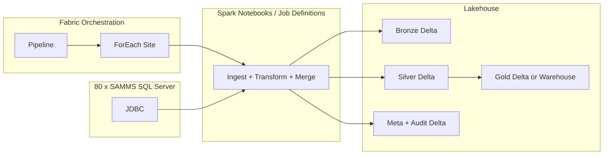

# SaveDartsSrv → Microsoft Fabric: Complete Migration Design

**Audience:** Microsoft Fabric Data Architect / Senior Data Engineer  
**Scope:** SaveDartsSrv flow only (EF Core path); BulkDart extension noted for later  
**Source context:** `SaveDartsSrvDocumentation`, `BHG-DR-LIB/SaveDartsSrvs.cs`, workspace architecture rules  

---

## Executive Summary

**SaveDartsSrv** today is the **EF Core, row-by-row upsert path** (10 nearly identical methods by year) used for backfills and `SelectConstructor` routing—not the primary daily **Bulk + `stg.DartsSrvMerge*`** path. The right Fabric target is a **Lakehouse-centric medallion design**: **Fabric Pipelines** for orchestration, parameterization, parallelism, and alerting; **PySpark notebooks** (or packaged libraries) for JDBC extraction, shared transformation, and **Delta Lake `MERGE`** keyed on `(SiteCode, DsId)` with **`RowChkSum`** as the change predicate.

**CDC** should be implemented as a **layered strategy**: prefer **SQL Server Change Tracking / CT** where you can operationalize it across clinics; otherwise **watermark + bounded lookback** per site with **idempotent Delta merges** and **run-level checkpoints**. This combination addresses the **7+ hour** runtime through **parallel site ingestion**, **set-based merges**, **elimination of per-site full Azure row loads into app memory**, and **selective retry** of failed sites.

**Observability** should use **Delta audit tables in the Lakehouse** plus **Fabric item run history** and **Azure Monitor / Log Analytics** alerts wired to **Logic Apps or Power Automate** for email.

**Dataflows Gen2** are not recommended as the core engine for 80 JDBC sources and complex merge logic; **Warehouse** is optional for **Gold / SQL-first** consumption, not required to replace SaveDartsSrv semantics.

---

## Current-State Challenges

| Challenge | How it shows up in SaveDartsSrv |
|-----------|----------------------------------|
| Long runtime | Sequential or lightly parallel site processing; EF path loads existing rows per site/year into memory; row-by-row work |
| No true CDC | Incremental scope is driven by a **calendar-based lookback** and multi-column date `OR` filters, not row-level change streams |
| Weak ops | Limited structured pipeline logs, site-level failure isolation, and standardized alerting |
| 80 sources | Same logic repeated per site; connection and failure domains multiply |
| Hard to scale | Application-tier loops and N×year methods; tuning requires code changes |
| Tight coupling | Task queue, SQL text, connection strings, business rules, and persistence interwoven in C# |

**Legacy facts (from documentation):**

- Per-site tasks from `tsk` / `vw_TaskListMap`; child tasks with `TaskName = pats.tbl_dartssrv`, `ActionKey = 9`, `SiteCode`, `WorkDate`.
- `SelectConstructor` + `dms.tbl_MapSrc2Dsn` (ActionKey 9) drive the SELECT column list and `CHECKSUM(...) AS RowChkSum`.
- Dynamic lookback on **five date columns** (`dsDtStart`, `dsDtAdded`, `dsUpdate`, `dsBilled`, `dsSigDate`) plus `dsClt <= 0` placeholder logic.
- Lookback windows: **-15 days** normally, **-90** on month-end Fridays, **-200** on special override dates (e.g. one-time fixes).
- Upsert semantics: **`(SiteCode, DsId)`** business key; **`RowChkSum`** avoids rewriting unchanged rows.
- **Year-partitioned** Azure targets: `pats.tbl_DartsSrv_2014B4` / `pats.tbl_DartsSrv_2015` … `pats.tbl_DartsSrv_2023`.
- **SaveDartsSrvs.cs** is the EF path; **daily Schedule 9** more often uses **BulkDartsSrvLoader** + staging MERGE procs—Save path is historical/backfill/SelectConstructor routing.

The documentation identifies the **dominant performance issue** on the Save path: in-memory `List` + `foreach` + `RowChkSum` compare versus **set-based merge** (as in `SaveDartsSrvs_Migration.md` / `SaveDartsSrvs_Fabric.py`).

---

## Target-State Microsoft Fabric Architecture

**Recommended shape: Lakehouse + Delta (primary) + Pipelines + Notebooks + metadata tables + optional Warehouse for Gold.**

### Architecture diagram (Mermaid)

### Layer roles

- **Bronze:** Raw pulls per site/run (append-only or snapshot-by-run), minimal transformation, strong audit columns (`_ingest_run_id`, `_site_code`, `_extracted_at`).
- **Silver:** **Curated DartsSrv** aligned to business keys, same grain as today (`SiteCode` + `DsId`), **Delta `MERGE`** with `RowChkSum` (and optional true CDC columns when available).
- **Gold:** Analytics-ready views/tables (denormalized dims, cross-domain joins, reporting models). Can stay **Delta** (Lakehouse SQL endpoint) or **sync to Warehouse** for Power BI / T-SQL workloads.

### Medallion architecture

**Yes, it fits.** SaveDartsSrv is a classic **ingest → conform → serve** pattern. Bronze isolates source quirks; Silver holds the **system of record for DartsSrv in Fabric**; Gold is optional until reporting demands justify extra modeling.

### Event-based design

**Optional later.** For 80 on-prem SQL Servers, **Event Hubs + Debezium** or **ADF change-feed** style patterns are heavy. Start with **scheduled pipeline + JDBC + CDC/watermarks**; add events only if latency requirements tighten.

---

## Recommended Technology Choices

| Capability | Choice | Rationale |
|------------|--------|-----------|
| Orchestration | **Fabric Pipelines** | Native scheduling, parameters, **ForEach** parallelism, failure branches, integration with monitoring |
| Heavy transforms / merge | **PySpark + Delta** | Matches `MERGE` + `RowChkSum`, handles wide rows, scales horizontally |
| Primary storage | **Lakehouse (Delta/Parquet)** | ACID, time travel, partition pruning, idempotent merges |
| Dataflows Gen2 | **Not primary** | 80 JDBC sources, conditional columns, binary fields, and merge semantics are awkward and harder to test than code |
| Warehouse | **Gold optional** | Use when you need **dedicated SQL DW**, cross-object governance, or BI patterns that favor Warehouse over Lakehouse SQL |
| CDC source | **CT / CDC on SQL Server where possible** + **watermarks** elsewhere | True CDC reduces lookback scans; watermarks keep restarts deterministic |
| Config / mappings | **Metadata tables** (mirror `tbl_MapSrc2Dsn`, site registry) | Same idea as `SelectConstructor`, without recompiling C# |

### What to orchestrate in Pipelines

- Schedule, parameters (`WorkDate`, environment, concurrency).
- **ForEach** over active sites (from metadata or replicated control DB).
- Invoke notebook / Spark job per site or per wave.
- Retry policies at activity level.
- Failure branches → webhook → Logic App / Power Automate.
- Child pipeline for **retry failed sites only**.

### What to implement in PySpark notebooks

- JDBC read with generated SQL from metadata.
- Dynamic lookback and conditional columns (`ServiceType`, notes/signature columns).
- Type coercion, `SiteCode` / `LastModAt` injection.
- Bronze writes; Silver **year routing** (`filter(year(DsDtStart) == year)` or aligned legacy rule).
- **Delta `MERGE`**: `whenMatchedUpdate` only when `RowChkSum` differs; `whenNotMatchedInsert`; delete handling when CT available.
- Data-quality checks close to the data.

### Metadata-driven design

- Replicate or sync **`ctrl.tbl_LocationCons`** (or equivalent) into **`meta.dim_site`** with secret references, not raw passwords in code.
- Replicate **`dms.tbl_MapSrc2Dsn`** for ActionKey 9 into **`meta.map_column`** (or generate static YAML/SQL from it during build).
- **Lookback override** table for special dates (replace hard-coded C# one-offs).
- **Feature flags** per site: CT enabled, notes included, `ServiceType` present.

### When not to use Dataflows Gen2

- High fan-out JDBC to many distinct servers.
- Complex conditional schemas and binary columns.
- Large-scale **MERGE** with custom predicates—notebooks are clearer, testable, and version-controlled.

### When Warehouse is useful vs Lakehouse

- **Lakehouse + Delta:** default for SaveDartsSrv Silver and most Gold patterns; SQL endpoint for ad hoc queries.
- **Warehouse:** when consumers need **dedicated DW** semantics, heavy cross-join reporting, or organizational standards mandate Warehouse as the semantic layer.

---

## End-to-End Pipeline Flow

1. **Trigger:** Time-based (daily) or manual (“rerun failed sites”). Pass **`WorkDate`**, **`PipelineRunId`**, environment.
2. **Pipeline reads metadata:** Active sites, JDBC secret references (or Key Vault IDs), optional **feature flags** (`include_notes`, `ServiceType` present), **lookback override** table for special dates (replacing hard-coded `1/24/2025` style fixes).
3. **Pre-flight:** Validate metadata completeness; optionally **short-circuit** sites marked disabled.
4. **Parallel site-level ingestion** (ForEach with concurrency cap, e.g. 8–20 depending on gateway/SQL capacity):
   - Notebook activity **parameterized** by `SiteCode`, `RunId`.
   - **Bronze write:** land raw batch with query hash / predicate used.
5. **Silver CDC / merge** (same notebook or chained activity):
   - Normalize types, add `SiteCode`, `LastModAt`, partition by `year(DsDtStart)` (or rule aligned with legacy year routing / `WrkYear`).
   - For each year slice: **Delta `MERGE`** on `(SiteCode, DsId)`; `whenMatched` only if `RowChkSum` differs (and optionally CDC `change_op`).
6. **Gold** (if in scope): Build **incremental** Gold tables or **views** over Silver; avoid double physicalization until needed.
7. **Validation:** Row counts vs expectations, null PK checks, **checksum spot checks**, optional **reconciliation** against a small Azure SQL slice during migration.
8. **Logging:** Append **site run row** to `meta.pipeline_site_run`; aggregate **pipeline run** to `meta.pipeline_run`.
9. **Notifications:** On failure at site or pipeline level, invoke **Logic App / Power Automate** with run id, site, step, error, link to Fabric monitor.

This mirrors the documented sequence (task per site → SELECT with lookback → upsert by year) but **splits** it into durable stages and **parallelizes** safely.

---

## CDC Design

**Goal:** Capture **insert / update / delete** with **restartable**, **idempotent** processing.

### Recommended layered approach

**Tier 1 — SQL Server Change Tracking (preferred where deployable)**

- Enable CT on `dbo.tblDartsSrv` per SAMMS (or equivalent).
- Extract using `CHANGETABLE` with **last synchronization version** per `(SiteCode)` stored in Fabric metadata.
- **Deletes:** CT provides delete versions; propagate to Silver with **`MERGE` … `whenMatchedDelete`** or soft-delete column `IsDeleted` if downstream requires history.

**Tier 2 — Watermark + multi-column activity time (fallback)**

- Persist **`last_successful_extract_utc`** and optionally **max observed** composite activity time from source columns (aligned with legacy intent: updates across billing/sign/add/start).
- Query: `WHERE activity_time > watermark - overlap_window` with **15-minute / 1-day overlap** to catch late updates; rely on **`MERGE` + `RowChkSum`** to make duplicates harmless.

**Tier 3 — Legacy parity window**

- Keep **business lookback** (`-15` / `-90` / special overrides) as a **safety net** during migration or for sites without CT—**narrow over time** as confidence grows.

### Inserts, updates, deletes

- **Inserts / updates:** `MERGE` with `RowChkSum` change condition (same semantic as SaveDartsSrv).
- **Deletes:** Without CT, **hard deletes at source are invisible** unless you periodically run a **reconciliation** job or full snapshot diff; **with CT**, handle explicitly.

### Late-arriving changes

- **Overlap window** on watermarks.
- **Idempotent merges** (same key + same payload = no write).
- Optional **late data zone** in Bronze tagged by `_ingest_run_id` for audit.

### Restartability

- **Checkpoint:** `meta.pipeline_site_run` with status `SUCCESS` / `FAILED` / `RUNNING`, **`extract_version` or watermark**, **`bronze_path`**, **`rows_read`**, **`rows_merged`**.
- **Rerun failed sites:** Pipeline reads sites where `status != SUCCESS` for `RunId` or last N hours.

### Recommended metadata tables (illustrative)

| Table | Purpose |
|-------|---------|
| **`meta.dim_site`** | `site_code`, secret id, jdbc template, `ct_enabled`, `notes_enabled`, `service_type_enabled` |
| **`meta.map_column`** | Mirrors `dms.tbl_MapSrc2Dsn` for ActionKey 9 (column list, types, optional predicates) |
| **`meta.site_cdc_cursor`** | `site_code`, `last_change_version` (CT) or `watermark_datetime`, `updated_at` |
| **`meta.pipeline_run`** | `run_id`, `work_date`, `start/end`, `status`, `parameters_json` |
| **`meta.pipeline_site_run`** | `run_id`, `site_code`, `stage`, `status`, `error_message`, `retry_count`, `duration_ms`, `rows_bronze`, `rows_silver_insert`, `rows_silver_update`, `rows_silver_delete` |

---

## Performance Optimization Strategy

| Technique | Application |
|-----------|-------------|
| **Parallel site ingestion** | Pipeline **ForEach** with **bounded concurrency**; tune against SQL Server load and any **self-hosted integration** limits |
| **Eliminate EF-style full loads** | No “load all Azure rows for site into memory”; use **Delta merge** only |
| **Set-based merge** | One `MERGE` per year partition per site batch, not row loops |
| **Partitioning** | Silver/Gold Delta: **`year`** (from `DsDtStart` to match legacy), **`site_code`** optional if file sizes warrant (trade-off: many small files vs prune benefit) |
| **Incremental extraction** | CT or watermarks to **shrink JDBC result sets** vs fixed multi-week lookback |
| **File format** | **Delta/Parquet**; consider Z-order or liquid clustering on `(SiteCode, DsId)` if supported in your Fabric runtime for hot merge paths |
| **Batch sizing** | Per site: if CT returns huge bursts, **chunk by version range** or time slices |
| **Retries** | **Per-site retry** (transient SQL/network) with exponential backoff; do not fail the entire 80-site run for one bad site |
| **Pushdown** | JDBC `predicates` / custom `query` to limit columns and rows at source |
| **Metadata-driven SQL** | Single notebook + **generated SQL** from `map_column` (replaces 10 C# methods + duplicated field lists) |

Fabric can cut runtime materially by **parallelism + smaller reads + no app-tier O(N) loops**; exact factor depends on SQL capacity and concurrency caps.

---

## Logging / Monitoring / Observability Design

### What to log

- **Pipeline:** run id, trigger time, `WorkDate`, overall status.
- **Per site:** start/end, JDBC duration, merge duration, rows extracted/merged, error stack, retry count.
- **Data quality:** null keys, year distribution anomalies, sudden row-count deltas vs trailing average.

### Where to store

- **Primary:** Delta tables under **`meta/`** in the Lakehouse (queryable, joinable to data).
- **Secondary:** Fabric **Monitoring hub** / item run history (UI deep links).
- **Optional:** **Azure Log Analytics** if you export Activity / custom events for enterprise SOC integration.

### How logs should be structured

- **Append-only** `meta.pipeline_site_run` with **JSON** `error_detail` for stack traces.
- Keep **human-readable `stage` enums:** `EXTRACT_BRONZE`, `MERGE_SILVER_2019`, etc.

### Troubleshooting

- Filter by `run_id` + `site_code`.
- Link from alert email to **Fabric pipeline run URL** + **notebook output** (if you standardize structured logging).

### Selective reprocessing

- Query `meta.pipeline_site_run` for `status = FAILED` or anomalous metrics; feed list into **child pipeline** “recovery run.”

### Audit tables (centralized design)

- **`meta.pipeline_run`:** one row per orchestration execution.
- **`meta.pipeline_site_run`:** many rows per run; authoritative for **per-site** outcomes.
- Optional **`meta.data_quality_check`:** rule id, result, measured value, threshold.

---

## Alerting / Email Notification Strategy

### Mechanisms

- **Fabric pipeline:** On failure branch → **Webhook** to **Logic App** or **Power Automate** → **Send email (Microsoft 365)**.
- **Azure Monitor alert** on **failed Fabric activities** (if integrated with your subscription) for centralized paging.
- Optional **custom webhook** to ticketing (ServiceNow, Jira).

### What to include in the alert email

- Pipeline name
- **Failed site(s)**
- **Failed step / activity name**
- **Error message** (truncated + pointer to full detail in meta table)
- **Run id**
- **Timestamp (UTC)**
- **Direct link** to Fabric monitoring
- Optional **Lakehouse SQL snippet** to pull last N errors for that run

### Best practice for success/failure design

- **Failure:** immediate site-level or pipeline-level alert after retries exhausted.
- **Success:** optional **daily digest** (duration, row totals, sites skipped) to avoid alert fatigue.

### Alert granularity

- **Site-level:** failure after retries (actionable: clinic data or integration team).
- **Pipeline-level:** orchestration failure, metadata failure, authentication failure.
- **Batch / daily summary:** optional success digest for trend detection.

---

## Pipeline vs PySpark Notebook Recommendation

| In **Pipelines** | In **Notebooks** |
|------------------|------------------|
| Schedule, parameters, concurrency, dependencies | JDBC read, dynamic SQL, type coercion |
| ForEach over sites | Bronze write, Silver merge, year split |
| Retry policy at activity level | Complex `MERGE`, binary columns, unit-testable Python |
| Call Logic App on failure | Shared library code imported across dev/test/prod |
| Invoke “retry failed” child pipeline | Data-quality checks close to data |

### Why this split is optimal

- Pipelines are **best for operations** (when, how many, what if fail).
- Notebooks are **best for data logic** at this scale (80 sources, wide schema, merges).

### When not to use Dataflows Gen2

- As the **primary** extract/transform/merge engine for this workload—use code + Delta instead.

### Maintainability and scalability

- Package repeated Python as **wheel** or **notebook modules** in workspace Git.
- One parameterized merge function + year loop replaces **10 duplicate C# methods**.

---

## Data Model / Layer Design

### Bronze layer

- **Purpose:** Immutable-ish raw landing; full fidelity for replay.
- **Options:**
  - Path-based: `bronze/samms/dartssrv/site_code={site}/ingest_date={date}/run_id={run_id}`
  - Or single Delta: `bronze_dartssrv_raw` partitioned by `site_code`, `ingest_date`
- **Columns:** source columns + `_ingest_run_id`, `_site_code`, `_extracted_at`, optional `_source_query_hash`

### Silver layer

- **Purpose:** Conformed DartsSrv at **(SiteCode, DsId)** grain; year-aligned tables or partitions mirroring `pats.tbl_DartsSrv_20XX`.
- **Examples:** `silver/pats/dartssrv_yyyy` or unified `silver_dartssrv` with `year` partition.
- **Engine:** Delta; **MERGE** is the upsert mechanism.

### Gold layer

- **Purpose:** Business-ready facts/dims for analytics.
- **Examples:** `gold/dartssrv_session_fact`, `gold/dartssrv_daily_agg`
- **Implementation:** Views or materialized Delta; **Warehouse** only if required by consumers.

### Raw vs curated vs business-ready

- **Bronze = raw** (source-shaped)
- **Silver = curated** (typed, keyed, conformed to enterprise keys)
- **Gold = business-ready** (denormalized, aggregated, role-specific)

### Delta table strategy

- ACID transactions per merge batch.
- **Time travel** for debugging and rollback scenarios.
- **VACUUM** / retention policies per compliance.

### Naming conventions

| Artifact | Example |
|----------|---------|
| Bronze Delta | `bronze_dartssrv_raw` or path `bronze/samms/dartssrv/...` |
| Silver Delta | `silver_dartssrv_2022` or partition `year=2022` |
| Gold | `gold_dartssrv_session_fact` |
| Meta | `meta_pipeline_run`, `meta_pipeline_site_run`, `meta_site_cdc_cursor` |
| Notebooks | `nb_dartssrv_ingest_merge` |
| Pipelines | `pl_dartssrv_daily`, `pl_dartssrv_retry_failed` |

### Partitioning recommendations

- **Silver:** `year` from `DsDtStart` (legacy alignment); add `site_code` only if justified by file sizes and query patterns.
- **Bronze:** `site_code`, `ingest_date`, optionally `run_id`.

### Retention strategy

- Bronze **30–90 days** (extend if compliance requires full replay window).
- Silver: **full history** with operational **VACUUM**; legal hold overrides.

### Archival strategy

- Older years to **cheaper storage** or separate Lakehouse if volumes warrant; keep metadata for lineage.

### Reprocessing strategy

- Re-run Bronze→Silver for a **`run_id` range** or **`site_code` list** without touching successful sites.

---

## Failure Recovery and Restartability

| Scenario | Pattern |
|----------|---------|
| Some sites fail | Mark per-site status; pipeline completes with **partial success**; **recovery pipeline** ingests only failed sites |
| Avoid redoing successes | **Idempotent merge** + **checkpoint**; optional **skip list** for sites already `SUCCESS` for `run_id` |
| Notebook crash | **Delta** transactional commit boundaries per site/year batch; rerun from last failed **stage** recorded in metadata |
| Data consistency | **Single-site serial merge** per year table partition avoids cross-site races; merges keyed on `(SiteCode, DsId)` |
| Source partial batch | Bronze append + **run_id**; Silver merge is deterministic from Bronze slice |

### Checkpointing strategy

- Persist **stage-level** completion in `meta.pipeline_site_run`.
- Watermarks / CT versions updated **only after** successful Silver commit for that site (or use two-phase: “extract done” then “merge done”).

### Idempotent processing

- Same incoming row + same `RowChkSum` → no update in Silver.
- Overlapping time windows safe when merge predicate is correct.

### Recovery from pipeline or notebook failures

- **Retry activity** in Fabric for transient failures.
- **Child pipeline** accepts list of sites from SQL query against `meta.pipeline_site_run`.

### Data consistency after retries

- Delta **ACID** ensures merge commits are atomic per job configuration; avoid two concurrent writers to same site/year without coordination.

---

## Security and Operational Best Practices

| Area | Recommendation |
|------|----------------|
| **Secrets / credentials** | Fabric **Key Vault connections** / workspace-managed identity; **no** connection strings in notebook source |
| **Environment separation** | Separate workspaces or lakehouses for **Dev / Test / Prod**; same artifacts, parameter-driven paths |
| **Parameterization** | `WorkDate`, `MaxConcurrency`, `EnableCT`, `BronzeRetentionDays`, environment name |
| **Configuration-driven design** | Metadata tables + pipeline parameters; avoid hard-coded site lists |
| **Source connection management** | Central `meta.dim_site`; rotate secrets via Key Vault; audit access |
| **Role-based access** | Operators vs engineers vs analysts; least privilege on Lakehouse and pipelines |
| **Deployment strategy** | Fabric Git integration; deployment pipelines for workspace promotion |
| **CI/CD** | Automated tests against **small fixture** SQL databases; validate generated SQL and merge behavior |
| **Network** | On-prem SAMMS may require **VNet Data Gateway** or approved connectivity—validate early |

---

## Migration Strategy: C# to Fabric Component Mapping

| Legacy (SaveDartsSrv / surrounding stack) | Fabric role |
|-------------------------------------------|-------------|
| `tsk` / `vw_TaskListMap` child tasks per site | **Pipeline ForEach** + **`meta.dim_site`** driver (or replicated control DB) |
| `ctrl.tbl_LocationCons` | **Secrets + site connection metadata** |
| `dms.tbl_MapSrc2Dsn` (ActionKey 9) | **`meta.map_column`** + SQL generator |
| `SelectConstructor` + dynamic `ServiceType` / notes | **Notebook:** build SQL from metadata + site flags |
| Dynamic lookback (-15/-90/special) | **Config table** + single `get_lookback_days(work_date)` function (as in `SaveDartsSrvs_Fabric.py`) |
| `CHECKSUM(...) AS RowChkSum` | **Same expression in SQL** or compute in Spark if source-side checksum unavailable |
| `SaveDartSrv20XX` × 10 | **One parameterized merge** with **year dimension** |
| `RowChkSum` skip logic | **`whenMatchedUpdate(condition="target.RowChkSum <> source.RowChkSum")`** |
| EF `SaveChanges` | **Delta `MERGE` transaction** |
| `LastModAt` | **`current_timestamp()` in Spark** on merge |
| `AllNewRows` optimization | Largely **unnecessary** with Delta merge (no pre-load of destination into app memory); optional fast path for empty targets |
| Bulk path (`BulkDartsSrvLoader`, `stg.DartsSrvMerge*`) | **Out of scope for this document**; future work should reuse same Bronze/Silver/meta/alerting patterns |

**Decoupling principle:** Orchestration (when/who runs) ≠ extraction (how to read SAMMS) ≠ persistence (how to merge to Delta) ≠ observability (how to record outcomes).

---

## Implementation Roadmap

1. **Discovery:** Inventory which SAMMS instances can enable **CT**; document firewall and identity path.
2. **Foundation:** Create Lakehouse, `meta_*` tables, replicate **site + mapping** metadata.
3. **Notebook MVP:** One site, one year, Bronze + Silver merge with **`RowChkSum`**.
4. **Parallel pipeline:** ForEach + concurrency + per-site logging.
5. **CDC pilot:** Enable CT on **N pilot sites**; compare row counts vs legacy window.
6. **Cutover plan:** Dual-write or parallel compare period vs Azure SQL `pats.tbl_DartsSrv_*`.
7. **Decommission SaveDartsSrv path** once parity proven; keep Bulk path until separate project.
8. **Extend pattern to BulkDart:** Same Bronze/Silver/meta/alerting; swap extract to **bulk export** or **staging table** pattern and align with `stg.DartsSrvMerge*` semantics.

---

## Risks and Mitigation

| Risk | Mitigation |
|------|------------|
| CT not allowed on all 80 servers | Tiered CDC + watermarks + overlap |
| SQL overload from parallel JDBC | Concurrency caps, staggered waves, read replicas if available |
| Deletes invisible without CT | CT or periodic reconciliation / soft-delete policy |
| Schema drift (`ServiceType`, notes) | Metadata flags + integration tests per site group |
| Wrong year routing | Lock rules to legacy: `year(DsDtStart)` vs `WrkYear`—document and test edge cases |
| Operational complexity | Strong meta tables + recovery pipeline + dashboards |

---

## Final Recommendation

Adopt a **Fabric Lakehouse + Delta + Pipeline-orchestrated PySpark** architecture for SaveDartsSrv. Use **medallion layers** (Bronze raw, Silver curated merges, Gold optional). Implement **CDC as SQL Server Change Tracking where feasible**, backed by **watermarked incremental JDBC** and **`RowChkSum`-aware Delta merges** for correctness and idempotency. Use **Pipelines** for **parallel site execution, retries, and alerting**; use **notebooks** for **all heavy data logic**. Store **structured run telemetry in Delta meta tables** and wire **failure webhooks to Logic Apps / Power Automate** for email. This design **directly replaces** the duplicated C# year methods and EF loops with **one parameterized merge path**, cuts wall-clock time through **parallelism and smaller extracts**, and **extends cleanly** to **BulkDart** by swapping the extract stage while keeping Silver semantics, metadata, and operations unchanged.

---

## Reference: Repository Documentation

- **`SaveDartsSrvs_Explained.md`** — Save vs Bulk paths, `RowChkSum`, lookback, task-per-site routing, year tables.
- **`SaveDartsSrvs_Migration.md`** — C# → PySpark/Delta concept mapping, line-count comparison.
- **`SaveDartsSrvs_Fabric.py`** — Example notebook structure: `get_lookback_days`, `build_source_query`, Delta merge pattern.
- **`DartsSrv_ETL_Complete_Documentation.md`** — Extended ETL reference (consult for edge cases).

---

*Document generated to consolidate the Fabric migration design proposal for SaveDartsSrv. Align implementation details with current Microsoft Fabric feature availability in your tenant.*
